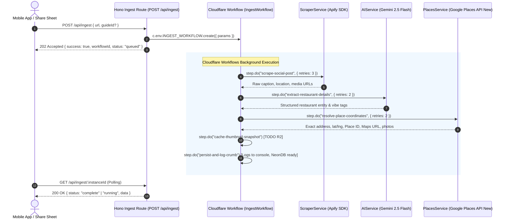

# Technical Specification: Async Ingestion Engine with Cloudflare Workflows

## 1. Overview
The Crumbs Ingestion Engine handles incoming social media links (Instagram Reels, TikTok) shared from the mobile app's Share Sheet without blocking the client. We implement **Cloudflare Workflows** to orchestrate asynchronous scraping, AI extraction, Google Places address resolution, and persistence with automatic step retries and durability.

---

## 2. Architecture & Components

---

## 3. Agreed Decisions

1. **Service Architecture:** All services under `src/services/` are class-based with constructor dependency injection (`ScraperService`, `AIService`, `PlacesService`).
2. **Scraping Engine:** Official `apify-client` SDK with typed `ScraperError` (no silent mock fallbacks).
3. **AI Extraction:** Vercel AI SDK `generateText` with `Output.object({ schema })`.
4. **Geocoding & Place Enrichment:** Google Places API (New) Text Search (`https://places.googleapis.com/v1/places:searchText`).
5. **Persistence Target:** Log workflow results to console and return the normalized payload from the workflow instance; full Drizzle + NeonDB integration will follow in a subsequent phase.
6. **Thumbnail Storage:** Add a distinct `cache-thumbnail-snapshot` workflow step with a structured TODO for Cloudflare R2 bucket integration.
7. **Async Exclusivity:** All ingestion runs asynchronously via `INGEST_WORKFLOW`.

---

## 4. Implementation Details

### A. Configuration & Types
* Update [`wrangler.jsonc`](file:///Users/khoa/Documents/crumbs/api/wrangler.jsonc):
  * Register the workflow binding `INGEST_WORKFLOW` mapping to class `IngestWorkflow`.
* Update [`src/types/env.ts`](file:///Users/khoa/Documents/crumbs/api/src/types/env.ts):
  * Define `IngestWorkflowParams` (`url: string`, `guideId?: string`, `userId?: string`).
  * Add `INGEST_WORKFLOW: Workflow<IngestWorkflowParams>`, `GOOGLE_PLACES_API_KEY?: string`, `APIFY_TOKEN?: string` to `Bindings`.

### B. Ingest Workflow Implementation
* Create [`src/workflows/ingestWorkflow.ts`](file:///Users/khoa/Documents/crumbs/api/src/workflows/ingestWorkflow.ts):
  * `IngestWorkflow extends WorkflowEntrypoint<Bindings, IngestWorkflowParams>`
  * **Step 1 (`scrape-social-post`)**: Calls `scraper.scrape(url)` with 3 exponential retries.
  * **Step 2 (`extract-restaurant-details`)**: Calls `ai.extract(scraped)` using Gemini 2.5 Flash + Zod schema via `generateText(Output.object)`.
  * **Step 3 (`resolve-place-coordinates`)**: Calls `places.resolve(name, city, address)` via Google Places API (New).
  * **Step 4 (`cache-thumbnail-snapshot`)**: Prepares media snapshot structure with TODO for Cloudflare R2 upload.
  * **Step 5 (`persist-and-log-crumb`)**: Logs structured crumb output and returns the final object.

### C. API Endpoints
* Update [`src/routes/ingest.ts`](file:///Users/khoa/Documents/crumbs/api/src/routes/ingest.ts):
  * `POST /api/ingest`: Creates workflow instance via `c.env.INGEST_WORKFLOW.create()` and returns `202 Accepted` with `workflowId`.
  * `GET /api/ingest/:instanceId`: Retrieves workflow instance status using `c.env.INGEST_WORKFLOW.get(instanceId)`.
* Update [`src/index.ts`](file:///Users/khoa/Documents/crumbs/api/src/index.ts):
  * Export `IngestWorkflow` class so Cloudflare Workers runtime can instantiate the workflow entrypoint.
