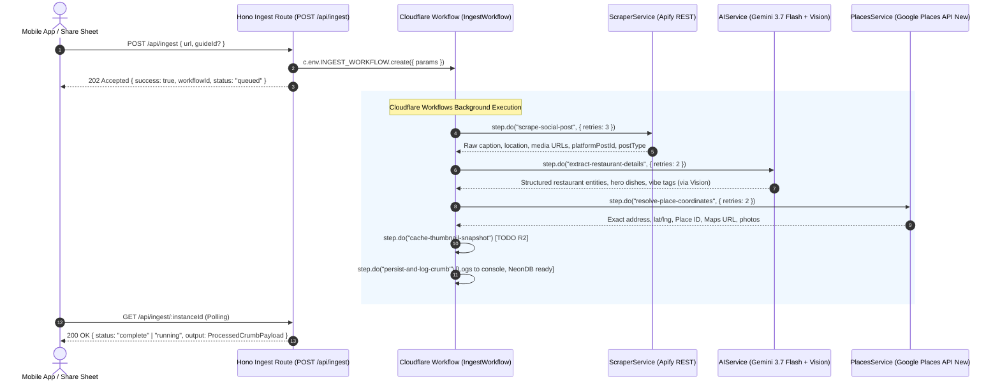
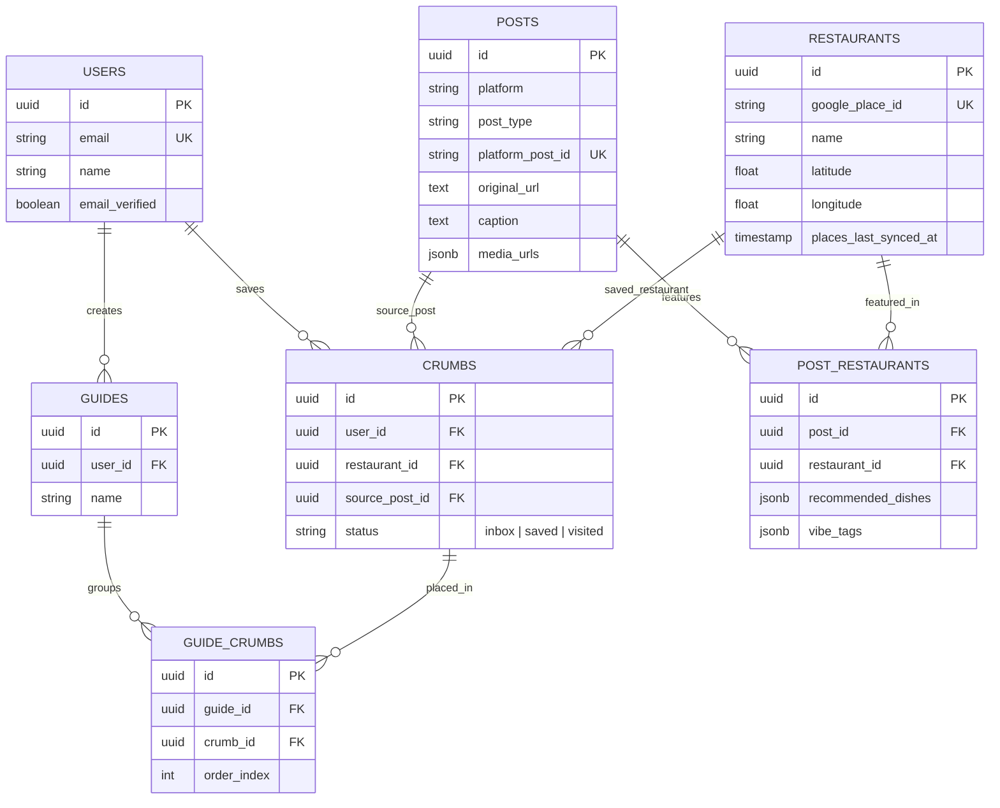

# Technical Specification: Async Ingestion Engine with Cloudflare Workflows

## 1. Overview
The Crumbs Ingestion Engine handles incoming social media links (Instagram Reels, TikTok) shared from the mobile app's Share Sheet without blocking the client. We implement **Cloudflare Workflows** to orchestrate asynchronous scraping, AI extraction, Google Places address resolution, and Drizzle/Neon database persistence with automatic step retries and durability.

---

## 2. Architecture & Components

---

## 3. Database & Entity Architecture (Drizzle ORM / Neon PostgreSQL)

