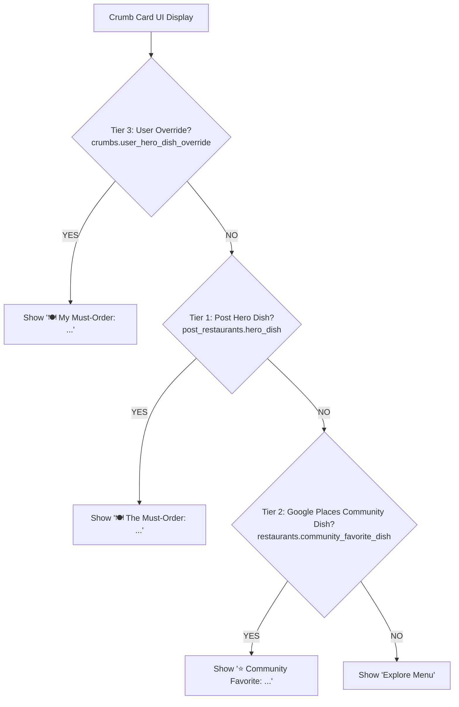

# Design Specification: Hero Dish AI Extraction & 3-Tier Fallback

## 1. Overview
This is a backend and intelligence tier feature for Crumbs that powers the "Spotify for Cravings" experience. It enriches social media post ingestion by extracting the singular Hero Dish, sensory Vibe Anchor, Course Category, and Walk-in Tips, backed by an automated 3-tier fallback hierarchy.

## 2. Information Architecture & Precedence

## 3. UI/UX Contract for iOS Clients
* **Hero Dish Banner**: Displayed prominently above restaurant details.
* **Vibe Anchor Tagline**: Evocative 3-8 word sensory atmosphere description rendered in italics below the restaurant title.
* **Course Category Badge**: Used for crawl sequencing (`aperitif` | `main` | `dessert` | `cafe_bakery` | `cocktail_bar` | `snack`).
* **Reservation Action Button**: Direct deep link to Resy, OpenTable, SevenRooms, or Tock if detected.
