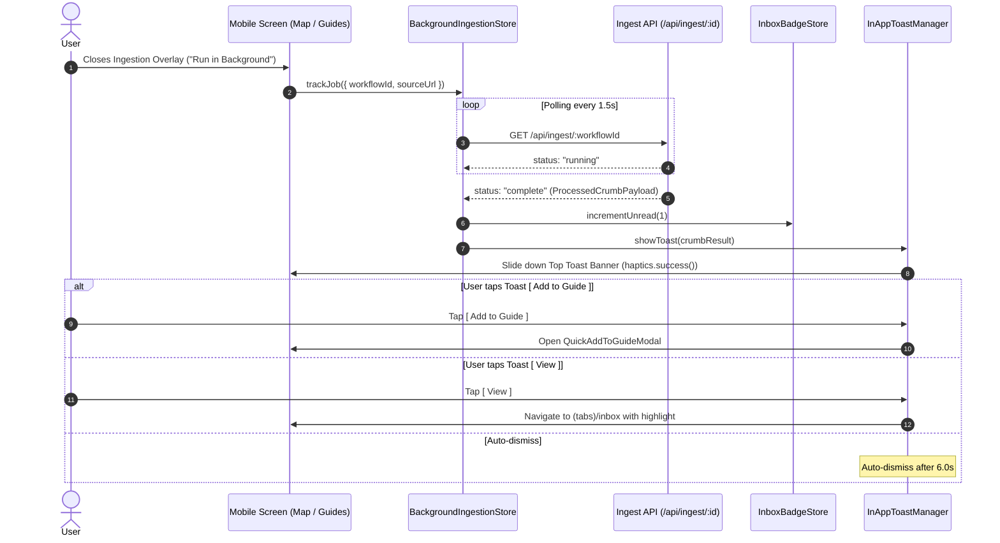

# Crumbs: Inbox View, Compact Crumb Card & Background Ingestion UI/UX Specification

## 1. Executive Summary & Product Vision

In **Crumbs** ("*Spotify for Cravings*"), the **Inbox** functions as the user's culinary staging ground—the frictionless catchment area where newly captured spots from Instagram Reels and TikTok land before being organized into curated guides or booked for weekend date nights.

This specification defines the complete UI/UX architecture, visual hierarchy, micro-interactions, layout density, component contracts, motion physics, tactile haptic feedback, and platform adaptations for:
1. **The Full Crumbs Inbox Screen**: High-density editorial list with search, filter chips, and empty states.
2. **The Custom Compact Crumb Card**: A horizontal, space-efficient card (~108pt height) allowing users to scan 4–5 food spots per viewport without losing appetizing photography, hero dish callouts, or quick actions.
3. **Background Ingestion Pipeline Tracking**: Non-blocking asynchronous task management that continues processing even when overlays are closed.
4. **In-App Non-Modal Toast Banner**: Elegant top slide-down banner celebrating completed background ingestions with direct `[ Add to Guide ]` and `[ View ]` actions.
5. **Inbox Tab Badge Management**: Real-time unread counter synchronized with persistent MMKV timestamps that resets immediately upon tab visit.

```
┌─────────────────────────────────────────────────────────────────────────┐
│ Top Safe Area (In-App Toast Banner on Background Complete)              │
│ ┌─────────────────────────────────────────────────────────────────────┐ │
│ │ [📸 Place]  Captured to Inbox! 🌿           [ Add to Guide ] [ ✕ ]  │ │
│ │             Via Carota · Must-Order: Truffle Gnocchi                │ │
│ └─────────────────────────────────────────────────────────────────────┘ │
│                                                                         │
│ Inbox                                                     (12 Unsaved)  │  <-- Georgia Display
│ Newly ingested spots from social reels awaiting organization.           │
│                                                                         │
│ [ 🔍 Search spots, dishes, vibes, or @creators...                 ]     │  <-- SearchInput
│ [ All (14) ]  [ ⚡ Unorganized (12) ]  [ 🍷 Bookable (5) ]  [ West Vill ] │  <-- Filter Chips
│                                                                         │
│ ┌─────────────────────────────────────────────────────────────────────┐ │
│ │ ┌─────────┐  Via Carota                            $$$ · 4.6 ★      │ │  <-- Compact Card
│ │ │  88x88  │  51 Grove St, West Village             @nycfoodie 📸     │ │      (108pt H)
│ │ │  Photo  │  🍝 MUST-ORDER: Truffle Cacio e Pepe                    │ │
│ │ └─────────┘  [ Date Night ]  [ Natural Wine ]  [ 🗺️ Guide ] [ 🍷 ]  │ │
│ └─────────────────────────────────────────────────────────────────────┘ │
│ ┌─────────────────────────────────────────────────────────────────────┐ │
│ │ ┌─────────┐  L'Industrie Pizzeria                    $ · 4.8 ★      │ │
│ │ │  88x88  │  104 Christopher St, West Village      @devourpower 📸  │ │
│ │ │  Photo  │  🍕 MUST-ORDER: Burrata Slice with Hot Honey            │ │
│ │ └─────────┘  [ Quick Bite ]  [ Late Night ]    [ 🗺️ Guide ] [ 🗺️ ]  │ │
│ └─────────────────────────────────────────────────────────────────────┘ │
│                                                                         │
│ [ Map ]                      [ Guides ]                 [ Inbox (● 3) ] │  <-- Tab Badge
└─────────────────────────────────────────────────────────────────────────┘
```

---

## 2. Design System Alignment & Token Strategy

All UI surfaces, typography, radii, and spatial grids strictly adhere to `mobile/DESIGN.md` and `mobile/src/theme/tokens.ts`.

### 2.1 Color Palette & Semantic Tokens

| Semantic Token | Hex / Value | Usage in Inbox & Background Flows |
| :--- | :--- | :--- |
| `Theme.colors.background` | `#F7F4EF` | Base Warm Buttercream canvas for the Inbox screen |
| `Theme.colors.cardBackground` | `#FFFFFF` | Crisp White surface for Compact Crumb Cards & In-App Toast |
| `Theme.colors.canvas` | `#1E1915` | Deep Espresso tone for high-contrast dark accents and photo scrims |
| `Theme.colors.primary` | `#C45B3E` | Terracotta brand action (`[ Add to Guide ]`, Tab Badge, Must-Order dish text) |
| `Theme.colors.primaryPressed` | `#A84B31` | Darkened Terracotta for active press states |
| `Theme.colors.primaryLight` | `#E89078` | Soft terracotta tint for hero dish highlights and badge borders |
| `Theme.colors.onPrimary` | `#FFFFFF` | White text / icons over terracotta backgrounds |
| `Theme.colors.inputBackground` | `#F0EAE1` | Tonal warm linen for search input, filter chips, and image placeholders |
| `Theme.colors.inputBorder` | `#D8CEBF` | Border stroke for search field and inactive filter chips |
| `Theme.colors.cardBorder` | `#DDD5CA` | Clean border defining Compact Crumb Cards against Buttercream canvas |
| `Theme.colors.grabHandle` | `#C5B9A8` | Grab handles for modals and slide-out drawers |
| `Theme.colors.text` | `#1A1715` | Charcoal high-legibility heading and body text |
| `Theme.colors.textMuted` | `#736B63` | Subtitles, creator provenance, and neighborhood metadata |
| `Theme.colors.textSubtle` | `#9E958C` | Timestamp, inactive step indicators, and search placeholder text |
| `Theme.colors.success` | `#7C9070` | Pistachio / Sage accent for "Captured to Inbox!", ratings, and open status |
| `Theme.colors.accent` | `#DFB064` | Warm Gold for star ratings and VIP culinary highlights |
| `Theme.colors.error` | `#DC2626` | Destructive swipe actions and deletion confirmations |
| `Theme.colors.errorBackground`| `rgba(220, 38, 38, 0.1)` | Alert and error state backgrounds |

### 2.2 Typography Scale

- **Screen Headline**: `Georgia` (iOS) / `serif` (Android), `fontSize: 28`, `fontWeight: 'bold'`, `color: Theme.colors.text`.
- **Screen Subtitle / Counter**: Sans-serif, `fontSize: 14`, `color: Theme.colors.textMuted`.
- **Compact Card Title**: `Georgia` (iOS) / `serif` (Android), `fontSize: 17`, `fontWeight: 'bold'`, `lineHeight: 21`.
- **Location & Neighborhood**: Sans-serif, `fontSize: 12`, `fontWeight: '500'`, `color: Theme.colors.textMuted`.
- **Must-Order Dish Callout**: Sans-serif, `fontSize: 11`, `fontWeight: '700'`, `color: Theme.colors.primary`, `letterSpacing: 0.2`.
- **Vibe Tag Pills**: Sans-serif, `fontSize: 10`, `fontWeight: '600'`, `color: Theme.colors.text`.
- **Toast Title**: `Georgia` bold (15pt); **Toast Body**: Sans-serif (12pt).
- **Tab Bar Badge**: Sans-serif, `fontSize: 10`, `fontWeight: '800'`, `color: Theme.colors.onPrimary`.

### 2.3 Geometry & Radii

- **Screen Content Padding**: `Theme.spacing.lg` (`24pt`) horizontal on standard screens, `Theme.spacing.md` (`16pt`) on compact viewports.
- **Compact Card Outer Radius**: `Theme.radii.lg` (`18pt`).
- **Compact Card Image Thumbnail**: `88x88pt`, `borderRadius: Theme.radii.md` (`14pt`).
- **Filter Chips**: `height: 34pt`, `borderRadius: Theme.radii.pill` (`999pt`).
- **Toast Banner**: `borderRadius: Theme.radii.xl` (`24pt`), margin horizontal: `Theme.spacing.md` (`16pt`).
- **Action Buttons**: Compact mini-buttons `height: 32pt`, `borderRadius: Theme.radii.pill` (`999pt`).

---

## 3. Inbox Screen Information Architecture & Layout

### 3.1 Header, Search & Filter Bar

The Inbox screen header prioritizes rapid triaging of newly captured items:

```
┌─────────────────────────────────────────────────────────────┐
│ Inbox                                          (12 Unsaved) │  <-- Header Row
│ 12 newly ingested spots awaiting organization               │
│                                                             │
│ ┌─────────────────────────────────────────────────────────┐ │
│ │ 🔍 Search spots, hero dishes, neighborhoods, or creators│ │  <-- SearchInput (44pt)
│ └─────────────────────────────────────────────────────────┘ │
│                                                             │
│ [ All (14) ]  [ ⚡ Unorganized (12) ]  [ 🍷 Bookable (5) ]   │  <-- Horizontal Filter Pills
└─────────────────────────────────────────────────────────────┘
```

#### Filter Segments:
1. **'All' (`count`)**: Displays every crumb currently in the user's library with `status !== 'archived'`.
2. **'Unorganized' / 'Not in Guide' (`count`)**: Default view. Displays crumbs where `guideIds.length === 0` so users can clear their backlog.
3. **'Bookable' (`count`)**: Filters for crumbs with verified Resy, OpenTable, SevenRooms, or Tock reservation links.
4. **Dynamic Neighborhood Chips**: Horizontally scrolls top neighborhoods extracted from crumbs (e.g. *West Village*, *SoHo*, *Shibuya*).

---

### 3.2 Custom Compact Crumb Card Design

The standard 16:9 hero card is ideal for rich detail views, but too tall for quick batch review. The **Compact Crumb Card** achieves high information density in a horizontal 108pt form factor:

```
┌─────────────────────────────────────────────────────────────────────────┐
│ ┌──────────────┐  Via Carota                                $$$ · 4.6 ★ │
│ │              │  51 Grove St, West Village                @nycfoodie 📸 │
│ │  88x88 Image │                                                        │
│ │  Thumbnail   │  🍝 MUST-ORDER: Truffle Cacio e Pepe                   │
│ │              │  ┌────────────┐ ┌──────────────┐ ┌──────────┐ ┌──────┐ │
│ │ [MUST-ORDER] │  │ Date Night │ │ Natural Wine │ │ [ 🗺️ + ] │ │ [🍷] │ │
│ └──────────────┘  └────────────┘ └──────────────┘ └──────────┘ └──────┘ │
└─────────────────────────────────────────────────────────────────────────┘
```

#### Visual Layout Grid (108pt Total Height):
- **Left Column (`88x88pt`)**:
  - High-resolution Google Places photo rendered via `expo-image` with crossfade.
  - Tonal placeholder with `🍽️` when no photo exists.
  - Subtle corner badge showing cuisine type or platform logo (`📸` for Instagram, `🎵` for TikTok).
- **Right Column (Flex 1, Padding Left: 12pt)**:
  - **Row 1 (Header)**: Restaurant name in `Georgia` serif (17pt bold, 1 line max with ellipsis) + Price & Rating pill (`$$$ · 4.6 ★`).
  - **Row 2 (Location & Provenance)**: Neighborhood & City (`West Village, NYC`) + Creator credit (`@nycfoodie`).
  - **Row 3 (Hero Dish Highlight)**: Prominent callout with pasta/cocktail icon: `🍝 MUST-ORDER: Truffle Cacio e Pepe` in bold Terracotta (`#C45B3E`).
  - **Row 4 (Vibe Tags & Action Buttons)**:
    - 2 compact vibe tag chips (`[ Date Night ]`, `[ Dimly Lit ]`).
    - Quick Action Button 1: `[ 🗺️ + ]` (Opens Quick Guide Picker).
    - Quick Action Button 2: `[ 🍷 Book ]` or `[ 🗺️ Maps ]` (Deep link to booking provider or Apple/Google Maps).

#### Swipe & Press Interactions:
- **Card Tap**: Opens the full Crumb Detail modal with rich photos, walk-in tips, and creator notes (`haptics.tap()`).
- **Swipe Left**: Reveals destructive action `[ 🗑️ Remove ]` in `Theme.colors.error` with smooth spring reveal (`haptics.heavy()` on trigger).
- **Swipe Right**: Quick-adds to the most recently updated Guide (`haptics.success()`).

---

### 3.3 Empty State & Zero-Inbox Delight

When all crumbs have been organized into guides or the user has just joined:

```
┌─────────────────────────────────────────────────────────────┐
│                                                             │
│                      ┌───────────┐                          │
│                      │    🍞     │                          │
│                      └───────────┘                          │
│                                                             │
│                 Inbox Zero! 🌿                              │
│       All your captured food spots are organized.           │
│                                                             │
│   Share food reels from Instagram or TikTok directly        │
│   to Crumbs, and AI will extract the spot, hero dish,       │
│   and vibes straight into your inbox.                       │
│                                                             │
│   ┌─────────────────────────────────────────────────────┐   │
│   │              [ 🗺️ Explore City Map ]                │   │
│   └─────────────────────────────────────────────────────┘   │
│   ┌─────────────────────────────────────────────────────┐   │
│   │              [ ➕ Add Spot Manually ]               │   │
│   └─────────────────────────────────────────────────────┘   │
└─────────────────────────────────────────────────────────────┘
```

- Component: Standardized `EmptyState` component with `emoji="🍞"`, `serifTitle=true`, and Buttercream-compliant styling.

---

## 4. Background Ingestion Tracking & Non-Modal In-App Toast Banner

### 4.1 Background Processing Lifecycle

Users should never be forced to wait inside a modal while scraping and AI analysis run.
1. **Backgrounding**: When a user taps *"Run in Background"* or closes the ingestion bottom sheet, the task is registered with the global `useBackgroundIngestionStore`.
2. **Silent Polling**: The app continues polling Cloudflare Workflows in the background (`POLLING_INTERVAL_MS = 1500`).
3. **Completion**: Upon `status: 'complete'`, the background store:
   - Invalidates React Query cache (`QUERY_KEYS.crumbs.inbox()`).
   - Increments the unread count in `useInboxBadgeStore`.
   - Triggers the **In-App Toast Banner**.



---

### 4.2 In-App Non-Modal Toast Banner Specification

The Toast banner appears at the very top of the screen beneath the device status bar / Dynamic Island without blocking ongoing interactions (panning the map, browsing guides).

```
┌─────────────────────────────────────────────────────────────────────────┐
│  ▲ TOP SAFE AREA MARGIN (insets.top + 6pt)                              │
│ ┌─────────────────────────────────────────────────────────────────────┐ │
│ │ ┌─────────┐  Captured to Inbox! 🌿           [ 🗺️ Guide ]   [ ✕ ]   │ │
│ │ │ 44x44   │  Via Carota                                             │ │
│ │ │ Photo   │  🍝 Must-Order: Truffle Cacio e Pepe                    │ │
│ │ └─────────┘                                                         │ │
│ └─────────────────────────────────────────────────────────────────────┘ │
└─────────────────────────────────────────────────────────────────────────┘
```

#### Toast Anatomy & Specifications:
- **Position**: Floating `absolute` top banner anchored at `top: insets.top + spacing.xs`, horizontal margins `Theme.spacing.md` (`16pt`).
- **Container**: Translucent White (`#FFFFFF` with 95% opacity), `borderRadius: Theme.radii.xl` (`24pt`), `borderWidth: 1`, `borderColor: Theme.colors.cardBorder`.
- **Shadow**: Subtle organic depth (`shadowColor: '#000'`, `shadowOffset: { width: 0, height: 4 }`, `shadowOpacity: 0.12`, `shadowRadius: 10`, `elevation: 6`).
- **Left Thumbnail**: `44x44pt` rounded image of the restaurant with bread loaf badge overlay (`🍞`).
- **Middle Content**:
  - Header: `"Captured to Inbox! 🌿"` in `Theme.colors.success` (11pt bold).
  - Title: `"[Restaurant Name]"` in `Georgia` bold (14pt).
  - Hero Dish: `"Must-Order: [Dish Name]"` in `Theme.colors.primary` (12pt medium).
- **Right Action Buttons**:
  - `[ 🗺️ Guide ]`: Terracotta mini-pill button (`height: 30pt`, `paddingHorizontal: 10pt`) that directly opens the Guide Picker.
  - `[ ✕ ]`: Crisp close icon.
- **Duration**: 6000ms auto-dismiss timer (pauses on touch down).
- **Gesture**: Swipe up on banner dismisses immediately with spring physics.

---

## 5. Inbox Tab Badge Management

The Tab Bar badge gives immediate visual proof of new, unorganized food spots.

```
┌─────────────────────────────────────────────────────────────────────────┐
│     [ 🗺️ Map ]              [ 📖 Guides ]          [ 📥 Inbox (● 3) ]   │
└─────────────────────────────────────────────────────────────────────────┘
```

### 5.1 Badge State Logic

```ts
export interface InboxBadgeState {
  /** Timestamp when user last opened the Inbox tab */
  lastInboxViewedAt: number;
  /** Active unread count derived from server or background completions */
  unreadCount: number;
  /** Marks all current crumbs as viewed and resets badge */
  markInboxAsViewed: () => void;
  /** Increments badge when background ingestion finishes */
  incrementBadge: (delta?: number) => void;
}
```

1. **Storage**: `lastInboxViewedAt` is persisted in MMKV via Zustand persist middleware (`crumbs-inbox-badge-storage`).
2. **Unread Calculation**:
   $$\text{Unread Count} = \sum \mathbf{1}_{\{ \text{crumb.createdAt} > \text{lastInboxViewedAt} \land \text{crumb.status} == 'inbox' \}}$$
3. **Immediate Reset on Tab Focus**:
   - In `mobile/src/app/(tabs)/inbox/index.tsx`, an effect triggers on tab focus (`useFocusEffect` / `useIsFocused`):
     ```ts
     useFocusEffect(
       useCallback(() => {
         useInboxBadgeStore.getState().markInboxAsViewed();
       }, [])
     );
     ```
   - Badge immediately animates down to 0 without lag.
4. **Native Tab Bar Representation**:
   - In `mobile/src/app/(tabs)/_layout.tsx`, the `NativeTabs.Trigger` for `inbox` passes the dynamic count to `badge={unreadCount > 0 ? String(unreadCount) : undefined}`.

---

## 6. Tactile Haptic Feedback Matrix

Every interaction in the Inbox, Toast, and Background flows triggers purpose-built haptic feedback via `@/utils/haptics`:

| Trigger / Action | Haptic Method | Rationale & Sensory Experience |
| :--- | :--- | :--- |
| **Tab Bar Press (`Inbox`)** | `haptics.selection()` | Mechanical click acknowledging tab navigation |
| **Search Filter Chip Tap** | `haptics.selection()` | Discrete selection tick |
| **Search Input Clear `[ ✕ ]`** | `haptics.tap()` | Crisp light tap |
| **Compact Card Press** | `haptics.tap()` | Soft tactile tap opening place detail |
| **Compact Card `[ 🗺️ + ]` Press** | `haptics.primary()` | Medium impact on high-intent guide assignment |
| **Swipe Card Left (Delete/Archive)** | `haptics.heavy()` | Weighty tactile feedback warning of destructive action |
| **Swipe Card Right (Quick Guide Add)**| `haptics.success()` | Satisfying double-pulse completion |
| **Background Ingest Completed (Toast)**| `haptics.success()` | Celebratory arrival of newly captured spot |
| **Toast `[ 🗺️ Guide ]` Press** | `haptics.primary()` | Direct primary action tap |
| **Toast Swipe Up / Dismiss** | `haptics.tap()` | Light dismissal tick |
| **Pull to Refresh Complete** | `haptics.tap()` | Refresh completion tick |

---

## 7. Component Architecture & Props Specification

```
mobile/src/
├── app/(tabs)/
│   ├── _layout.tsx                    # NativeTabs layout with unread badge binding
│   └── inbox/
│       └── index.tsx                  # Full Inbox screen (Search, Filters, FlatList)
├── components/
│   ├── inbox/
│   │   ├── CompactCrumbCard.tsx       # 108pt horizontal compact card
│   │   ├── InboxFilterBar.tsx         # 'All', 'Unorganized', 'Bookable' filter chips
│   │   ├── InboxSearchBar.tsx         # SearchInput wrapper with live debounce
│   │   └── InAppToastBanner.tsx       # Top slide-down non-modal notification banner
│   └── ingestion/
│       └── QuickAddToGuideModal.tsx   # Rapid guide assignment bottom sheet
├── hooks/
│   ├── useInboxCrumbs.ts              # TanStack Query hook for inbox filtering & caching
│   └── useBackgroundIngestion.ts      # Global background workflow poller & listener
└── store/
    ├── background-ingestion.ts        # Zustand store tracking running workflow IDs
    └── inbox-badge.ts                 # Zustand store tracking unread count & last viewed timestamp
```

### 7.1 TypeScript Interface Definitions

```ts
import type { UnifiedRestaurantSpot } from '@/types/ingest';

export interface CompactCrumbCardProps {
  crumb: InboxCrumb;
  onPress: (crumb: InboxCrumb) => void;
  onAddToGuide: (crumb: InboxCrumb) => void;
  onBookOrMapPress: (crumb: InboxCrumb) => void;
  onDelete?: (crumb: InboxCrumb) => void;
}

export interface InboxCrumb extends UnifiedRestaurantSpot {
  crumbId: string;
  userId: string;
  sourcePlatform?: 'instagram' | 'tiktok' | 'unknown';
  sourceAuthor?: string | null;
  status: 'inbox' | 'saved' | 'visited';
  guideIds: string[];
  createdAt: string;
  updatedAt: string;
}

export interface InAppToastBannerProps {
  toast: InAppToastPayload | null;
  onDismiss: () => void;
  onAddToGuide: (crumb: UnifiedRestaurantSpot) => void;
  onViewInInbox: (crumb: UnifiedRestaurantSpot) => void;
}

export interface InAppToastPayload {
  id: string;
  restaurant: UnifiedRestaurantSpot;
  sourceUrl: string;
  createdAt: number;
}
```

---

## 8. Platform Adaptation Matrix (iOS vs Android)

| Feature / Dimension | iOS (Liquid Glass & SF Symbols) | Android (Material 3 & Tonal Surfaces) |
| :--- | :--- | :--- |
| **In-App Toast Banner** | `BlurView` with `.ultraThinMaterial`, 1px specular white border highlight | Material 3 `SurfaceContainerHigh` (`#FFFFFF`) with elevation 6 & tonal shadow |
| **Compact Card Surface** | Translucent card (`rgba(255,255,255,0.92)`) with `Theme.colors.cardBorder` | Opaque Card with Material 3 tonal elevation and ripple effect on press |
| **Tab Bar Badge** | Native iOS Red/Terracotta capsule badge on `NativeTabs.Trigger` | Android Material 3 badge count on NavigationBar item |
| **Swipeable Row Actions** | iOS Mail-style interactive spring slide with rubber-band damping | Material swipe dismiss with color fill transition |
| **Typography** | `Georgia` for restaurant titles; SF Pro for metadata | `serif` for titles; Roboto for metadata |
| **Icons** | SF Symbols (`fork.knife`, `bookmark.fill`, `tray.fill`, `arrow.clockwise`) | Material Symbols (`restaurant`, `bookmark`, `inbox`, `refresh`) |

---

## 9. Accessibility, Contrast & Internationalization

- **Touch Target Ergonomics**: All interactive elements (filter chips, guide add buttons, booking links) exceed minimum touch targets ($\ge 44\times 44\text{pt}$ on iOS, $\ge 48\times 48\text{dp}$ on Android).
- **Dynamic Type & Font Scaling**: All cards employ flexible vertical layout containers that expand gracefully if users have large accessibility text enabled without truncating critical titles.
- **Screen Reader Announcements (VoiceOver & TalkBack)**:
  - Compact cards announce: `"[Restaurant Name], [Neighborhood], Must-Order: [Dish], rated [Rating] stars. Double tap to view details. Actions available."`
  - Toast banner announces via accessibility live region: `"Alert: [Restaurant Name] has been saved to your Crumbs inbox."`
  - Badge announces: `"[N] unread crumbs in Inbox tab."`
- **Contrast Ratios**:
  - Terracotta action buttons (`#C45B3E`) on White: **4.65:1** (WCAG AA).
  - Charcoal titles (`#1A1715`) on Buttercream: **13.8:1** (WCAG AAA).
  - Vibe tag text (`#1A1715`) on Linen (`#F0EAE1`): **11.2:1** (WCAG AAA).

---

## 10. Engineering Implementation Roadmap & Checklist

- [ ] **1. Inbox Data Hook (`useInboxCrumbs`)**: Implement query hook supporting search filtering, status filtering (`unorganized` vs `all`), and optimistic guide assignment.
- [ ] **2. Compact Crumb Card Component (`CompactCrumbCard.tsx`)**: Build the 108pt horizontal card with `88x88` thumbnail, `Georgia` serif title, must-order badge, vibe tags, and quick-action buttons.
- [ ] **3. Filter Chips & Search Bar (`InboxFilterBar.tsx`)**: Build horizontal pill filters for *'All'*, *'Unorganized'*, *'Bookable'*, and neighborhood chips.
- [ ] **4. Empty State Integration (`EmptyState.tsx`)**: Wire up zero-inbox state with *"Explore Map"* and *"Add Spot"* CTAs.
- [ ] **5. Background Ingestion Store (`useBackgroundIngestionStore.ts`)**: Implement Zustand store for tracking background polling across app lifecycle.
- [ ] **6. In-App Toast Banner (`InAppToastBanner.tsx`)**: Create top floating slide-down notification with auto-dismiss and direct `[ Add to Guide ]` integration.
- [ ] **7. Inbox Tab Badge Store & Layout (`inbox-badge.ts`, `_layout.tsx`)**: Implement timestamp comparison (`createdAt > lastInboxViewedAt`), tab badge rendering, and instant reset on tab focus.
- [ ] **8. Haptic Feedback Wiring**: Bind `haptics.selection()`, `haptics.tap()`, `haptics.primary()`, and `haptics.heavy()` across all touchpoints.
- [ ] **9. Quality Assurance & Static Analysis**: Verify `bun run check` (`tsc --noEmit && oxlint . && prettier . --check`) passes with zero warnings.
