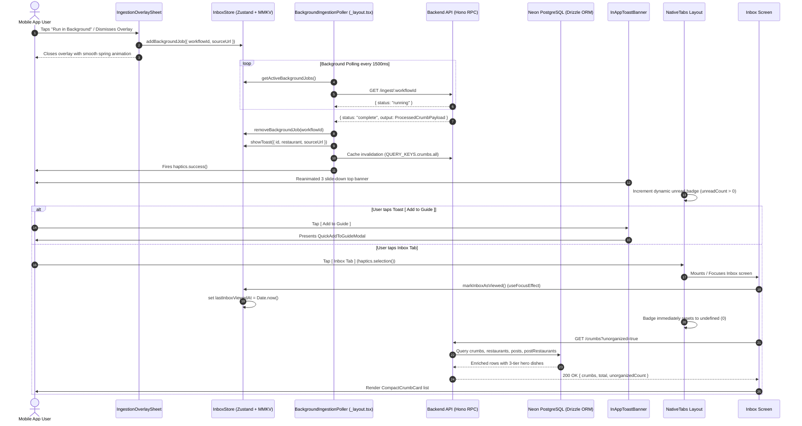

# Technical Specification: Full Crumbs Inbox View, Compact Crumb Card & Background Ingestion

## 1. Executive Summary & Architecture Overview

The **Crumbs Inbox** is the primary culinary staging ground where newly ingested spots from Instagram Reels and TikTok land before being organized into curated guides or booked for weekend dining. 

This specification establishes the complete technical architecture for:
1. **Backend CRUD & Enriched Query Engine**: Database repository and Hono RPC routes for `GET /crumbs`, `PATCH /crumbs/:id`, and `DELETE /crumbs/:id` with 3-tier effective hero dish calculation and multi-criteria filtering.
2. **Mobile Client State Architecture**: Persistent Zustand store (`inbox.ts` with MMKV) managing `lastInboxViewedAt`, background ingestion jobs, and active toast banners.
3. **Background Ingestion Poller Service**: A non-blocking background poller (`BackgroundIngestionPoller.tsx`) mounted at the root layout that monitors active workflow executions and celebrates completions.
4. **In-App Non-Modal Toast Banner**: A top safe-area slide-down notification banner (`InAppToastBanner.tsx` / `InAppToast.tsx`) with Reanimated 3 spring physics and direct `[ Add to Guide ]` integration.
5. **Compact Crumb Card Component**: A space-efficient horizontal card (~108pt height) featuring 88x88 photography, Georgia serif typography, hero dish callouts, vibe chips, and quick action mini-buttons.
6. **Full Inbox Screen**: High-density triage interface (`mobile/src/app/(tabs)/inbox/index.tsx`) with live debounced search, filter segments ('All', 'Unorganized', 'Bookable', dynamic neighborhoods), pull-to-refresh, empty states, and tab focus unread clearing.
7. **Dynamic Tab Bar Badge**: Unread badge counter bound to `NativeTabs.Trigger` synchronized in real time.

---

### 1.1 End-to-End System Sequence Diagram



---

## 2. Backend Architecture & Enriched CRUD Endpoints

### 2.1 Type Contracts: `api/src/modules/crumbs/crumbs.types.ts`

```ts
import type { Crumb } from '../../core/db/schemas/crumbs.table';
import type { Restaurant } from '../../core/db/schemas/restaurants.table';
import type { Post } from '../../core/db/schemas/posts.table';

export interface CrumbFilterOptions {
  status?: 'inbox' | 'saved' | 'visited';
  search?: string;
  guideId?: string;
  unorganized?: boolean;
  bookable?: boolean;
  neighborhood?: string;
  limit?: number;
  offset?: number;
}

export interface CrumbPostAttribution {
  heroDish: string | null;
  vibeAnchor: string | null;
  courseCategory: string | null;
  walkInTips: string | null;
  vibeTags: string[];
  recommendedDishes: string[];
  creatorNotes: string | null;
}

export interface EnrichedUserCrumb {
  id: string;
  userId: string;
  restaurantId: string;
  sourcePostId: string | null;
  status: string;
  userNotes: string | null;
  userHeroDishOverride: string | null;
  effectiveHeroDish: string | null;
  createdAt: string;
  updatedAt: string;
  restaurant: {
    id: string;
    googlePlaceId: string | null;
    name: string;
    formattedAddress: string | null;
    city: string | null;
    state: string | null;
    country: string | null;
    latitude: number | null;
    longitude: number | null;
    cuisine: string | null;
    rating: number | null;
    userRatingCount: number | null;
    priceLevel: string | null;
    mapsUrl: string | null;
    websiteUrl: string | null;
    photoUrl: string | null;
    editorialSummary: string | null;
    communityFavoriteDish: string | null;
    reservationUrl: string | null;
    reservationProvider: string | null;
  };
  sourcePost: {
    id: string;
    platform: string;
    postType: string;
    platformPostId: string | null;
    authorUsername: string | null;
    originalUrl: string;
    caption: string | null;
    locationName: string | null;
    mediaUrls: string[];
    classification: string | null;
    summary: string | null;
  } | null;
  postAttribution: CrumbPostAttribution | null;
  guideIds: string[];
  guides: Array<{
    id: string;
    name: string;
    emojiIcon: string;
  }>;
}

export interface ListCrumbsResponse {
  success: boolean;
  crumbs: EnrichedUserCrumb[];
  total: number;
  unorganizedCount: number;
  bookableCount: number;
}

export interface UpdateCrumbInput {
  status?: 'inbox' | 'saved' | 'visited';
  userNotes?: string | null;
  userHeroDishOverride?: string | null;
}
```

---

### 2.2 Database Repository: `api/src/modules/crumbs/crumbs.repository.ts`

The repository coordinates querying Drizzle ORM, executing multi-criteria filtering, joining across `Restaurants`, `Posts`, `GuideCrumbs`, and `PostRestaurants`, and computing the 3-Tier Effective Hero Dish.

```ts
import { eq, and, desc, inArray, ilike, or, isNull } from 'drizzle-orm';
import type { getDb } from '../../core/db/client';
import {
  Crumbs,
  Restaurants,
  Posts,
  PostRestaurants,
  GuideCrumbs,
  Guides,
  type Crumb,
} from '../../core/db/schemas';
import type {
  CrumbFilterOptions,
  EnrichedUserCrumb,
  ListCrumbsResponse,
  UpdateCrumbInput,
} from './crumbs.types';

type DbInstance = ReturnType<typeof getDb>;

export class CrumbsRepository {
  /**
   * Queries and returns enriched user crumbs with 3-tier hero dishes and filter aggregates.
   */
  static async listUserCrumbs(
    db: DbInstance,
    userId: string,
    options: CrumbFilterOptions = {},
  ): Promise<ListCrumbsResponse> {
    const rawCrumbs = await db.query.Crumbs.findMany({
      where: eq(Crumbs.userId, userId),
      orderBy: [desc(Crumbs.createdAt)],
      with: {
        restaurant: true,
        sourcePost: true,
        guideCrumbs: {
          with: {
            guide: true,
          },
        },
      },
    });

    // Resolve PostRestaurants junction for creator attribution & hero dish
    const restaurantIds = rawCrumbs
      .map((c) => c.restaurantId)
      .filter((id): id is string => Boolean(id));
    const postIds = rawCrumbs
      .map((c) => c.sourcePostId)
      .filter((id): id is string => Boolean(id));

    const postRestaurants =
      restaurantIds.length > 0 && postIds.length > 0
        ? await db.query.PostRestaurants.findMany({
            where: and(
              inArray(PostRestaurants.restaurantId, restaurantIds),
              inArray(PostRestaurants.postId, postIds),
            ),
          })
        : [];

    const postRestMap = new Map<string, (typeof postRestaurants)[0]>();
    for (const pr of postRestaurants) {
      postRestMap.set(`${pr.postId}_${pr.restaurantId}`, pr);
    }

    let unorganizedCount = 0;
    let bookableCount = 0;

    const enrichedList: EnrichedUserCrumb[] = [];

    for (const c of rawCrumbs) {
      if (!c.restaurant) continue;

      const guideItems = c.guideCrumbs || [];
      const guideIds = guideItems.map((gc) => gc.guideId);
      const isUnorganized = guideIds.length === 0;
      const isBookable = Boolean(
        c.restaurant.reservationUrl || c.restaurant.reservationProvider,
      );

      if (isUnorganized) unorganizedCount++;
      if (isBookable) bookableCount++;

      const pr =
        c.sourcePostId && c.restaurantId
          ? postRestMap.get(`${c.sourcePostId}_${c.restaurantId}`)
          : undefined;

      // 3-Tier Hero Dish Resolution Precedence:
      // Tier 3 (User Override) -> Tier 1 (Post Hero Dish) -> Tier 2 (Community Favorite Dish)
      const effectiveHeroDish =
        c.userHeroDishOverride ||
        pr?.heroDish ||
        c.restaurant.communityFavoriteDish ||
        null;

      const postAttribution = c.sourcePost
        ? {
            heroDish: pr?.heroDish ?? null,
            vibeAnchor: pr?.vibeAnchor ?? null,
            courseCategory: pr?.courseCategory ?? null,
            walkInTips: pr?.walkInTips ?? null,
            vibeTags: pr?.vibeTags ?? [],
            recommendedDishes: pr?.recommendedDishes ?? [],
            creatorNotes: pr?.creatorNotes ?? null,
          }
        : null;

      const guides = guideItems
        .filter((gc) => Boolean(gc.guide))
        .map((gc) => ({
          id: gc.guide.id,
          name: gc.guide.name,
          emojiIcon: gc.guide.emojiIcon,
        }));

      enrichedList.push({
        id: c.id,
        userId: c.userId,
        restaurantId: c.restaurantId,
        sourcePostId: c.sourcePostId,
        status: c.status,
        userNotes: c.userNotes ?? null,
        userHeroDishOverride: c.userHeroDishOverride ?? null,
        effectiveHeroDish,
        createdAt: c.createdAt.toISOString(),
        updatedAt: c.updatedAt.toISOString(),
        restaurant: {
          id: c.restaurant.id,
          googlePlaceId: c.restaurant.googlePlaceId ?? null,
          name: c.restaurant.name,
          formattedAddress: c.restaurant.formattedAddress ?? null,
          city: c.restaurant.city ?? null,
          state: c.restaurant.state ?? null,
          country: c.restaurant.country ?? null,
          latitude: c.restaurant.latitude ? Number(c.restaurant.latitude) : null,
          longitude: c.restaurant.longitude ? Number(c.restaurant.longitude) : null,
          cuisine: c.restaurant.cuisine ?? null,
          rating: c.restaurant.rating ? Number(c.restaurant.rating) : null,
          userRatingCount: c.restaurant.userRatingCount ?? null,
          priceLevel: c.restaurant.priceLevel ?? null,
          mapsUrl: c.restaurant.mapsUrl ?? null,
          websiteUrl: c.restaurant.websiteUrl ?? null,
          photoUrl: c.restaurant.photoUrl ?? null,
          editorialSummary: c.restaurant.editorialSummary ?? null,
          communityFavoriteDish: c.restaurant.communityFavoriteDish ?? null,
          reservationUrl: c.restaurant.reservationUrl ?? null,
          reservationProvider: c.restaurant.reservationProvider ?? null,
        },
        sourcePost: c.sourcePost
          ? {
              id: c.sourcePost.id,
              platform: c.sourcePost.platform,
              postType: c.sourcePost.postType,
              platformPostId: c.sourcePost.platformPostId ?? null,
              authorUsername: c.sourcePost.authorUsername ?? null,
              originalUrl: c.sourcePost.originalUrl,
              caption: c.sourcePost.caption ?? null,
              locationName: c.sourcePost.locationName ?? null,
              mediaUrls: c.sourcePost.mediaUrls ?? [],
              classification: c.sourcePost.classification ?? null,
              summary: c.sourcePost.summary ?? null,
            }
          : null,
        postAttribution,
        guideIds,
        guides,
      });
    }

    // Apply Client Filter Predicates
    let filtered = enrichedList;

    if (options.status) {
      filtered = filtered.filter((c) => c.status === options.status);
    }

    if (options.unorganized === true) {
      filtered = filtered.filter((c) => c.guideIds.length === 0);
    }

    if (options.bookable === true) {
      filtered = filtered.filter(
        (c) =>
          Boolean(c.restaurant.reservationUrl) ||
          Boolean(c.restaurant.reservationProvider),
      );
    }

    if (options.guideId) {
      filtered = filtered.filter((c) => c.guideIds.includes(options.guideId!));
    }

    if (options.neighborhood) {
      const targetN = options.neighborhood.toLowerCase();
      filtered = filtered.filter((c) =>
        c.restaurant.formattedAddress?.toLowerCase().includes(targetN),
      );
    }

    if (options.search) {
      const q = options.search.toLowerCase().trim();
      filtered = filtered.filter((c) => {
        const nameMatch = c.restaurant.name.toLowerCase().includes(q);
        const addressMatch = c.restaurant.formattedAddress?.toLowerCase().includes(q);
        const cuisineMatch = c.restaurant.cuisine?.toLowerCase().includes(q);
        const heroDishMatch = c.effectiveHeroDish?.toLowerCase().includes(q);
        const creatorMatch = c.sourcePost?.authorUsername?.toLowerCase().includes(q);
        const vibeMatch = c.postAttribution?.vibeTags?.some((tag) =>
          tag.toLowerCase().includes(q),
        );
        const notesMatch = c.userNotes?.toLowerCase().includes(q);
        return Boolean(
          nameMatch ||
            addressMatch ||
            cuisineMatch ||
            heroDishMatch ||
            creatorMatch ||
            vibeMatch ||
            notesMatch,
        );
      });
    }

    return {
      success: true,
      crumbs: filtered,
      total: filtered.length,
      unorganizedCount,
      bookableCount,
    };
  }

  /**
   * Updates an existing crumb record belonging to the authenticated user.
   */
  static async update(
    db: DbInstance,
    crumbId: string,
    userId: string,
    input: UpdateCrumbInput,
  ): Promise<EnrichedUserCrumb | null> {
    const existing = await db.query.Crumbs.findFirst({
      where: and(eq(Crumbs.id, crumbId), eq(Crumbs.userId, userId)),
    });

    if (!existing) {
      return null;
    }

    await db
      .update(Crumbs)
      .set({
        ...(input.status !== undefined && { status: input.status }),
        ...(input.userNotes !== undefined && { userNotes: input.userNotes }),
        ...(input.userHeroDishOverride !== undefined && {
          userHeroDishOverride: input.userHeroDishOverride,
        }),
        updatedAt: new Date(),
      })
      .where(and(eq(Crumbs.id, crumbId), eq(Crumbs.userId, userId)));

    const listResult = await this.listUserCrumbs(db, userId);
    return listResult.crumbs.find((c) => c.id === crumbId) || null;
  }

  /**
   * Deletes a crumb record belonging to the authenticated user.
   */
  static async delete(
    db: DbInstance,
    crumbId: string,
    userId: string,
  ): Promise<boolean> {
    const deleted = await db
      .delete(Crumbs)
      .where(and(eq(Crumbs.id, crumbId), eq(Crumbs.userId, userId)))
      .returning();

    return deleted.length > 0;
  }
}
```

---

### 2.3 Route Controller: `api/src/modules/crumbs/crumbs.route.ts`

```ts
import { Hono } from 'hono';
import { zValidator } from '@hono/zod-validator';
import { z } from 'zod';
import type { AppEnv } from '../../core/types/env';
import { requireAuth } from '../../core/auth/auth.middleware';
import { getDb } from '../../core/db/client';
import { CrumbsRepository } from './crumbs.repository';

const queryFilterSchema = z.object({
  status: z.enum(['inbox', 'saved', 'visited']).optional(),
  search: z.string().optional(),
  guideId: z.string().optional(),
  unorganized: z
    .string()
    .optional()
    .transform((val) => val === 'true'),
  bookable: z
    .string()
    .optional()
    .transform((val) => val === 'true'),
  neighborhood: z.string().optional(),
});

const updateCrumbSchema = z.object({
  status: z.enum(['inbox', 'saved', 'visited']).optional(),
  userNotes: z.string().max(1000).nullable().optional(),
  userHeroDishOverride: z.string().max(255).nullable().optional(),
});

export const crumbsRouter = new Hono<AppEnv>()
  .use('*', requireAuth)
  /**
   * GET /crumbs
   * Returns enriched user crumbs with status, search, and unorganized filter metrics.
   */
  .get('/', zValidator('query', queryFilterSchema), async (c) => {
    const user = c.get('user');
    const db = getDb(c.env.DATABASE_URL || '');
    const filters = c.req.valid('query');

    const result = await CrumbsRepository.listUserCrumbs(db, user.id, filters);
    return c.json(result, 200);
  })
  /**
   * PATCH /crumbs/:id
   * Updates crumb status, personal notes, or hero dish override.
   */
  .patch('/:id', zValidator('json', updateCrumbSchema), async (c) => {
    const user = c.get('user');
    const crumbId = c.req.param('id');
    const input = c.req.valid('json');
    const db = getDb(c.env.DATABASE_URL || '');

    const updatedCrumb = await CrumbsRepository.update(
      db,
      crumbId,
      user.id,
      input,
    );

    if (!updatedCrumb) {
      return c.json(
        {
          success: false,
          error: 'Crumb not found or unauthorized',
        },
        404,
      );
    }

    return c.json(
      {
        success: true,
        crumb: updatedCrumb,
      },
      200,
    );
  })
  /**
   * DELETE /crumbs/:id
   * Removes a crumb from the user's library and any linked guides.
   */
  .delete('/:id', async (c) => {
    const user = c.get('user');
    const crumbId = c.req.param('id');
    const db = getDb(c.env.DATABASE_URL || '');

    const deleted = await CrumbsRepository.delete(db, crumbId, user.id);

    if (!deleted) {
      return c.json(
        {
          success: false,
          error: 'Crumb not found or unauthorized',
        },
        404,
      );
    }

    return c.json(
      {
        success: true,
        message: 'Crumb deleted successfully',
      },
      200,
    );
  });
```

---

## 3. Mobile Client State & Persistent Store

### 3.1 Store: `mobile/src/store/inbox.ts`

Manages client-side unread timestamp tracking (`lastInboxViewedAt`), active background workflows (`activeBackgroundJobs`), and active non-modal notification toasts (`activeToast`).

```ts
import { create } from 'zustand';
import { persist, createJSONStorage } from 'zustand/middleware';
import { zustandMMKVStorage } from '@/utils/storage';
import type { UnifiedRestaurantSpot } from '@/types/ingest';

export interface BackgroundIngestJob {
  workflowId: string;
  sourceUrl: string;
  startedAt: number;
  status: 'queued' | 'running' | 'complete' | 'error';
  spotCount?: number;
}

export interface InAppToastPayload {
  id: string;
  restaurant: UnifiedRestaurantSpot;
  sourceUrl: string;
  createdAt: number;
}

interface InboxState {
  lastInboxViewedAt: number;
  activeBackgroundJobs: Record<string, BackgroundIngestJob>;
  activeToast: InAppToastPayload | null;

  // Actions
  markInboxAsViewed: () => void;
  addBackgroundJob: (job: { workflowId: string; sourceUrl: string }) => void;
  updateBackgroundJob: (
    workflowId: string,
    patch: Partial<BackgroundIngestJob>,
  ) => void;
  removeBackgroundJob: (workflowId: string) => void;
  showToast: (payload: InAppToastPayload) => void;
  hideToast: () => void;
}

export const useInboxStore = create<InboxState>()(
  persist(
    (set) => ({
      lastInboxViewedAt: 0,
      activeBackgroundJobs: {},
      activeToast: null,

      markInboxAsViewed: () =>
        set({
          lastInboxViewedAt: Date.now(),
        }),

      addBackgroundJob: ({ workflowId, sourceUrl }) =>
        set((state) => ({
          activeBackgroundJobs: {
            ...state.activeBackgroundJobs,
            [workflowId]: {
              workflowId,
              sourceUrl,
              startedAt: Date.now(),
              status: 'running',
            },
          },
        })),

      updateBackgroundJob: (workflowId, patch) =>
        set((state) => {
          const existing = state.activeBackgroundJobs[workflowId];
          if (!existing) return state;
          return {
            activeBackgroundJobs: {
              ...state.activeBackgroundJobs,
              [workflowId]: { ...existing, ...patch },
            },
          };
        }),

      removeBackgroundJob: (workflowId) =>
        set((state) => {
          const next = { ...state.activeBackgroundJobs };
          delete next[workflowId];
          return { activeBackgroundJobs: next };
        }),

      showToast: (payload) =>
        set({
          activeToast: payload,
        }),

      hideToast: () =>
        set({
          activeToast: null,
        }),
    }),
    {
      name: 'crumbs-inbox-storage',
      storage: createJSONStorage(() => zustandMMKVStorage),
      partialize: (state) => ({
        lastInboxViewedAt: state.lastInboxViewedAt,
        activeBackgroundJobs: state.activeBackgroundJobs,
      }),
    },
  ),
);
```

---

## 4. TanStack Query Hooks: `mobile/src/hooks/useCrumbs.ts`

```ts
import { useQuery, useMutation, useQueryClient } from '@tanstack/react-query';
import { apiClient } from '@/utils/api-client';
import { QUERY_KEYS } from '@/utils/query-keys';
import { haptics } from '@/utils/haptics';
import { useInboxStore } from '@/store/inbox';
import type { EnrichedUserCrumb, UpdateCrumbInput } from '@api/modules/crumbs/crumbs.types';

export interface UseCrumbsFilterOptions {
  status?: 'inbox' | 'saved' | 'visited';
  search?: string;
  guideId?: string;
  unorganized?: boolean;
  bookable?: boolean;
  neighborhood?: string;
}

/**
 * Hook to query enriched crumbs with filtering and search capabilities.
 */
export function useCrumbsQuery(filters: UseCrumbsFilterOptions = {}) {
  return useQuery({
    queryKey: [...QUERY_KEYS.crumbs.all, 'list', filters],
    queryFn: async () => {
      const res = await apiClient.crumbs.$get({
        query: {
          ...(filters.status && { status: filters.status }),
          ...(filters.search && { search: filters.search }),
          ...(filters.guideId && { guideId: filters.guideId }),
          ...(filters.unorganized !== undefined && {
            unorganized: String(filters.unorganized),
          }),
          ...(filters.bookable !== undefined && {
            bookable: String(filters.bookable),
          }),
          ...(filters.neighborhood && { neighborhood: filters.neighborhood }),
        },
      });

      if (!res.ok) {
        throw new Error(`Failed to fetch crumbs: HTTP ${res.status}`);
      }

      const data = await res.json();
      return data;
    },
  });
}

/**
 * Hook to update crumb status, notes, or hero dish override.
 */
export function useUpdateCrumbMutation() {
  const queryClient = useQueryClient();

  return useMutation({
    mutationFn: async ({
      crumbId,
      input,
    }: {
      crumbId: string;
      input: UpdateCrumbInput;
    }) => {
      const res = await apiClient.crumbs[':id'].$patch({
        param: { id: crumbId },
        json: input,
      });

      if (!res.ok) {
        const err = (await res.json().catch(() => ({}))) as { error?: string };
        throw new Error(err.error || `HTTP error ${res.status}`);
      }

      return res.json();
    },
    onSuccess: () => {
      haptics.success();
      queryClient.invalidateQueries({ queryKey: QUERY_KEYS.crumbs.all });
      queryClient.invalidateQueries({ queryKey: QUERY_KEYS.guides.all });
    },
    onError: () => {
      haptics.error();
    },
  });
}

/**
 * Hook to delete a crumb record with cache invalidation and haptics.
 */
export function useDeleteCrumbMutation() {
  const queryClient = useQueryClient();

  return useMutation({
    mutationFn: async (crumbId: string) => {
      const res = await apiClient.crumbs[':id'].$delete({
        param: { id: crumbId },
      });

      if (!res.ok) {
        const err = (await res.json().catch(() => ({}))) as { error?: string };
        throw new Error(err.error || `HTTP error ${res.status}`);
      }

      return res.json();
    },
    onSuccess: () => {
      haptics.heavy();
      queryClient.invalidateQueries({ queryKey: QUERY_KEYS.crumbs.all });
      queryClient.invalidateQueries({ queryKey: QUERY_KEYS.guides.all });
    },
    onError: () => {
      haptics.error();
    },
  });
}

/**
 * Hook to compute the real-time unread counter for the Inbox tab badge.
 */
export function useUnreadCrumbsCount(): number {
  const lastViewedAt = useInboxStore((s) => s.lastInboxViewedAt);
  const { data } = useCrumbsQuery({ unorganized: true });

  if (!data || !data.crumbs) return 0;

  return data.crumbs.filter(
    (c) => new Date(c.createdAt).getTime() > lastViewedAt,
  ).length;
}
```

---

## 5. UI Component Architecture

```
mobile/src/components/
├── crumbs/
│   └── CompactCrumbCard.tsx            # Horizontal 108pt space-efficient crumb card
├── inbox/
│   ├── InAppToastBanner.tsx            # Top slide-down notification banner
│   ├── InboxFilterBar.tsx              # Pill filter selector ('All', 'Unorganized', 'Bookable')
│   └── InboxSearchBar.tsx              # Debounced search bar with clear button
└── ingestion/
    └── BackgroundIngestionPoller.tsx   # Global background poller mounted at root layout
```

---

### 5.1 `CompactCrumbCard.tsx` (108pt Horizontal Layout)

- **Outer Container**:
  - Height: `108pt`
  - Margin bottom: `Theme.spacing.sm` (`8pt`)
  - Background: `Theme.colors.cardBackground` (`#FFFFFF`)
  - Border: 1px solid `Theme.colors.cardBorder` (`#DDD5CA`)
  - Radius: `Theme.radii.lg` (`18pt`)
  - Padding: `Theme.spacing.sm` (`8pt`)
- **Left Photography Column**:
  - Dimension: `88x88pt`
  - Radius: `Theme.radii.md` (`14pt`)
  - Image renderer: `expo-image` with transition crossfade
  - Fallback placeholder: `Theme.colors.inputBackground` with food emoji (`🍽️`)
  - Platform watermark badge: Overlaid on top-left (`📸` for Instagram, `🎵` for TikTok)
- **Right Information Column**:
  - **Row 1 (Header)**: Restaurant Title in `Georgia` serif bold (17pt, 1 line truncation) + Rating/Price pill (`$$$ · 4.6 ★`) in `Theme.colors.textMuted`.
  - **Row 2 (Location & Provenance)**: Neighborhood & City (`West Village, NYC`) + Creator attribution (`@nycfoodie 📸`).
  - **Row 3 (Hero Dish Callout)**: Bold Terracotta pill (`Theme.colors.primary`): `🍝 MUST-ORDER: Truffle Cacio e Pepe` (11pt bold).
  - **Row 4 (Vibe Tags & Mini-Actions)**:
    - 2 compact vibe tag pills (`[ Date Night ]`, `[ Natural Wine ]`) in `Theme.colors.inputBackground`.
    - Mini-Action 1: `[ 🗺️ + ]` (Opens Guide Picker, `haptics.primary()`).
    - Mini-Action 2: `[ 🍷 Book ]` or `[ 🗺️ Maps ]` (Deep link, `haptics.tap()`).

```ts
export interface CompactCrumbCardProps {
  crumb: EnrichedUserCrumb;
  onPress: (crumb: EnrichedUserCrumb) => void;
  onAddToGuide: (crumb: EnrichedUserCrumb) => void;
  onBookOrMapPress: (crumb: EnrichedUserCrumb) => void;
  onDelete?: (crumb: EnrichedUserCrumb) => void;
}
```

---

### 5.2 `InAppToastBanner.tsx` (Top Slide-Down Non-Modal Banner)

- **Presentation**: Absolute overlay anchored at `top: insets.top + 6pt`, horizontal margin `Theme.spacing.md` (`16pt`).
- **Motion Physics**: React Native Reanimated 3 spring entry:
  ```ts
  const translateY = useSharedValue(-120);
  useEffect(() => {
    if (activeToast) {
      haptics.success();
      translateY.value = withSpring(0, { damping: 18, stiffness: 200 });
      const timer = setTimeout(() => {
        handleDismiss();
      }, 6000);
      return () => clearTimeout(timer);
    } else {
      translateY.value = withTiming(-140, { duration: 250 });
    }
  }, [activeToast]);
  ```
- **Visuals**:
  - Left: 44x44pt rounded thumbnail of restaurant.
  - Middle: Header *"Captured to Inbox! 🌿"* in `Theme.colors.success` + Georgia Title + Hero Dish Callout.
  - Right: Terracotta mini-action `[ 🗺️ Guide ]` + Close button `[ ✕ ]`.
- **Interactivity**: Tapping the banner navigates to `/(tabs)/inbox`. Swiping up or tapping `✕` dismisses.

---

### 5.3 `BackgroundIngestionPoller.tsx` (Global Task Poller)

- Mounted at root layout `mobile/src/app/_layout.tsx`.
- Runs continuous `setInterval` (1500ms) polling for all entries in `activeBackgroundJobs`.
- Queries `apiClient.ingest[':instanceId'].$get()`.
- On `status === 'complete'`:
  - Extracts first restaurant entity.
  - Normalizes to `UnifiedRestaurantSpot`.
  - Removes job via `removeBackgroundJob(workflowId)`.
  - Triggers toast via `showToast({ id: workflowId, restaurant, sourceUrl, createdAt: Date.now() })`.
  - Invalidates TanStack Query `QUERY_KEYS.crumbs.all`.

---

## 6. Full Inbox Screen: `mobile/src/app/(tabs)/inbox/index.tsx`

### 6.1 Screen Structure & Interaction Architecture

1. **Safe Area Header**:
   - Title: *"Inbox"* in `Georgia` serif bold (28pt).
   - Subtitle: *"Newly ingested spots from social reels awaiting organization."*
   - Unorganized Count Badge: `(12 Unsaved)` in `Theme.colors.primary`.
2. **Search Input**:
   - Wrapped inside `SearchInput` component with live debouncing and clear button (`✕`).
3. **Filter Segment Chips**:
   - `[ All (14) ]`
   - `[ ⚡ Unorganized (12) ]` *(Default Selected)*
   - `[ 🍷 Bookable (5) ]`
   - Dynamic Neighborhood Chips extracted from query results.
4. **FlatList & Pull-to-Refresh**:
   - `RefreshControl` styled with `Theme.colors.primary`.
   - `renderItem`: `CompactCrumbCard`.
   - `ListEmptyComponent`: Standardized `EmptyState` component with bread emoji (`🍞`), Georgia title *"Inbox Zero! 🌿"*, and *"Explore City Map"* action.
5. **Focus Effect & Unread Reset**:
   - `useFocusEffect` calls `markInboxAsViewed()` from `useInboxStore` to clear the unread tab badge.

---

## 7. Dynamic Tab Bar Badge Integration: `mobile/src/app/(tabs)/_layout.tsx`

```tsx
import { NativeTabs } from 'expo-router/unstable-native-tabs';
import { useUnreadCrumbsCount } from '@/hooks/useCrumbs';
import { haptics } from '@/utils/haptics';

export default function TabLayout() {
  const unreadCount = useUnreadCrumbsCount();

  return (
    <NativeTabs
      minimizeBehavior="onScrollDown"
      screenListeners={{
        tabPress: () => {
          haptics.selection();
        },
      }}
    >
      <NativeTabs.Trigger name="(home)">
        <NativeTabs.Trigger.Icon sf="map.fill" md="map" />
        <NativeTabs.Trigger.Label>Map</NativeTabs.Trigger.Label>
      </NativeTabs.Trigger>

      <NativeTabs.Trigger name="guides">
        <NativeTabs.Trigger.Icon sf="bookmark.fill" md="bookmark" />
        <NativeTabs.Trigger.Label>Guides</NativeTabs.Trigger.Label>
      </NativeTabs.Trigger>

      <NativeTabs.Trigger
        name="inbox"
        badge={unreadCount > 0 ? String(unreadCount) : undefined}
      >
        <NativeTabs.Trigger.Icon sf="tray.fill" md="inbox" />
        <NativeTabs.Trigger.Label>Inbox</NativeTabs.Trigger.Label>
      </NativeTabs.Trigger>
    </NativeTabs>
  );
}
```

---

## 8. Tactile Haptics & Design System Compliance

### 8.1 Complete Haptic Feedback Mapping

| User Action / Trigger | Method | Tactile Sensation & UX Rationale |
| :--- | :--- | :--- |
| **Tab Bar Press (`Inbox`)** | `haptics.selection()` | Clean mechanical click acknowledging tab switch |
| **Filter Chip Tap** | `haptics.selection()` | Selection tick indicating filter segment change |
| **Search Input Clear `[ ✕ ]`** | `haptics.tap()` | Crisp light tap clearing search field |
| **Compact Card Press** | `haptics.tap()` | Soft tactile tap opening place details |
| **Compact Card `[ 🗺️ + ]` Press** | `haptics.primary()` | Medium impact satisfying tap on guide assignment |
| **Swipe Card Left (Delete)** | `haptics.heavy()` | Weighty impact signaling destructive action |
| **Swipe Card Right (Quick Add)** | `haptics.success()` | Celebratory confirmation on rapid organization |
| **Background Ingestion Complete** | `haptics.success()` | Double-pulse notification arrival |
| **Toast `[ 🗺️ Guide ]` Press** | `haptics.primary()` | Medium impact CTA press |
| **Toast Swipe Up / Dismiss** | `haptics.tap()` | Light dismissal tick |
| **Pull to Refresh Complete** | `haptics.tap()` | Refresh completion tick |

### 8.2 Repository Rule Enforcement

- **Theme Tokens Only**: All styles use `Theme.colors.*`, `Theme.spacing.*`, and `Theme.radii.*` (Zero raw hex colors).
- **Keyboard Handling**: Search input and modal interactions use `react-native-keyboard-controller`.
- **Static Analysis**: Must pass `bun run check` (`tsc --noEmit && oxlint . && prettier . --check`) with zero errors.

---

## 9. Implementation Roadmap & Verification Checklist

- [ ] **1. Backend Repository & Types**:
  - Implement `api/src/modules/crumbs/crumbs.types.ts`.
  - Implement `api/src/modules/crumbs/crumbs.repository.ts` with 3-tier hero dish resolution and multi-criteria filtering.
- [ ] **2. Backend Routes & Tests**:
  - Update `api/src/modules/crumbs/crumbs.route.ts` with `GET /`, `PATCH /:id`, `DELETE /:id`.
  - Create `api/src/modules/crumbs/crumbs.route.test.ts`.
- [ ] **3. Client Store & Hooks**:
  - Create `mobile/src/store/inbox.ts` with Zustand and MMKV persistence.
  - Create `mobile/src/hooks/useCrumbs.ts` with TanStack Query hooks.
- [ ] **4. Background Ingestion Services**:
  - Create `mobile/src/components/ingestion/BackgroundIngestionPoller.tsx`.
  - Create `mobile/src/components/inbox/InAppToastBanner.tsx`.
- [ ] **5. Compact Crumb Card & Inbox Subcomponents**:
  - Create `mobile/src/components/crumbs/CompactCrumbCard.tsx`.
  - Create `mobile/src/components/inbox/InboxFilterBar.tsx`.
- [ ] **6. Full Inbox Screen & Tab Layout**:
  - Build `mobile/src/app/(tabs)/inbox/index.tsx` with search, filters, `FlatList`, and focus badge reset.
  - Update `mobile/src/app/(tabs)/_layout.tsx` to bind `useUnreadCrumbsCount()` to the inbox badge.
  - Update `mobile/src/app/_layout.tsx` to mount `BackgroundIngestionPoller` and `InAppToastBanner`.
- [ ] **7. Verification & Quality Assurance**:
  - Run backend route tests (`bun test`).
  - Run frontend static analysis (`bun run check`).
