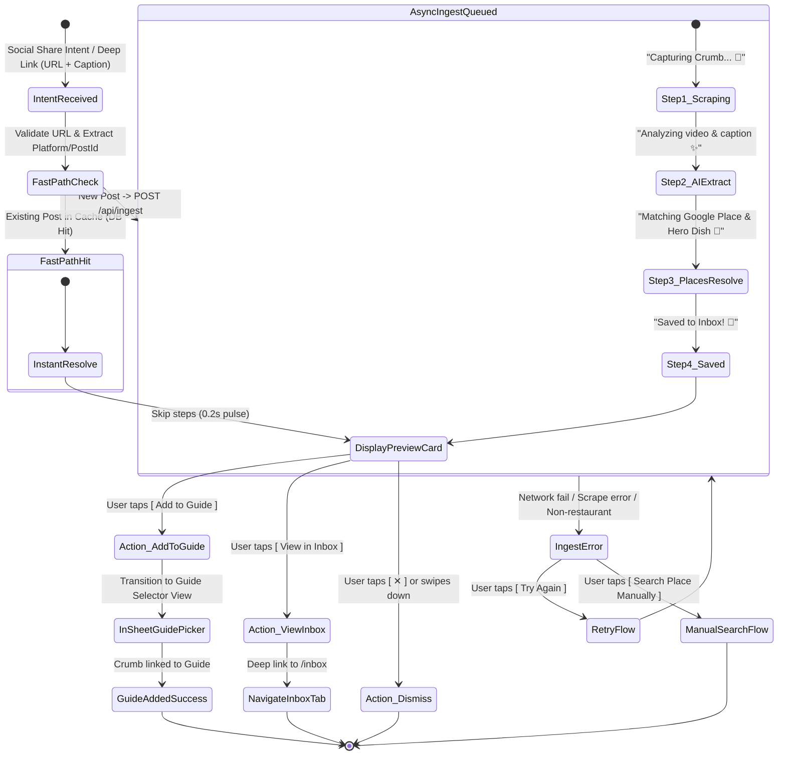

# Crumbs: Incoming Social Share Intent UI/UX Specification

## 1. Executive Summary & Product Vision

**Crumbs** is the opinionated food, vibe, and place-discovery platform ("*Spotify for Cravings*"). Frictionless capture is the single most vital top-of-funnel interaction in the entire product ecosystem. When a user is browsing Instagram Reels or TikTok and encounters an appetizing dish, chic natural wine bar, or hidden bakery, saving that spot must feel as effortless and delightful as tapping "Share to Crumbs".

This specification defines the complete end-to-end UI/UX architecture, visual hierarchy, micro-interactions, state transitions, motion physics, tactile haptic feedback, and platform adaptations for the **Incoming Social Share Intent & Ingestion Overlay**.

```
  ┌───────────────────────┐
  │ Instagram / TikTok    │
  │ Share Sheet           │
  └──────────┬────────────┘
             │ (Deep Link / Share Intent URL)
             ▼
  ┌───────────────────────────────────────────────────────────┐
  │ Floating Ingestion Bottom Sheet (Buttercream & Glass)     │
  │                                                           │
  │  [🍞 Bread Loaf Pulse Animation]                          │
  │  ● Step 1: Capturing Crumb... 🍞                          │
  │  ● Step 2: Analyzing video & caption ✨                   │
  │  ● Step 3: Matching Google Place & Hero Dish 📍           │
  │  ✓ Step 4: Saved to Inbox! 🌿                             │
  │                                                           │
  │  ┌─────────────────────────────────────────────────────┐  │
  │  │ Resolved Preview Card                               │  │
  │  │  • 16:9 Hero Photo + "Must-Order: Truffle Gnocchi"  │  │
  │  │  • Restaurant Title (Georgia Serif) & Vibe Tags     │  │
  │  │  • Creator attribution: "@nycfoodie on Instagram"   │  │
  │  └─────────────────────────────────────────────────────┘  │
  │                                                           │
  │  [ Add to Guide 🗺️ ] (Primary)   [ View in Inbox ] (Sec) │
  └───────────────────────────────────────────────────────────┘
```

---

## 2. Design System Alignment & Token Strategy

All UI surfaces, typography, radii, and spatial grids strictly adhere to `mobile/DESIGN.md` and `mobile/src/theme/tokens.ts`.

### 2.1 Color Palette & Semantic Tokens

| Semantic Token | Hex / Value | Purpose in Share Ingestion Flow |
| :--- | :--- | :--- |
| `Theme.colors.background` | `#F7F4EF` | Base Warm Buttercream surface for bottom sheet backdrop |
| `Theme.colors.cardBackground` | `#FFFFFF` | Crisp White container for the Resolved Place Preview Card |
| `Theme.colors.canvas` | `#1E1915` | Deep Espresso overlay scrim backdrop behind modal |
| `Theme.colors.primary` | `#C45B3E` | Warm Terracotta primary action buttons (`[ Add to Guide ]`, active step indicators) |
| `Theme.colors.primaryPressed` | `#A84B31` | Darkened Terracotta touch state |
| `Theme.colors.primaryLight` | `#E89078` | Tinted terracotta pills, progress track active glow |
| `Theme.colors.onPrimary` | `#FFFFFF` | White text / icons over terracotta backgrounds |
| `Theme.colors.inputBackground` | `#F0EAE1` | Tonal neutral container for secondary CTA and preview details |
| `Theme.colors.inputBorder` | `#D8CEBF` | Subtle divider and secondary button borders |
| `Theme.colors.cardBorder` | `#DDD5CA` | 1px clean contrast border framing the resolved preview card |
| `Theme.colors.grabHandle` | `#C5B9A8` | Tactile grab handle indicator pill at top of sheet |
| `Theme.colors.text` | `#1A1715` | Charcoal high-contrast heading and body text |
| `Theme.colors.textMuted` | `#736B63` | Editorial metadata, caption quotes, and secondary subtitles |
| `Theme.colors.textSubtle` | `#9E958C` | Step counters, timestamps, inactive progress step text |
| `Theme.colors.success` | `#7C9070` | Pistachio / Sage accent for "Saved to Inbox!", open hours, verified checkmarks |
| `Theme.colors.accent` | `#DFB064` | Warm Gold star ratings and VIP dish callouts |
| `Theme.colors.error` | `#DC2626` | Failure state badges and retry alerts |
| `Theme.colors.errorBackground`| `rgba(220, 38, 38, 0.1)` | Alert banner background |
| `Theme.colors.errorBorder` | `rgba(220, 38, 38, 0.2)` | Alert banner stroke |

### 2.2 Typography Scale

- **Display & Spot Names**: `Georgia` (iOS) / `serif` (Android), `fontSize: 22`, `fontWeight: 'bold'`, `color: Theme.colors.text`.
- **Card Subheaders & Section Titles**: Sans-serif (SF Pro / Roboto), `fontSize: 16`, `fontWeight: '700'`.
- **Progress Step Active**: Sans-serif, `fontSize: 15`, `fontWeight: '600'`, `color: Theme.colors.text`.
- **Progress Step Pending**: Sans-serif, `fontSize: 14`, `fontWeight: '400'`, `color: Theme.colors.textSubtle`.
- **Hero Dish Badge**: Sans-serif, `fontSize: 12`, `fontWeight: '700'`, `letterSpacing: 0.2`.
- **Vibe Tags & Micro-pills**: Sans-serif, `fontSize: 12`, `fontWeight: '600'`.
- **Creator Provenance**: Sans-serif, `fontSize: 12`, `fontWeight: '500'`, `color: Theme.colors.textMuted`.

### 2.3 Geometry & Elevation

- **Sheet Corner Radius**: `Theme.radii.sheet` (`36pt`) for organic, tactile thumb interaction.
- **Preview Card Radius**: `Theme.radii.xl` (`24pt`) outer container, `Theme.radii.lg` (`18pt`) for image cover.
- **Button Radius**: `Theme.radii.lg` (`18pt`), height: `52pt`.
- **Tag / Badge Radius**: `Theme.radii.pill` (`999pt`) or `Theme.radii.sm` (`8pt`).
- **Grab Handle**: `width: 36pt`, `height: 5pt`, `borderRadius: 999pt`, `backgroundColor: Theme.colors.grabHandle`.

---

## 3. End-to-End User Experience & Flow Architecture

### 3.1 Flow State Machine



---

## 4. UI Layouts & Wireframes (State-by-State)

### State 1: Active Ingestion Progress (The 4-Stage Live Animation)

When the share intent opens the app (or in-app overlay), a floating Buttercream bottom sheet ascends smoothly from the bottom thumb zone. 

```
┌─────────────────────────────────────────────────────────────┐
│                          ───────                            │  <-- Grab Handle
│                                                             │
│                      ┌───────────┐                          │
│                      │   🍞 ✨   │  <-- Bread Icon with     │
│                      └───────────┘      Glow & Soft Pulse   │
│                                                             │
│                Capturing Crumb...                           │  <-- Georgia Serif Header
│         Extracting culinary gems from Instagram             │
│                                                             │
│  ┌───────────────────────────────────────────────────────┐  │
│  │                                                       │  │
│  │   ✓  Capturing Crumb...                          1.2s │  │  <-- Step 1 (Completed)
│  │   │                                                   │  │
│  │   ◎  Analyzing video & caption...              [•••]  │  │  <-- Step 2 (Active shimmer)
│  │   │                                                   │  │
│  │   ○  Matching Google Place & Hero Dish                │  │  <-- Step 3 (Pending)
│  │   │                                                   │  │
│  │   ○  Saved to Inbox!                                  │  │  <-- Step 4 (Pending)
│  │                                                       │  │
│  └───────────────────────────────────────────────────────┘  │
│                                                             │
│   [ Run in Background ]                          [ Cancel ] │
└─────────────────────────────────────────────────────────────┘
```

#### Detailed Step State Hierarchy:
1. **Step 1: Capturing Crumb... 🍞**
   - *Status*: Extracting raw caption, author handle (`@creator`), tagged location, and video frames.
   - *Icon*: `Theme.colors.success` checkmark upon completion.
2. **Step 2: Analyzing video & caption ✨**
   - *Status*: Multimodal Gemini 3.7 Flash Vision analyzing food dishes, course categories, vibe anchors, and reservation hints.
   - *Active Visual*: Pulsing Terracotta dot with animated horizontal pulse bar.
3. **Step 3: Matching Google Place & Hero Dish 📍**
   - *Status*: Google Places API (New) resolving exact geocoordinates, address, opening hours, verified photos, and Tier 2 dish fallbacks.
4. **Step 4: Saved to Inbox! 🌿**
   - *Status*: Drizzle ORM storing crumb, linking to user inbox, creating post-restaurant associations.
   - *Transition*: Smooth spring expansion into the **Resolved Preview Card**.

---

### State 2: Resolved Preview Card (Single Spot Match)

Once processing completes, the step list collapses with a spring animation and reveals the rich editorial **Resolved Preview Card**.

```
┌─────────────────────────────────────────────────────────────┐
│                          ───────                            │
│                                                             │
│   🌿  SAVED TO INBOX                        @nycfoodie  📸  │  <-- Provenance Header
│                                                             │
│  ┌───────────────────────────────────────────────────────┐  │
│  │ ┌───────────────────────────────────────────────────┐ │  │
│  │ │                                                   │ │  │
│  │ │               [ HERO PHOTO (16:9) ]               │ │  │  <-- Google Places High-Res Photo
│  │ │                                                   │ │  │
│  │ │  ┌──────────────────────────────────────────────┐ │ │  │
│  │ │  │ 🍝 MUST-ORDER: Truffle Cacio e Pepe          │ │ │  │  <-- Overlaid Hero Dish Pill
│  │ │  └──────────────────────────────────────────────┘ │ │  │
│  │ └───────────────────────────────────────────────────┘ │  │
│  │                                                       │  │
│  │  Via Carota                              $$$ · 4.6 ★  │  │  <-- Georgia Display Title
│  │  51 Grove St, West Village, New York                  │  │  <-- Muted Address
│  │                                                       │  │
│  │  “Low-lit rustic Tuscan trattoria with fresh pasta”   │  │  <-- Vibe Anchor Quote
│  │                                                       │  │
│  │  ┌──────────────┐ ┌─────────────┐ ┌────────────────┐  │  │
│  │  │  Date Night  │ │ Dimly Lit   │ │  Natural Wine  │  │  │  <-- Vibe Tag Pills
│  │  └──────────────┘ └─────────────┘ └────────────────┘  │  │
│  │                                                       │  │
│  │  💡 Walk-in Tip: Arrive at 4:45 PM for bar seating    │  │  <-- Tactical Creator Tip
│  └───────────────────────────────────────────────────────┘  │
│                                                             │
│  ┌───────────────────────────────────────────────────────┐  │
│  │               [ 🗺️ Add to Guide ]                     │  │  <-- Primary Terracotta CTA (52pt)
│  └───────────────────────────────────────────────────────┘  │
│  ┌───────────────────────────────────────────────────────┐  │
│  │               [ 📥 View in Inbox ]                    │  │  <-- Secondary Buttercream Button
│  └───────────────────────────────────────────────────────┘  │
└─────────────────────────────────────────────────────────────┘
```

#### Key Elements of the Resolved Preview Card:
- **Hero Image Container**: 16:9 aspect ratio with soft gradient scrim (`linear-gradient(to top, rgba(0,0,0,0.6) 0%, transparent 60%)`).
- **Hero Dish Pill**: Overlaid on the bottom-left of the photography. Rendered with `Theme.colors.cardBackground` (`#FFFFFF`), `Theme.colors.primary` icon, and bold typography.
- **Restaurant Title**: `Georgia` bold display font (22pt) in `Theme.colors.text`.
- **Metadata Line**: Price tier (`$$$`), Google Maps rating (`4.6 ★`), and Neighborhood (`West Village`).
- **Vibe Anchor Quotation**: 1-sentence sensory atmospheric description crafted by AI from the video & caption.
- **Standardized Vibe Tags**: Clean chips (`Theme.colors.inputBackground`) styled with `Theme.radii.pill`.
- **Tactical Walk-In Note**: Callout box with light amber background if reservation/walk-in secrets were detected.

---

### State 3: Multi-Spot Ingestion Carousel (When 2+ Spots Found in 1 Reel/Post)

When a social post features multiple spots (e.g., *"Top 5 Pasta Spots in NYC"*), the overlay presents an editorial multi-spot selector with individual spot cards and a master *"Save All"* CTA.

```
┌─────────────────────────────────────────────────────────────┐
│                          ───────                            │
│                                                             │
│   ✨  3 SPOTS DISCOVERED IN REEL                            │
│   "Best Italian in West Village" by @nycfoodie              │
│                                                             │
│   ┌───────────────────────────┐ ┌─────────────────────────┐ │
│   │ [ PHOTO 1 ]               │ │ [ PHOTO 2 ]             │ │  <-- Horizontal Scroll Snap Cards
│   │ 🍝 Truffle Cacio e Pepe   │ │ 🍕 Burrata Margherita   │ │
│   │ Via Carota                │ │ L'Industrie Pizzeria    │ │
│   │ West Village · $$$        │ │ West Village · $        │ │
│   │ [✓ Saved] [Add to Guide]  │ │ [✓ Saved] [Add to Guide]│ │
│   └───────────────────────────┘ └─────────────────────────┘ │
│                                                             │
│   ● ○ ○  (1 of 3)                                           │  <-- Pagination Dots
│                                                             │
│  ┌───────────────────────────────────────────────────────┐  │
│  │           [ 🗺️ Add All 3 Spots to Guide ]             │  │  <-- Bulk Action CTA
│  └───────────────────────────────────────────────────────┘  │
│  ┌───────────────────────────────────────────────────────┐  │
│  │               [ 📥 View All in Inbox ]                │  │
│  └───────────────────────────────────────────────────────┘  │
└─────────────────────────────────────────────────────────────┘
```

---

### State 4: Fast-Path Cache Hit State (Instant Resolution)

If another Crumbs user has previously ingested this Instagram Reel or TikTok URL:
1. The backend triggers the Fast-Path Cache Hit branch in <150ms.
2. The UI skips step-by-step progress, plays a single micro-flash bread pulse (0.15s), triggers `haptics.success()`, and immediately renders the resolved card with a badge:
   - `⚡ Instant Match from Crumbs Community`
3. Instant gratification with zero waiting time.

---

### State 5: Edge & Error States

#### Scenario A: Non-Restaurant Content (Travel/Lifestyle without Specific Food Spots)
- **Header**: *"Scenic Post Detected 🌴"*
- **Editorial Subtitle**: *"We analyzed this post, but couldn't pinpoint a specific restaurant or food spot."*
- **Source Preview**: Small thumbnail of the post + original caption snippet.
- **Actions**:
  - `[ 🔍 Search Place Manually ]` (Opens Place Autocomplete search sheet)
  - `[ Dismiss ]`

#### Scenario B: Ingestion Pipeline Error / Network Timeout
- **Header**: *"Couldn't Capture Spot 🍞"*
- **Error Container**: `Theme.colors.errorBackground` with `Theme.colors.errorBorder`.
- **Explanation**: *"Instagram rate limit or temporary network hiccup. Would you like to retry or add manually?"*
- **Actions**:
  - `[ 🔄 Try Ingesting Again ]` (Primary Terracotta CTA)
  - `[ 🔍 Search Manually ]` (Secondary Buttercream CTA)

---

## 5. Micro-Interactions, Motion & Animation Specifications

All animations leverage **React Native Reanimated 3** with natural spring physics (no stiff linear easing).

### 5.1 Spring Physics Parameters

```ts
export const IngestionSprings = {
  // Snappy entry for bottom sheet & modals
  sheetEntry: {
    damping: 24,
    stiffness: 220,
    mass: 0.9,
  },
  // Bouncy tactile feel for card reveals
  cardPop: {
    damping: 16,
    stiffness: 180,
    mass: 0.8,
  },
  // Gentle pulse for bread icon
  breadPulse: {
    damping: 10,
    stiffness: 100,
  },
};
```

### 5.2 Micro-Interactions Timeline

```
T + 0ms    : Sheet slides up from bottom with IngestionSprings.sheetEntry.
T + 100ms  : Bread Loaf icon begins continuous gentle scale loop (1.0 -> 1.08 -> 1.0).
T + 200ms  : Step 1 ("Capturing Crumb... 🍞") renders with Terracotta active dot.
T + 1400ms : Step 1 completes -> Checkmark scales in with green burst (haptics.selection()).
             Step 2 ("Analyzing video & caption ✨") activates with glowing shimmer track.
T + 3200ms : Step 2 completes -> Checkmark turns Pistachio green.
             Step 3 ("Matching Google Place & Hero Dish 📍") activates.
T + 4800ms : Step 3 completes. Step 4 ("Saved to Inbox! 🌿") flashes with success banner.
T + 5200ms : Step box folds into header; Resolved Preview Card springs upward with cardPop.
             Haptic Notification Success triggers (haptics.success()).
```

---

## 6. Tactile Haptic Feedback Mapping

Tactile feedback is essential to making Crumbs feel alive and responsive. We strictly implement `@/utils/haptics`.

| Event / Step in Share Flow | Haptic Trigger Method | Physical Sensation & UX Rationale |
| :--- | :--- | :--- |
| **Share Sheet Opened / Overlay Mounts** | `haptics.tap()` | Light subtle confirmation that intent was caught |
| **Step 1 Completion (Scraped)** | `haptics.selection()` | Subtle mechanical click indicating progress milestone |
| **Step 2 Completion (AI Extracted)** | `haptics.selection()` | Discrete selection tick |
| **Step 3 Completion (Places Matched)**| `haptics.selection()` | Discrete selection tick |
| **Crumb Saved & Card Revealed** | `haptics.success()` | Double-pulse celebratory confirmation |
| **Fast-Path Cache Hit (Instant)** | `haptics.success()` | Instant double-pulse feedback without delay |
| **Press Primary CTA `[ Add to Guide ]`**| `haptics.primary()` | Medium-impact satisfying press on high-intent CTA |
| **Select Guide in Picker** | `haptics.selection()` | Clean tick per guide row tap |
| **Confirm Added to Guide** | `haptics.success()` | Success confirmation |
| **Press Secondary `[ View in Inbox ]`** | `haptics.tap()` | Crisp light tap |
| **Ingestion Error / Unrelated** | `haptics.error()` | Heavy buzz signaling failure/warning |
| **Sheet Dismiss / Swipe Down** | `haptics.tap()` | Smooth exit tick |

---

## 7. Component Architecture & Props Specification

### 7.1 Component Breakdown

```
mobile/src/components/ingestion/
├── IngestionOverlaySheet.tsx      # Main controller & in-sheet navigation container
├── IngestionProgressSteps.tsx     # Animated 4-step pipeline list with Reanimated
├── IngestionCrumbCard.tsx         # Hero photo, hero dish badge, vibe tags & metadata
├── CrumbsPickerCarousel.tsx       # Swipeable carousel for multi-restaurant reels
├── GuidePickerView.tsx            # In-sheet guide picker for rapid assignment
└── IngestionErrorState.tsx        # Graceful error & manual search fallback container
```

### 7.2 Component Interfaces & TypeScript Types

```ts
import type { ProcessedCrumbPayload, EnrichedRestaurant } from '@/types/ingest';

export type IngestionStepId = 
  | 'capturing' 
  | 'analyzing' 
  | 'matching' 
  | 'saved';

export interface IngestionStep {
  id: IngestionStepId;
  label: string;
  sublabel?: string;
  status: 'pending' | 'active' | 'completed' | 'error';
}

export interface IngestionOverlaySheetProps {
  /** The incoming URL shared from Instagram or TikTok */
  sourceUrl: string;
  /** Optional pre-filled caption passed by the OS share intent */
  initialCaption?: string;
  /** Controls modal visibility */
  visible: boolean;
  /** Callback to close the overlay */
  onClose: () => void;
  /** Callback when user navigates directly to Inbox screen */
  onNavigateToInbox: (crumbId?: string) => void;
  /** Callback when crumb is added to a specific guide */
  onAddedToGuide?: (guideId: string, crumbId: string) => void;
}

export interface IngestionCrumbCardProps {
  restaurant: EnrichedRestaurant;
  sourceUrl: string;
  authorUsername?: string | null;
  onAddToGuide: (restaurant: EnrichedRestaurant) => void;
  onViewInInbox: (restaurant: EnrichedRestaurant) => void;
  onEditDishOrVibe?: (restaurant: EnrichedRestaurant) => void;
}

export interface GuidePickerViewProps {
  restaurantName: string;
  crumbId?: string;
  crumbIds?: string[];
  onClose: () => void;
  onGuideSelected: (guideId: string) => Promise<void>;
  onCreateNewGuide: () => void;
}
```

---

## 8. Platform Adaptation Matrix (iOS vs Android)

| Design Dimension | iOS Experience (Apple Liquid Glass) | Android Experience (Material 3) |
| :--- | :--- | :--- |
| **Surface Backdrop** | `BlurView` / `.ultraThinMaterial` with specular 1px border (`rgba(255,255,255,0.4)`) | Material 3 `SurfaceContainerHigh` (`#F7F4EF` with tonal elevation 3) |
| **Presentation Style** | Interactive iOS `pageSheet` / detent bottom sheet (`.height(480)`) | `ModalBottomSheet` with Android drag gesture & predictive back |
| **Grab Handle** | Centered capsule pill (`Theme.colors.grabHandle`, `opacity: 0.7`) | Standard M3 drag handle (`Theme.colors.grabHandle`) |
| **Display Typography** | `Georgia` (Bold serif) | `serif` (Bold serif system fallback) |
| **Icons & Symbols** | SF Symbols via `expo-symbols` (`fork.knife`, `sparkles`, `tray.and.arrow.down`) | Material Icons (`restaurant`, `auto_awesome`, `inbox`) |
| **Haptic Motors** | CoreHaptics engine via `expo-haptics` (Crisp sharp transients) | Android vibration effects + touch ripple state layers |
| **Close Gesture** | Downward swipe gesture with rubber-banding resistance | Downward swipe or Hardware Back button / Predictive Back |

---

## 9. Accessibility, Internationalization & Touch Ergonomics

- **Minimum Touch Targets**: All buttons, tags, and icons meet $\ge 44 \times 44\text{pt}$ (iOS) and $\ge 48 \times 48\text{dp}$ (Android).
- **Dynamic Type**: All labels support iOS Dynamic Type and Android font scaling without clipping or overflowing layout containers.
- **Screen Readers (VoiceOver & TalkBack)**:
  - Progress steps announce state changes: *"Step 2 of 4: Analyzing video and caption, in progress."*
  - Preview card announces: *"Saved [Restaurant Name], Must-order dish: [Dish Name], rated [Rating] stars."*
  - Action buttons have explicit `accessibilityRole="button"` and `accessibilityLabel="Add [Restaurant Name] to Guide"`.
- **Contrast Ratios**:
  - Terracotta buttons (`#C45B3E`) with White text (`#FFFFFF`): **4.65:1** (WCAG AA Compliant).
  - Charcoal text (`#1A1715`) on Buttercream (`#F7F4EF`): **13.8:1** (WCAG AAA Compliant).
  - Muted text (`#736B63`) on Buttercream (`#F7F4EF`): **5.1:1** (WCAG AA Compliant).

---

## 10. Engineering Implementation Roadmap & Checklist

- [ ] **1. Share Intent Handler Registration**: Configure iOS Share Extension / `expo-sharing` / Android Send Intent listener in `mobile/app.json` and root `_layout.tsx`.
- [ ] **2. Ingestion Hook & Polling Engine**: Implement `useIngestionWorkflow(url)` in `mobile/src/hooks/useIngestion.ts` integrating with `POST /api/ingest` and `GET /api/ingest/:instanceId`.
- [ ] **3. Ingestion Bottom Sheet Component**: Build `IngestionOverlaySheet.tsx` styled with Buttercream (`#F7F4EF`), grab handles, and Reanimated 3 spring transitions.
- [ ] **4. 4-Step Animated Pipeline**: Implement `IngestionProgressSteps.tsx` with bread icon pulse and step-by-step checkmarks.
- [ ] **5. Resolved Preview Card**: Implement `ResolvedCrumbPreviewCard.tsx` with hero dish overlay pill, creator provenance, vibe tags, and Google Place metadata.
- [ ] **6. Guide Picker View**: Build `GuidePickerView.tsx` to allow 1-tap guide assignment.
- [ ] **7. Fast-Path Cache & Error Branching**: Handle `cached: true` instant displays, non-food detection alerts, and manual search fallbacks.
- [ ] **8. Haptic Integration**: Bind `haptics.selection()`, `haptics.success()`, `haptics.primary()`, and `haptics.error()` across all interaction triggers.
- [ ] **9. Quality Assurance**: Verify type safety (`bun run check`), visual polish, and responsive layout across both compact (iPhone SE / Pixel 7a) and large (iPhone Pro Max / Pixel Pro) screens.
