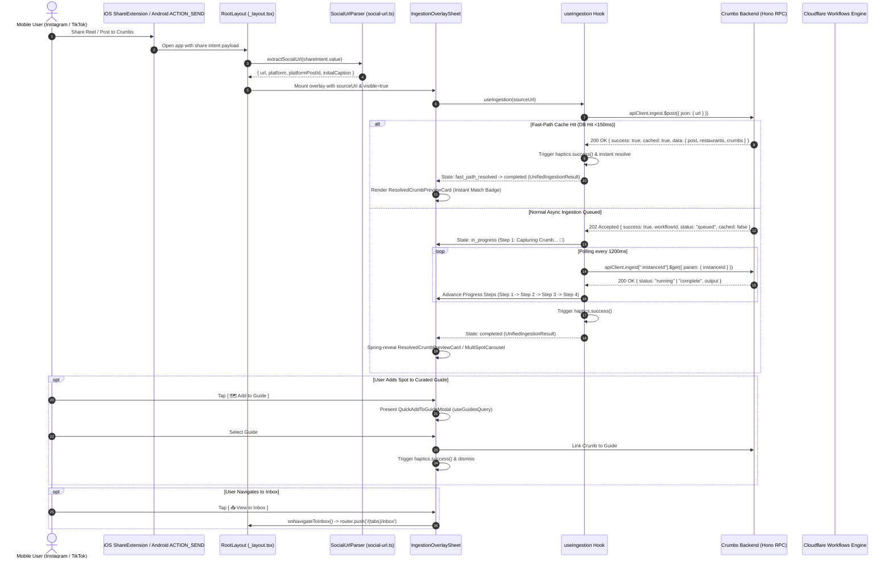
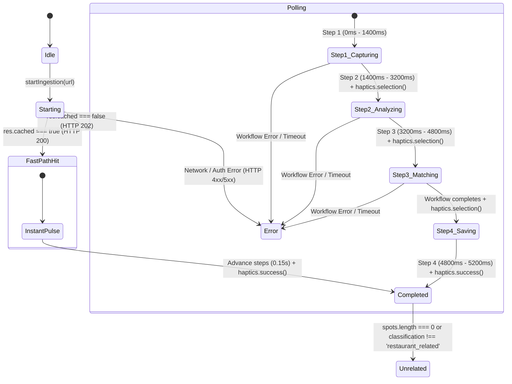

# Technical Specification: Incoming Social Share Feature (Instagram & TikTok Ingestion)

## 1. Executive Summary & Product Architecture

**Crumbs** ("*Spotify for Cravings*") requires an instant, frictionless capture pipeline for culinary recommendations discovered on Instagram and TikTok. When a user taps "Share" on an Instagram Reel or TikTok video and selects Crumbs, the app intercepts the share intent, parses and sanitizes the URL/caption, and initiates the ingestion pipeline with real-time visual progress feedback and instant preview resolution.

### 1.1 End-to-End System Flow



---

## 2. Native Configuration & Package Setup

### 2.1 Package Installation

We utilize `expo-share-intent` (v8.0+) to bridge native OS share sheets on both iOS and Android into React Native:

```bash
bun add expo-share-intent
```

### 2.2 `mobile/app.json` Configuration Plugin

Add the `expo-share-intent` config plugin and deep link scheme to `mobile/app.json`:

```json
{
  "expo": {
    "name": "Crumbs",
    "slug": "crumbs",
    "version": "1.0.0",
    "scheme": "crumbs",
    "ios": {
      "bundleIdentifier": "com.kasseling.crumbs",
      "entitlements": {
        "com.apple.security.application-groups": ["group.com.kasseling.crumbs"]
      }
    },
    "android": {
      "package": "com.kasseling.crumbs",
      "intentFilters": [
        {
          "action": "SEND",
          "category": ["DEFAULT"],
          "data": {
            "mimeType": "text/plain"
          }
        }
      ]
    },
    "plugins": [
      "expo-router",
      [
        "expo-splash-screen",
        {
          "backgroundColor": "#208AEF",
          "image": "./assets/images/splash-icon.png",
          "imageWidth": 76
        }
      ],
      [
        "expo-share-intent",
        {
          "ios": {
            "AppGroup": "group.com.kasseling.crumbs",
            "shareExtensionVersion": "1.0.0"
          },
          "android": {
            "packageNames": [
              "com.instagram.android",
              "com.zhiliaoapp.musically",
              "com.ss.android.ugc.trill"
            ]
          }
        }
      ]
    ]
  }
}
```

### 2.3 Platform Adaptation Notes

- **iOS Share Extension**: `expo-share-intent` creates a lightweight iOS App Extension target sharing user defaults via the App Group `group.com.kasseling.crumbs`. When a link is shared from Instagram/TikTok, the extension stores the shared text/URL and launches the main Crumbs app via the custom URI scheme `crumbs://`.
- **Android `ACTION_SEND`**: Intercepts `android.intent.action.SEND` with MIME type `text/plain` and extracts `android.intent.extra.TEXT`.

---

## 3. Client-Side Social URL Parsing & Sanitization

### 3.1 Module: `mobile/src/utils/social-url.ts`

When Instagram or TikTok share intents fire, the OS payload often contains mixed text, creator captions, hashtags, and tracking parameters. `social-url.ts` cleans and normalizes this input before calling backend APIs.

```ts
export type SocialPlatform = 'instagram' | 'tiktok' | 'unknown';
export type SocialPostType = 'reel' | 'carousel' | 'post' | 'video' | 'unknown';

export interface ExtractedSocialShare {
  /** Clean, canonical URL ready for ingestion API */
  url: string | null;
  /** Raw unparsed URL extracted from string */
  rawUrl: string | null;
  /** Target social media platform */
  platform: SocialPlatform;
  /** Unique platform post ID (e.g. shortcode or video ID) */
  platformPostId: string | null;
  /** Detected post type */
  postType: SocialPostType;
  /** Extracted residual caption text without URL */
  initialCaption?: string;
}

export interface ParsedSocialUrl {
  platform: SocialPlatform;
  platformPostId: string | null;
  postType: SocialPostType;
}
```

### 3.2 Regular Expressions & Sanitization Rules

1. **Instagram Patterns**:
   - Matches: `https?:\/\/(?:www\.)?instagram\.com\/(?:p|reel|reels|tv|share\/reel)\/([A-Za-z0-9_-]+)`
   - Tracking params stripped: `igsh`, `utm_source`, `utm_medium`, `utm_campaign`, `igshid`, `fbclid`
   - Canonical format: `https://www.instagram.com/reel/[id]/` or `https://www.instagram.com/p/[id]/`

2. **TikTok Patterns**:
   - Standard: `https?:\/\/(?:www\.)?tiktok\.com\/@([A-Za-z0-9_.-]+)\/video\/(\d+)`
   - Short Links: `https?:\/\/(?:vm|vt|t)\.tiktok\.com\/([A-Za-z0-9_-]+)`
   - Tracking params stripped: `_t`, `_r`, `is_from_webapp`, `sender_device`, `utm_*`

3. **URL Extraction from Captions (`extractSocialUrl`)**:
   - Scans text using a broad URL regex `https?:\/\/[^\s]+`
   - Filters and sanitizes candidate URLs matching Instagram or TikTok domains
   - Cleans leading/trailing punctuation (e.g. `.` or `,` attached to URLs)
   - Strips the matched URL from the raw string to extract any accompanying caption text

### 3.3 Core Function Signatures

```ts
/**
 * Sanitizes tracking query parameters while preserving the core canonical URL.
 */
export function sanitizeSocialUrl(rawUrl: string): string;

/**
 * Parses platform, platformPostId, and postType from a clean social media URL.
 */
export function parseSocialUrl(url: string): ParsedSocialUrl;

/**
 * Extracts social media URLs and residual caption text from an incoming OS share string.
 */
export function extractSocialUrl(rawText: string): ExtractedSocialShare;

/**
 * Validates whether a given string contains a supported Instagram or TikTok post URL.
 */
export function isValidSocialUrl(url: string): boolean;
```

---

## 4. TypeScript Contracts & Data Models

### 4.1 Module: `mobile/src/types/ingest.ts`

These types establish strict symmetry with `api/src/modules/ingest/ingest.types.ts` and the backend `POST /ingest` and `GET /ingest/:instanceId` endpoints.

```ts
export type IngestionStepId = 'capturing' | 'analyzing' | 'matching' | 'saved';

export type IngestionStepStatus = 'pending' | 'active' | 'completed' | 'error';

export interface IngestionStep {
  id: IngestionStepId;
  label: string;
  sublabel?: string;
  status: IngestionStepStatus;
  elapsedMs?: number;
}

export interface PlaceOpeningPeriod {
  day?: number;
  open?: string;
  close?: string;
}

export interface PlaceDetails {
  placeId?: string;
  name: string;
  formattedAddress?: string;
  neighborhood?: string;
  latitude?: number;
  longitude?: number;
  mapsUrl?: string;
  websiteUrl?: string;
  rating?: number;
  userRatingCount?: number;
  priceLevel?: string;
  photoUrl?: string;
  regularOpeningHours?: PlaceOpeningPeriod[];
  editorialSummary?: string;
  communityFavoriteDish?: string;
  reservationUrl?: string;
  reservationProvider?: 'resy' | 'opentable' | 'sevenrooms' | 'tock' | 'custom';
}

export interface PostAttribution {
  heroDish?: string | null;
  vibeAnchor?: string | null;
  courseCategory?: string | null;
  walkInTips?: string | null;
  vibeTags: string[];
  recommendedDishes: string[];
  creatorNotes?: string | null;
}

export interface EnrichedRestaurant {
  name: string;
  cuisine?: string;
  address?: string;
  city?: string;
  state?: string;
  country?: string;
  heroDish?: string;
  vibeAnchor?: string;
  courseCategory?: 'aperitif' | 'main' | 'dessert' | 'cafe_bakery' | 'cocktail_bar' | 'snack';
  walkInTips?: string;
  reservationProvider?: 'resy' | 'opentable' | 'sevenrooms' | 'tock' | 'custom';
  reservationUrl?: string;
  vibeTags: string[];
  recommendedDishes: string[];
  notes?: string;
  placeDetails: PlaceDetails;
}

export interface ProcessedCrumbPayload {
  url: string;
  guideId: string | null;
  userId: string | null;
  platform: 'instagram' | 'tiktok' | 'unknown';
  postType: 'reel' | 'carousel' | 'post' | 'video' | 'unknown';
  platformPostId: string | null;
  authorUsername?: string | null;
  caption: string;
  locationName: string | null;
  mediaUrls: string[];
  classification:
    | 'restaurant_related'
    | 'travel_unrelated_to_restaurants'
    | 'random_unrelated';
  summary: string;
  restaurants: EnrichedRestaurant[];
  processedAt: string;
}

/**
 * Normalized representation of a single restaurant spot extracted from an ingestion payload.
 * Unifies both Fast-Path Cache Hit and Async Cloudflare Workflow output formats.
 */
export interface UnifiedRestaurantSpot {
  id?: string;
  crumbId?: string;
  name: string;
  googlePlaceId?: string | null;
  formattedAddress: string;
  neighborhood?: string;
  rating?: number | null;
  userRatingCount?: number | null;
  priceLevel?: string | null;
  photoUrl?: string | null;
  mapsUrl?: string | null;
  websiteUrl?: string | null;
  reservationUrl?: string | null;
  reservationProvider?: string | null;
  heroDish?: string | null;
  vibeAnchor?: string | null;
  courseCategory?: string | null;
  walkInTips?: string | null;
  vibeTags: string[];
  recommendedDishes: string[];
  editorialSummary?: string | null;
}

/**
 * Finalized UI payload consumed by IngestionOverlaySheet and child views.
 */
export interface UnifiedIngestionResult {
  sourceUrl: string;
  authorUsername?: string | null;
  caption?: string;
  classification: 'restaurant_related' | 'travel_unrelated_to_restaurants' | 'random_unrelated';
  summary: string;
  isCachedHit: boolean;
  spots: UnifiedRestaurantSpot[];
}
```

---

## 5. Ingestion State Machine & Polling Hook

### 5.1 Hook: `mobile/src/hooks/useIngestion.ts`

The `useIngestion` hook orchestrates dispatching `POST /ingest`, detecting instant fast-path cache hits, polling `GET /ingest/:instanceId`, pacing the 4-step live animation progress, and coordinating haptic triggers.



### 5.2 Hook State & Interface

```ts
export type IngestionPhase =
  | 'idle'
  | 'starting'
  | 'in_progress'
  | 'fast_path_resolved'
  | 'completed'
  | 'unrelated'
  | 'error';

export interface UseIngestionOptions {
  guideId?: string;
  onSuccess?: (result: UnifiedIngestionResult) => void;
  onError?: (error: Error) => void;
}

export interface UseIngestionReturn {
  phase: IngestionPhase;
  steps: IngestionStep[];
  activeStepIndex: number;
  result: UnifiedIngestionResult | null;
  error: Error | null;
  isPolling: boolean;
  startIngestion: (url: string) => Promise<void>;
  cancelIngestion: () => void;
  retry: () => void;
}
```

### 5.3 Step Timing & Dynamic Polling Engine

1. **Step Progression Milestones**:
   - `Step 1 (Capturing Crumb... 🍞)`: Active from $T+0\text{ms}$ to $T+1400\text{ms}$.
   - `Step 2 (Analyzing video & caption ✨)`: Active from $T+1400\text{ms}$ to $T+3200\text{ms}$.
   - `Step 3 (Matching Google Place & Hero Dish 📍)`: Active from $T+3200\text{ms}$ to workflow completion.
   - `Step 4 (Saved to Inbox! 🌿)`: Triggers on completion, pauses for $400\text{ms}$ to show success banner, then springs open the preview card.

2. **Polling Frequency**:
   - Interval: $1200\text{ms}$ interval polling `GET /ingest/:instanceId`.
   - Timeout: Max 45 seconds total polling window before issuing a retryable timeout error.
   - Early Completion: If the backend finishes at $T+2500\text{ms}$, the hook rapidly advances remaining steps with brief $150\text{ms}$ checkmark transitions and proceeds to `completed`.

3. **Fast-Path Cache Hit (<150ms)**:
   - When `apiClient.ingest.$post()` returns `cached: true`, all 4 steps mark `completed` in $150\text{ms}$, `haptics.success()` triggers immediately, and the resolved card mounts with the `⚡ Instant Match from Crumbs Community` pill.

---

## 6. UI Component Architecture

```
mobile/src/components/ingestion/
├── IngestionOverlaySheet.tsx      # Main controller & in-sheet navigation container
├── IngestionProgressSteps.tsx     # Animated 4-step pipeline list with Reanimated
├── IngestionCrumbCard.tsx         # Hero photo, hero dish badge, vibe tags & metadata
├── CrumbsPickerCarousel.tsx       # Swipeable carousel for multi-restaurant reels
├── GuidePickerView.tsx            # In-sheet guide picker for rapid assignment
└── IngestionErrorState.tsx        # Graceful error & manual search fallback container
```

### 6.1 `IngestionOverlaySheet.tsx` (Main Sheet Controller)

- **Presentation**: `Modal` with `presentationStyle={Platform.OS === 'ios' ? 'pageSheet' : 'overFullScreen'}`.
- **Surface**: Warm Buttercream (`Theme.colors.background`) surface with `Theme.radii.sheet` (36pt) top corners.
- **Backdrop**: Deep Espresso (`Theme.colors.canvas`) scrim overlay.
- **Header**: Tactile pill grab handle (`Theme.colors.grabHandle`, `width: 36`, `height: 5`).
- **Footer Actions**:
  - `[ Run in Background ]`: Closes overlay without cancelling backend workflow; displays a toast confirmation.
  - `[ Cancel ]`: Cancels polling and dismisses overlay (`haptics.tap()`).

### 6.2 `IngestionProgressSteps.tsx` (4-Stage Pipeline Animation)

- **Bread Pulse Micro-Interaction**:
  - Bread emoji icon container (`🍞 ✨`) oscillating smoothly using React Native Reanimated:
    ```ts
    const scale = useSharedValue(1);
    useEffect(() => {
      scale.value = withRepeat(
        withSequence(
          withTiming(1.08, { duration: 800, easing: Easing.inOut(Easing.ease) }),
          withTiming(1.0, { duration: 800, easing: Easing.inOut(Easing.ease) })
        ),
        -1,
        true
      );
    }, []);
    ```
- **Step Item Component**:
  - **Completed**: `Theme.colors.success` circle with `✓` checkmark + subtle bounce scale.
  - **Active**: `Theme.colors.primary` filled dot with animated pulsing glow track + `[•••]` indicator.
  - **Pending**: `Theme.colors.textSubtle` outlined circle `○`.
- **Haptic Milestone Dispatch**: Fires `haptics.selection()` on each step transition.

### 6.3 `IngestionCrumbCard.tsx` (Single Spot Match)

- **Provenance Header**: `🌿 SAVED TO INBOX` on left, `@creator on Instagram 📸` provenance badge on right.
- **16:9 Hero Photography Container**:
  - Uses `expo-image` with `contentFit="cover"`.
  - Gradient scrim overlay (`rgba(0,0,0,0.6)` at bottom to `transparent` at 60%).
- **Overlaid Hero Dish Badge**:
  - Positioned bottom-left of hero photo.
  - White container (`Theme.colors.cardBackground`), `Theme.colors.primary` icon, bold 12pt sans-serif:
    `🍝 MUST-ORDER: [Hero Dish Name]`
- **Restaurant Display Title**:
  - Georgia Serif bold display font (22pt) on iOS, `serif` on Android (`Theme.colors.text`).
- **Metadata Line**:
  - Price Tier (`$$$`) · Google Rating (`4.6 ★`) · Neighborhood (`West Village`).
- **Vibe Anchor Quote**:
  - AI-synthesized sensory quotation in `Theme.colors.textMuted` (e.g. *“Low-lit rustic Tuscan trattoria with fresh pasta”*).
- **Vibe Tag Pills**:
  - Horizontal chip wrap with `Theme.colors.inputBackground`, `Theme.radii.pill`, and `Theme.colors.text`.
- **Tactical Walk-In Note**:
  - Amber callout banner if `walkInTips` was extracted from creator caption.
- **Action Buttons**:
  - Primary CTA: `[ 🗺️ Add to Guide ]` (`Theme.colors.primary`, 52pt height, `haptics.primary()`).
  - Secondary CTA: `[ 📥 View in Inbox ]` (`Theme.colors.inputBackground`, `Theme.colors.inputBorder`, `haptics.tap()`).

### 6.4 `CrumbsPickerCarousel.tsx` (Multi-Spot Ingestion Selector)

- **Trigger**: Rendered when `result.spots.length >= 2`.
- **Header**: `✨ [N] SPOTS DISCOVERED IN REEL` + creator attribution subtitle.
- **Horizontal Scroll Snap**:
  - `ScrollView` with `horizontal`, `pagingEnabled={false}`, `snapToInterval={CARD_WIDTH + SPACING}`, `decelerationRate="fast"`.
  - Individual spot cards displaying spot thumbnail, hero dish, restaurant name, neighborhood, price level, and per-spot selection indicator.
- **Pagination Indicator**:
  - Active dot pill (`Theme.colors.primary`) and inactive dots (`Theme.colors.inputBorder`).
  - Fires `haptics.selection()` on scroll page index change.
- **Bulk Action CTAs**:
  - Primary CTA contains a count of selected spots: `[ 🗺️ Add X Spots to Guide ]` (`haptics.primary()`).
  - Secondary: `[ 📥 View All in Inbox ]` (`haptics.tap()`).

### 6.5 `GuidePickerView.tsx` (Rapid Guide Selector)

- **Trigger**: Transitions in-sheet over the preview card when `[ Add to Guide ]` is pressed.
- **Guide List**:
  - Queries user guides via `useGuidesQuery()`.
  - Renders guide row with emoji icon, guide title, spot count (`X spots`), and select indicator.
- **New Guide Action**:
  - `[ + Create New Guide ]` row at the top of the list transitions to `CreateGuideForm`.
- **Selection Action**:
  - Tapping a guide links the crumb ID(s) to the guide (batch linking supported), triggers `haptics.success()`, and closes overlay with feedback.

### 6.6 `IngestionErrorState.tsx` (Edge & Fallback States)

- **Scenario 1: Non-Restaurant / Travel / Random Post**:
  - Header: *"Scenic Post Detected 🌴"*
  - Body: *"We analyzed this post, but couldn't pinpoint a specific restaurant or food spot."*
  - Actions: `[ 🔍 Search Place Manually ]` (Primary) + `[ Dismiss ]`.
- **Scenario 2: Scraper / AI / Network Error**:
  - Header: *"Couldn't Capture Spot 🍞"*
  - Error Box: `Theme.colors.errorBackground` with `Theme.colors.errorBorder`.
  - Body: *"Instagram rate limit or temporary network hiccup. Would you like to retry or add manually?"*
  - Actions: `[ 🔄 Try Ingesting Again ]` (Primary Terracotta CTA) + `[ 🔍 Search Manually ]`.
- **Haptics**: Triggers `haptics.error()` upon mounting error state.

---

## 7. Root Layout Integration (`mobile/src/app/_layout.tsx`)

### 7.1 Lifecycle & Listener Mounting

The root layout listens for share intents across cold and warm app launches:

```tsx
import { useShareIntent } from 'expo-share-intent';
import { extractSocialUrl, isValidSocialUrl } from '@/utils/social-url';
import { IngestionOverlaySheet } from '@/components/ingestion/IngestionOverlaySheet';
import { haptics } from '@/utils/haptics';

export default function RootLayout() {
  const { hasShareIntent, shareIntent, resetShareIntent } = useShareIntent({
    resetOnBackground: true,
  });

  const [overlayState, setOverlayState] = useState<{
    visible: boolean;
    sourceUrl: string;
    initialCaption?: string;
  }>({
    visible: false,
    sourceUrl: '',
  });

  useEffect(() => {
    if (hasShareIntent && shareIntent.value) {
      const extracted = extractSocialUrl(shareIntent.value);
      if (extracted.url && isValidSocialUrl(extracted.url)) {
        haptics.tap();
        setOverlayState({
          visible: true,
          sourceUrl: extracted.url,
          initialCaption: extracted.initialCaption,
        });
      }
    }
  }, [hasShareIntent, shareIntent]);

  const handleCloseOverlay = () => {
    setOverlayState((prev) => ({ ...prev, visible: false }));
    resetShareIntent();
  };

  return (
    <KeyboardProvider>
      <QueryClientProvider client={queryClient}>
        <AppNavigator />
        {overlayState.visible && (
          <IngestionOverlaySheet
            visible={overlayState.visible}
            sourceUrl={overlayState.sourceUrl}
            initialCaption={overlayState.initialCaption}
            onClose={handleCloseOverlay}
            onNavigateToInbox={(crumbId) => {
              handleCloseOverlay();
              router.push('/(tabs)/inbox');
            }}
          />
        )}
      </QueryClientProvider>
    </KeyboardProvider>
  );
}
```

---

## 8. Tactile Haptics & Design System Compliance

### 8.1 Complete Haptic Feedback Matrix

All tactile interactions strictly call `@/utils/haptics`:

| User Action / System Event | Haptic Method | Feedback Style & Rationale |
| :--- | :--- | :--- |
| **Share Sheet Intercepted / Overlay Opens** | `haptics.tap()` | Light subtle click acknowledging intent capture |
| **Step 1 Complete (Scraped)** | `haptics.selection()` | Mechanical selection tick |
| **Step 2 Complete (AI Analyzed)** | `haptics.selection()` | Discrete selection tick |
| **Step 3 Complete (Places Matched)** | `haptics.selection()` | Discrete selection tick |
| **Crumb Saved & Card Revealed** | `haptics.success()` | Celebratory double-pulse confirmation |
| **Fast-Path Cache Hit (Instant)** | `haptics.success()` | Immediate double-pulse success notification |
| **Press Primary CTA `[ Add to Guide ]`** | `haptics.primary()` | Medium impact satisfying press |
| **Select Guide in Guide Picker** | `haptics.selection()` | Discrete tick per guide selection |
| **Guide Assignment Confirmed** | `haptics.success()` | Async operation success vibration |
| **Press Secondary CTA `[ View in Inbox ]`** | `haptics.tap()` | Crisp light tap |
| **Multi-Spot Carousel Page Swipe** | `haptics.selection()` | Subtle page change tick |
| **Ingestion Pipeline Error / Unrelated** | `haptics.error()` | Heavy buzz signaling failure/warning |
| **Dismiss Overlay / Swipe Down** | `haptics.tap()` | Smooth exit tick |

### 8.2 Design Token Enforcement

- **Zero Hardcoded Colors**: All colors use `Theme.colors.*` (`Theme.colors.background`, `Theme.colors.cardBackground`, `Theme.colors.primary`, `Theme.colors.text`, `Theme.colors.textMuted`, etc.).
- **Zero Magic Radii**: Use `Theme.radii.sheet` (`36pt`), `Theme.radii.xl` (`24pt`), `Theme.radii.lg` (`18pt`), `Theme.radii.pill` (`999pt`).
- **Keyboard Handling**: All interactive sheets and modals with text inputs use `KeyboardAwareScrollView` from `react-native-keyboard-controller`.

---

## 9. Implementation Roadmap & Verification

### 9.1 File Creation & Modification Checklist

- [ ] **1. Native Configuration**:
  - Update `mobile/package.json` to include `expo-share-intent`.
  - Update `mobile/app.json` with App Group, Scheme, Intent Filter, and Config Plugin.
- [ ] **2. Type Definitions**:
  - Create `mobile/src/types/ingest.ts` defining `EnrichedRestaurant`, `PlaceDetails`, `ProcessedCrumbPayload`, `UnifiedRestaurantSpot`, and `UnifiedIngestionResult`.
- [ ] **3. Social URL Parser**:
  - Create `mobile/src/utils/social-url.ts` implementing `extractSocialUrl`, `sanitizeSocialUrl`, `parseSocialUrl`, and `isValidSocialUrl`.
- [ ] **4. Ingestion Workflow Hook**:
  - Create `mobile/src/hooks/useIngestion.ts` with Fast-Path cache hit handling, step timing, dynamic polling, and haptics.
- [ ] **5. Ingestion UI Components**:
  - Create `mobile/src/components/ingestion/IngestionProgressSteps.tsx` (Reanimated 3 bread pulse + 4-step pipeline).
  - Create `mobile/src/components/ingestion/IngestionCrumbCard.tsx` (Hero photo, hero dish pill, Georgia title, vibe tags).
  - Create `mobile/src/components/ingestion/CrumbsPickerCarousel.tsx` (Horizontal snap carousel for 2+ spots).
  - Create `mobile/src/components/ingestion/GuidePickerView.tsx` (Guide picker + `CreateGuideForm` integration).
  - Create `mobile/src/components/ingestion/IngestionErrorState.tsx` (Non-restaurant detection + pipeline error retry).
  - Create `mobile/src/components/ingestion/IngestionOverlaySheet.tsx` (In-sheet navigation coordinator).
- [ ] **6. Root Layout Integration**:
  - Update `mobile/src/app/_layout.tsx` to mount `useShareIntent()` and `IngestionOverlaySheet`.
- [ ] **7. Quality & Verification**:
  - Run `bun run check` (`tsc --noEmit && oxlint . && prettier . --check`) to verify strict zero-error compliance.
