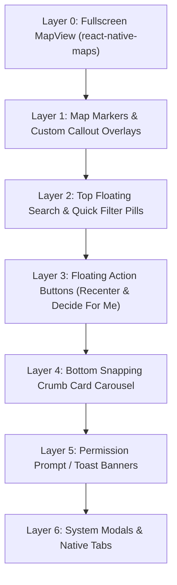
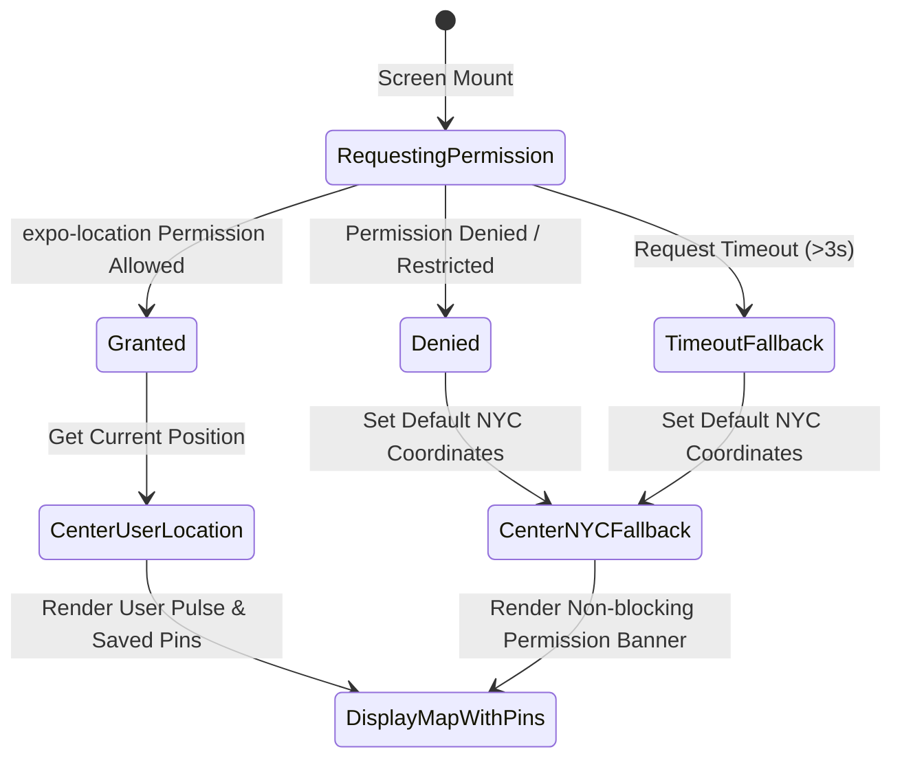

# Design Specification: Live Cravings Map (Home Tab)

## 1. Overview & Experience Principles

The **Live Cravings Map** (internally designated as the **Living Map** / **Cravings Map**) is the flagship home experience of Crumbs. It transforms a user's personal culinary bookmarks ("crumbs") saved from social media (Instagram, TikTok) into an interactive, visual, and geographic food discovery canvas ("Spotify for Cravings").

### Core UX Principles

1. **User-First Culinary Footprint**: Displays **only the user's saved crumbs** (across inbox, organized guides, and visited places) without cluttering third-party ad pins or unvetted directory noise.
2. **Effortless Geolocation with Graceful Fallback**: Automatically centers on the user's live coordinates via `expo-location` if permission is granted. If permission is denied, restricted, or undetermined, defaults smoothly to **New York City (Lower Manhattan / West Village)**.
3. **Warm, Appetizing Editorial Aesthetic**: Adheres strictly to Crumbs design tokens (`mobile/src/theme/tokens.ts` and `mobile/DESIGN.md`) — Warm Buttercream (`#F7F4EF`), Deep Espresso (`#1E1915`), Terracotta Brand Action (`#C45B3E`), Sage/Pistachio (`#7C9070`), and Warm Gold (`#DFB064`) with `Georgia` serif display typography.
4. **Synchronized Map & Card Carousel**: Interacting with map pins seamlessly brings up and centers the corresponding bottom preview card, and swiping cards smoothly pans the map camera to the selected pin.
5. **Thumb-Zone Ergonomics & Liquid Glass Controls**: Floating glass search/filter pill at the top and floating action island at the bottom (Decide Now, Recenter, Guide Filter) designed for one-handed thumb reach.

---

## 2. Information Architecture & Screen Layout

```
┌──────────────────────────────────────────────────────────┐
│  StatusBar (Time, Battery, Wifi)                         │
├──────────────────────────────────────────────────────────┤
│                                                          │
│  ┌────────────────────────────────────────────────────┐  │
│  │ 🔍 Search saved spots, vibes...    [ 📍 NYC ▾ ] [⚙️] │  │ ── Floating Glass Top Bar
│  └────────────────────────────────────────────────────┘  │
│                                                          │
│  ┌────────────────────────────────────────────────────┐  │
│  │ ( All 18 ) ( 🍷 Soho Date ) ( 🟢 Open ) ( 🍝 Pasta )│  │ ── Filter Chips Carousel
│  └────────────────────────────────────────────────────┘  │
│                                                          │
│                        [ 📍 Crumb Pin ]                  │
│                                                          │
│            [ 🌟 Active Selected Pin ]                    │
│                                                          │
│                                                          │
│                                    ┌──────────────────┐  │
│                                    │  [ ⌖ Recenter ]  │  │ ── Floating Controls
│                                    │  [ 🎲 Decide ]   │  │
│                                    └──────────────────┘  │
│                                                          │
│  ┌────────────────────────────────────────────────────┐  │
│  │ ┌──────────┐  Via Carota                  $$$ · 4.8★│ │
│  │ │          │  West Village · ● Open until 11 PM    │  │ ── Bottom Snapping
│  │ │  Photo   │  ✨ Must-Order: Cacio e Pepe Tagliat   │  │    Crumb Carousel
│  │ │          │  [ 🍷 Book Table ]  [ ➕ Guide ] [ › ] │  │    (CompactCrumbCard)
│  │ └──────────┘                                       │  │
│  └────────────────────────────────────────────────────┘  │
├──────────────────────────────────────────────────────────┤
│  [ 🗺️ Map ]          [ 📑 Guides ]          [ 📥 Inbox ] │ ── Native Tab Bar
└──────────────────────────────────────────────────────────┘
```

### Layer Hierarchy (Z-Index & Stacking)



---

## 3. Geolocation & Camera Lifecycle

### Geolocation State Machine



### Coordinate Defaults

| Location Target | Latitude | Longitude | Latitude Delta | Longitude Delta | Context |
| :--- | :--- | :--- | :--- | :--- | :--- |
| **NYC Default Fallback** | `40.7282` | `-73.9942` | `0.045` | `0.045` | West Village / Soho culinary epicenter |
| **Current User Location** | `user.coords.latitude` | `user.coords.longitude` | `0.035` | `0.035` | Standard neighborhood zoom |
| **Fit All Pins (Overview)** | `bounds.centerLat` | `bounds.centerLng` | `bounds.latSpan * 1.2` | `bounds.lngSpan * 1.2` | When user taps "View All" or toggles Guide |

### Camera Animation Specs
- **Default Transition**: `mapRef.animateToRegion(targetRegion, 600)` with ease-in-out curve.
- **Marker Focus Transition**: Panning smoothly to selected pin coordinate offset slightly upwards (`lat - delta * 0.15`) so the bottom card does not obscure the pin.
- **Recenter Action**: Animates directly to user coordinates with subtle `haptics.selection()`.

---

## 4. Map Styling & Aesthetic System

### Light & Dark Map Color Harmony

The map adopts custom styling to blend seamlessly into Crumbs' editorial palette rather than generic neon vector maps:

```ts
// Semantic Map Styling Tokens
export const MapTheme = {
  light: {
    water: '#D6E4E5',
    landscape: '#F7F4EF',      // Background Buttercream
    road: '#FFFFFF',
    poi: '#EFE9DF',
    building: '#E8E1D5',
    text: '#1A1715',
  },
  dark: {
    water: '#10171D',
    landscape: '#141210',      // Deep Espresso Dark Background
    road: '#1F1B17',
    poi: '#27221E',
    building: '#2E2822',
    text: '#F5F2EC',
  }
};
```

---

## 5. Map Pin & Marker Design System

Pins are designed to communicate immediate culinary intent (Hero Dish, Vibe, Status) without opening the card.

```
┌─────────────────────────┐
│     Unselected Pin      │
│  ┌───────────────────┐  │
│  │ 🍝  Via Carota    │  │  ── Terracotta pill (#C45B3E) / Ivory text
│  └─────────┬─────────┘  │
│            ▼            │
└─────────────────────────┘

┌─────────────────────────┐
│   Selected Active Pin   │
│  ┌───────────────────┐  │
│  │ ★ 🍝 VIA CAROTA   │  │  ── Scaled 1.2x, Primary highlight,
│  │   $$$ · 4.8★      │  │     Specular border with shadow halo
│  └─────────┬─────────┘  │
│            ▼            │
└─────────────────────────┘

┌─────────────────────────┐
│       Visited Pin       │
│  ┌───────────────────┐  │
│  │ ✓ 🍷 Buvette      │  │  ── Sage/Pistachio badge (#7C9070)
│  └─────────┬─────────┘  │
│            ▼            │
└─────────────────────────┘

┌─────────────────────────┐
│     Inbox / New Pin     │
│  ┌───────────────────┐  │
│  │ ✨ 🥐 Librae      │  │  ── Warm Gold badge (#DFB064)
│  └─────────┬─────────┘  │
│            ▼            │
└─────────────────────────┘
```

### Marker Component Anatomy (`CrumbMapMarker`)

1. **Category Emoji / Dish Icon**: Extracted hero dish emoji (e.g. 🍕, 🍜, 🍸, ☕, 🥐) or default `ForkKnife` icon.
2. **Compact Restaurant Name**: Bold 11pt platform sans-serif.
3. **Status Pill Fill**:
   - `saved`: `Theme.colors.primary` (`#C45B3E`)
   - `visited`: `Theme.colors.success` (`#7C9070`)
   - `inbox`: `Theme.colors.accent` (`#DFB064`)
4. **Active Selection State**:
   - Scales from `scale: 1.0` to `scale: 1.22` using Spring animation.
   - White 2pt halo outline (`#FFFFFF` in light, `Theme.colors.primaryLight` in dark).
   - Elevated Z-Index (`zIndex: 999`) to ensure it hovers above overlapping pins.

---

## 6. Bottom Snapping Crumb Carousel (`MapCrumbCarousel`)

Positioned directly above the thumb zone and native tabs.

### Visual & Interactive Behavior
- **Component**: Reuses `CompactCrumbCard` wrapped in a horizontal `FlatList` with `pagingEnabled={false}`, `snapToInterval={CARD_WIDTH + SPACING}`, and `decelerationRate="fast"`.
- **Card Sizing**: Width is `Dimensions.get('window').width - 48` (peeking adjacent cards by 16pt on each side).
- **Two-Way Synchronization**:
  1. **Pin Tap $\rightarrow$ Carousel**: Tapping any pin calls `carouselRef.scrollToIndex({ index, animated: true })` and highlights the card.
  2. **Carousel Swipe $\rightarrow$ Pin Focus**: Swiping to a card updates `selectedCrumbId` and calls `mapRef.animateToRegion` to center on that crumb's coordinates.
- **Card Actions**:
  - **Tap Card**: Navigates to full detail `/crumbs/[id]`.
  - **[ 🍷 Book Table ] / [ 📍 Map ]**: Triggers native table reservation or directions via `openDefaultMaps`.
  - **[ ➕ Guide ]**: Opens `QuickAddToGuideModal` to categorize.
  - **Dismiss / Collapse**: Swiping card downwards minimizes carousel into a floating pill (`"18 spots in view"`).

---

## 7. Floating Action Controls (Thumb Zone Island)

```
┌──────────────────────────────────────────────┐
│ [ ⌖ My Location ]          [ 🎲 Decide Now ] │
└──────────────────────────────────────────────┘
```

### 1. `MyLocationButton`
- **Design**: Floating circular Liquid Glass capsule (iOS: `expo-glass-effect`, Android: Material 3 container) with `location.fill` icon.
- **Behavior**:
  - If location is enabled: Pans back to user location smoothly (`haptics.selection()`).
  - If location was denied: Prompts system settings sheet or permission toast.

### 2. `DecideNowButton` ("Decide For Me")
- **Design**: High-contrast Terracotta capsule button with `SparkleIcon` / `DiceIcon` and label `"Decide Now"`.
- **Behavior**:
  - Filters crumbs currently visible in the map viewport (or within 5 miles).
  - Triggers rapid rolling haptic sequence (`haptics.primary()`).
  - Randomly selects a top-rated spot and triggers a camera swoop animation with celebratory particle / badge focus.

---

## 8. Filter Header & Guide Switcher

Located at the top of the map below safe area insets:

1. **Search Bar (`SearchInput`)**: Instant live text filtering of saved crumbs by restaurant name, neighborhood, cuisine, or hero dish.
2. **Guide Switcher Chip**: Dropdown pill showing active guide filter (e.g. `[ All Crumbs ▾ ]`, `[ 🍷 West Village Date Night ]`, `[ 🥐 Paris Bakery Tour ]`).
3. **Filter Pills**:
   - `All` (Default)
   - `Open Now` (Calculated using `getRestaurantOpenStatus`)
   - `Bookable 🍷` (Filters spots with Resy/OpenTable links)
   - `Unorganized ✨` (Inbox queue spots)
   - `Visited ✓`

---

## 9. Empty States & Permission Handling

### Scenario A: Location Permission Denied or Undetermined
- **Visual Presentation**: Map silently renders **New York City** coordinates. An unobtrusive floating pill banner appears below the search bar:
  > `📍 Showing NYC · Enable location to see nearby spots [ Enable ]`
- **User Action**: Tapping `[ Enable ]` re-triggers `Location.requestForegroundPermissionsAsync()`. If permanently denied, directs user gracefully to App Settings via `Linking.openSettings()`.

### Scenario B: Zero Crumbs Saved in Current Viewport
- **Visual Presentation**: Floating glass badge at top center:
  > `No saved crumbs in this area`
  > `[ Zoom to All Saved (18) ]` or `[ ➕ Add a Crumb ]`
- **Interaction**: Tapping `Zoom to All Saved` calculates bounding box of all user crumbs and animates camera to fit them.

### Scenario C: Brand New User (Zero Crumbs Globally)
- **Visual Presentation**: Translucent centered editorial card over the map:
  - Serif Title: *"Your Cravings Map is Fresh"*
  - Subtitle: *"Share food videos from Instagram & TikTok to watch your personal city guide come alive."*
  - CTA Button: `[ ➕ Add First Crumb ]` & `[ 🗺️ Explore Sample Guide ]`.

---

## 10. Platform-Specific Design Adaptations

| Element | iOS Implementation | Android Implementation |
| :--- | :--- | :--- |
| **Surfaces & Overlays** | Liquid Glass (`expo-glass-effect` with `1px` specular border) | Material 3 Tonal Container (`SurfaceContainerHigh` + elevation 4) |
| **Map Engine** | Apple Maps native (`PROVIDER_DEFAULT`) or Google Maps | Google Maps (`PROVIDER_GOOGLE`) |
| **Iconography** | SF Symbols (`location.fill`, `dice.fill`, `sparkle`) | Phosphor / Material Icons |
| **Carousel Snap** | Smooth decelerated inertia snap | Native page snapping |
| **Haptics** | Tactile selection & primary impulses via `haptics.*` | State layer touch ripple & Android haptic feedback |

---

## 11. Component Architecture & File Structure

```
mobile/src/
├── app/(tabs)/(home)/
│   └── index.tsx                     # Main Home Living Map screen
├── components/map/
│   ├── LiveCravingsMapView.tsx       # Core MapView wrapper with theme & camera control
│   ├── CrumbMapMarker.tsx            # Custom styled pin with hero dish emoji & state
│   ├── MapCrumbCarousel.tsx          # Horizontal snap carousel with CompactCrumbCard
│   ├── MapFilterBar.tsx              # Search input, Guide dropdown, and filter chips
│   ├── MapFloatingControls.tsx       # MyLocation & DecideNow floating capsules
│   ├── LocationPermissionBanner.tsx  # Unobtrusive permission recovery banner
│   └── MapEmptyStateOverlay.tsx      # Fresh user & empty viewport guidance
├── hooks/
│   ├── useUserLocation.ts            # expo-location permission & coords state hook
│   └── useMapCrumbs.ts               # Filtered & geographically clustered crumbs query
└── utils/
    ├── map-clustering.ts             # Viewport bounding box & pin distance helpers
    └── map-theme.ts                  # Light/Dark Map styling JSON configurations
```

---

## 12. Design Acceptance Criteria & Review Checklist

- [ ] Map opens immediately without blocking spinners; defaults to user location or NYC smoothly.
- [ ] Only user's saved crumbs are rendered as pins (no unverified third-party pins).
- [ ] Tapping a pin highlights it, plays a crisp tap haptic, and auto-scrolls the bottom carousel to that crumb.
- [ ] Swiping the bottom card carousel smoothly pans the map camera to the newly focused pin.
- [ ] Tapping a card opens the Crumb Detail view (`/crumbs/[id]`).
- [ ] "Decide Now" button picks a randomized craving from the current viewport with rolling haptics and focus animation.
- [ ] Search and filter chips immediately narrow down pins on the map in real time.
- [ ] Light and Dark modes render high-contrast, theme-consistent map palettes.
- [ ] Non-blocking handling for denied location permissions with 1-tap recovery.
- [ ] Respects safe area insets on all device form factors (iPhone Dynamic Island, Home Indicator, Android Nav Bar).
