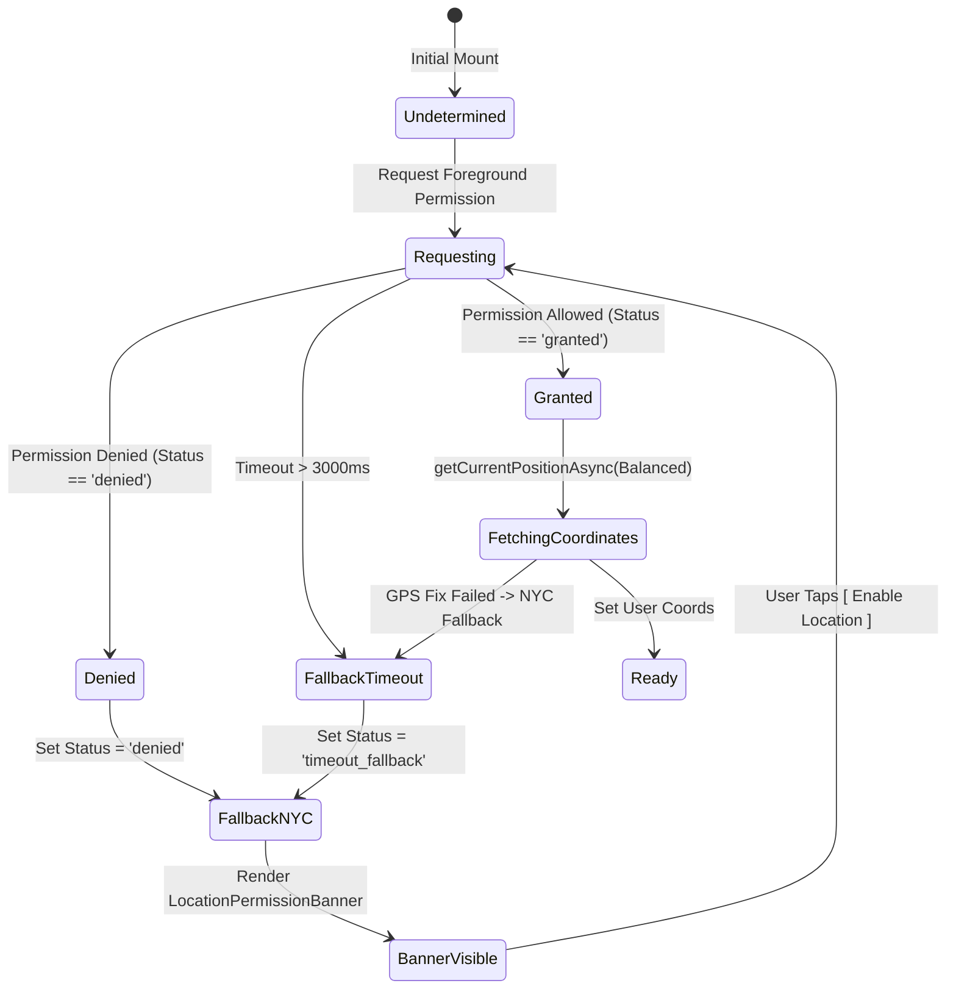
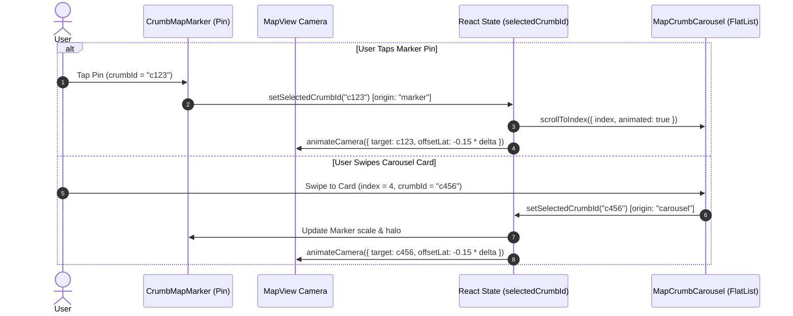
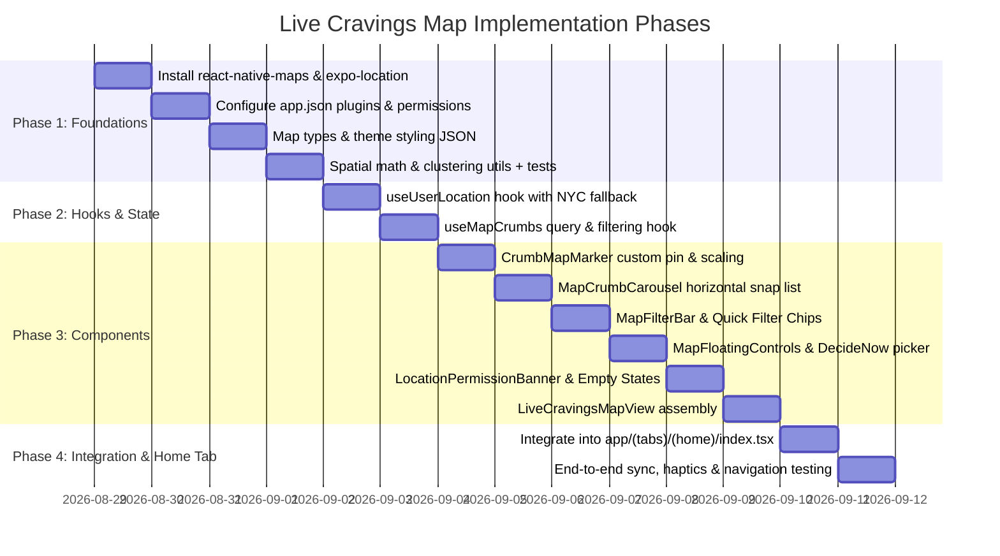

# Technical Specification: Live Cravings Map (Home Tab)

## 1. Executive Summary & Architectural Overview

The **Live Cravings Map** transforms the Crumbs Home tab (`mobile/src/app/(tabs)/(home)/index.tsx`) into a high-performance, interactive geospatial discovery canvas. Built upon `react-native-maps` and `expo-location`, it renders **only the authenticated user's saved crumbs** across all lifecycle states (Inbox, Organized Guides, and Visited spots).

### Architectural Goals & Invariants
1. **User Footprint Isolation**: Query and display strictly the user's personal culinary bookmarks from TanStack Query cache (`useCrumbsQuery`), without third-party directory or advertising noise.
2. **Resilient Geolocation State Machine**: Centers automatically on the user's current GPS coordinates via `expo-location`. If permissions are undetermined, denied, restricted, or timed out (>3s), gracefully falls back to **New York City (Lower Manhattan / West Village: `40.7282, -73.9942`)** and displays a non-blocking recovery banner.
3. **Bidirectional State Synchronization**:
   - **Pin Tap $\rightarrow$ Carousel**: Tapping a pin highlights the marker with a spring animation and scrolls the bottom card carousel to the corresponding crumb.
   - **Carousel Swipe $\rightarrow$ Camera Pan**: Swiping the card carousel smoothly moves the map camera to the target coordinate with an upward vertical offset (`latitude - latitudeDelta * 0.15`) so the bottom card never obscures the selected pin.
4. **Theme & Design Token Fidelity**: Custom light and dark map styling JSON matching the Crumbs editorial palette: Warm Buttercream (`#F7F4EF`), Deep Espresso (`#141210`), Terracotta (`#C45B3E`), Sage/Pistachio (`#7C9070`), and Warm Gold (`#DFB064`).
5. **Fluid Thumb-Zone Ergonomics**: Floating search pill, quick-filter chips, "Decide Now" randomized craving picker with rolling haptics, and location recenter buttons positioned for natural one-handed reach.

---

## 2. Dependencies & Native Platform Configuration

### 2.1 Package Dependencies

Install the required native map and location packages into `mobile/package.json`:

```bash
bun add react-native-maps expo-location
```

| Package | Purpose | Target Version |
| :--- | :--- | :--- |
| `react-native-maps` | Core interactive map view, custom markers, camera animations | `^1.20.1` (or Expo SDK 57 compatible `~1.20.1`) |
| `expo-location` | Foreground geolocation permissions & current GPS coordinates | `~19.0.8` (Expo SDK 57 compatible) |

### 2.2 Native Permissions Configuration (`mobile/app.json`)

Update `mobile/app.json` with permissions and config plugins:

```json
{
  "expo": {
    "ios": {
      "infoPlist": {
        "NSLocationWhenInUseUsageDescription": "Crumbs uses your location to show saved food spots and cravings near you on the map."
      }
    },
    "android": {
      "permissions": [
        "ACCESS_FINE_LOCATION",
        "ACCESS_COARSE_LOCATION"
      ]
    },
    "plugins": [
      "expo-router",
      "expo-splash-screen",
      "expo-share-intent",
      [
        "expo-location",
        {
          "locationWhenInUsePermission": "Crumbs uses your location to show saved food spots and cravings near you on the map."
        }
      ]
    ]
  }
}
```

---

## 3. Data Types & Models

### 3.1 Map Coordinate & Viewport Models (`mobile/src/types/map.ts`)

```ts
import type { EnrichedUserCrumb } from '@api/modules/crumbs/crumbs.types';

export interface MapCoordinates {
  latitude: number;
  longitude: number;
}

export interface MapRegion extends MapCoordinates {
  latitudeDelta: number;
  longitudeDelta: number;
}

export interface BoundingBox {
  minLat: number;
  maxLat: number;
  minLng: number;
  maxLng: number;
}

export type LocationPermissionStatus = 
  | 'undetermined'
  | 'granted'
  | 'denied'
  | 'restricted'
  | 'timeout_fallback';

export interface UserLocationState {
  coords: MapCoordinates | null;
  status: LocationPermissionStatus;
  isLoading: boolean;
  errorMessage: string | null;
}

export type MapQuickFilter = 
  | 'all'
  | 'open_now'
  | 'bookable'
  | 'unorganized'
  | 'visited';

export interface MapFilterState {
  searchQuery: string;
  selectedGuideId: string | null;
  quickFilter: MapQuickFilter;
}

export interface CrumbPinData {
  crumb: EnrichedUserCrumb;
  coordinate: MapCoordinates;
  heroEmoji: string;
  pinType: 'saved' | 'visited' | 'inbox';
}
```

### 3.2 NYC Coordinate Defaults

```ts
export const DEFAULT_NYC_COORDINATES: MapRegion = {
  latitude: 40.7282,
  longitude: -73.9942,
  latitudeDelta: 0.045,
  longitudeDelta: 0.045,
};

export const USER_NEIGHBORHOOD_ZOOM_DELTA = {
  latitudeDelta: 0.035,
  longitudeDelta: 0.035,
};
```

---

## 4. Custom Map Styling System (`mobile/src/utils/map-theme.ts`)

To prevent jarring generic vector neon blues and greens, `react-native-maps` consumes custom JSON styling conforming to Crumbs Warm Editorial tokens:

```ts
export const MAP_LIGHT_STYLE = [
  {
    elementType: 'geometry',
    stylers: [{ color: '#F7F4EF' }] // Background Buttercream
  },
  {
    elementType: 'labels.text.fill',
    stylers: [{ color: '#1E1915' }] // Deep Espresso text
  },
  {
    elementType: 'labels.text.stroke',
    stylers: [{ color: '#FFFFFF' }]
  },
  {
    featureType: 'administrative.land_parcel',
    elementType: 'labels.text.fill',
    stylers: [{ color: '#736B63' }]
  },
  {
    featureType: 'landscape.man_made',
    elementType: 'geometry.fill',
    stylers: [{ color: '#EFE9DF' }]
  },
  {
    featureType: 'landscape.natural',
    elementType: 'geometry.fill',
    stylers: [{ color: '#EDE5D8' }]
  },
  {
    featureType: 'poi',
    elementType: 'geometry',
    stylers: [{ color: '#E8E0D2' }]
  },
  {
    featureType: 'poi',
    elementType: 'labels.text.fill',
    stylers: [{ color: '#736B63' }]
  },
  {
    featureType: 'poi.business',
    stylers: [{ visibility: 'off' }] // Hide third-party clutter
  },
  {
    featureType: 'poi.park',
    elementType: 'geometry.fill',
    stylers: [{ color: '#DCE8D6' }] // Subtle Pistachio/Sage Park tint
  },
  {
    featureType: 'road',
    elementType: 'geometry',
    stylers: [{ color: '#FFFFFF' }] // Clean crisp white roads
  },
  {
    featureType: 'road',
    elementType: 'labels.text.fill',
    stylers: [{ color: '#736B63' }]
  },
  {
    featureType: 'road.arterial',
    elementType: 'geometry',
    stylers: [{ color: '#FDFBF7' }]
  },
  {
    featureType: 'road.highway',
    elementType: 'geometry',
    stylers: [{ color: '#F2E8D8' }]
  },
  {
    featureType: 'road.highway',
    elementType: 'labels.text.fill',
    stylers: [{ color: '#61584F' }]
  },
  {
    featureType: 'transit',
    stylers: [{ visibility: 'simplified' }]
  },
  {
    featureType: 'transit.station',
    elementType: 'labels.text.fill',
    stylers: [{ color: '#7C9070' }]
  },
  {
    featureType: 'water',
    elementType: 'geometry',
    stylers: [{ color: '#D6E4E5' }] // Soft Muted Blue-Grey Water
  },
  {
    featureType: 'water',
    elementType: 'labels.text.fill',
    stylers: [{ color: '#5B7A7C' }]
  }
];

export const MAP_DARK_STYLE = [
  {
    elementType: 'geometry',
    stylers: [{ color: '#141210' }] // Deep Espresso background
  },
  {
    elementType: 'labels.text.fill',
    stylers: [{ color: '#F5F2EC' }] // Light Ivory text
  },
  {
    elementType: 'labels.text.stroke',
    stylers: [{ color: '#141210' }]
  },
  {
    featureType: 'landscape.man_made',
    elementType: 'geometry.fill',
    stylers: [{ color: '#1F1B17' }]
  },
  {
    featureType: 'landscape.natural',
    elementType: 'geometry.fill',
    stylers: [{ color: '#1A1714' }]
  },
  {
    featureType: 'poi',
    elementType: 'geometry',
    stylers: [{ color: '#27221E' }]
  },
  {
    featureType: 'poi.business',
    stylers: [{ visibility: 'off' }]
  },
  {
    featureType: 'poi.park',
    elementType: 'geometry.fill',
    stylers: [{ color: '#1B2418' }] // Deep Sage Park tint
  },
  {
    featureType: 'road',
    elementType: 'geometry',
    stylers: [{ color: '#231E1A' }]
  },
  {
    featureType: 'road',
    elementType: 'labels.text.fill',
    stylers: [{ color: '#A69E93' }]
  },
  {
    featureType: 'road.highway',
    elementType: 'geometry',
    stylers: [{ color: '#332B25' }]
  },
  {
    featureType: 'water',
    elementType: 'geometry',
    stylers: [{ color: '#10171D' }]
  }
];
```

---

## 5. Geolocation Hook Architecture (`mobile/src/hooks/useUserLocation.ts`)

### 5.1 Lifecycle & State Machine
The `useUserLocation` hook manages foreground location acquisition with the following guarantees:
- Requests permission asynchronously on initial mount.
- Resolves within a strict `3000ms` race timeout so the UI never hangs on slow GPS fixes.
- If granted, calls `Location.getCurrentPositionAsync({ accuracy: Location.Accuracy.Balanced })`.
- If denied, restricted, or timed out, marks status and falls back to NYC.
- Provides `requestPermission()` to trigger re-prompts or deep link to native App Settings via `Linking.openSettings()`.



### 5.2 Hook Signature & Interface

```ts
export interface UseUserLocationResult {
  coords: MapCoordinates | null;
  status: LocationPermissionStatus;
  isLoading: boolean;
  errorMessage: string | null;
  requestPermission: () => Promise<boolean>;
  openAppSettings: () => Promise<void>;
  recenterToUser: () => Promise<MapCoordinates | null>;
}
```

---

## 6. Map Crumbs Query & Spatial Math (`mobile/src/hooks/useMapCrumbs.ts` & `mobile/src/utils/map-clustering.ts`)

### 6.1 `useMapCrumbs` Hook
Wraps `useCrumbsQuery()` and `useGuidesQuery()` to perform real-time local filtering:
1. **Coordinate Verification**: Filters out any crumbs without valid `restaurant.latitude` or `restaurant.longitude`.
2. **Text Search**: Matches `searchQuery` against `restaurant.name`, `restaurant.formattedAddress`, `restaurant.neighborhood`, `restaurant.cuisine`, `effectiveHeroDish`, and `postAttribution.vibeTags`.
3. **Guide Filtering**: If `selectedGuideId` is provided, filters crumbs where `guideIds.includes(selectedGuideId)`.
4. **Quick Filters**:
   - `open_now`: Evaluates `getRestaurantOpenStatus(crumb.restaurant.regularOpeningHours).isOpen === true`.
   - `bookable`: Checks `crumb.restaurant.reservationUrl != null || crumb.restaurant.reservationProvider != null`.
   - `unorganized`: Checks `crumb.guideIds.length === 0 || crumb.status === 'inbox'`.
   - `visited`: Checks `crumb.isVisited === true || crumb.status === 'visited'`.
5. **Emoji Deduction**: Maps cuisine and hero dish keywords to expressive emojis (e.g. Pasta `🍝`, Pizza `🍕`, Bakery/Croissant `🥐`, Coffee `☕`, Sushi `🍣`, Bar `🍸`, Burger `🍔`, Tacos `🌮`, Dessert `🍦`, Ramen `🍜`, Steak `🥩`, default `🍴`).

### 6.2 Spatial Calculations & Clustering Helper (`mobile/src/utils/map-clustering.ts`)

```ts
/**
 * Haversine formula for distance calculation between two lat/lng coordinates in miles.
 */
export function haversineDistanceMiles(
  lat1: number,
  lon1: number,
  lat2: number,
  lon2: number,
): number;

/**
 * Calculates a MapRegion bounding box encompassing all supplied coordinates with padding.
 */
export function getBoundingRegionForCoordinates(
  coordinates: MapCoordinates[],
  paddingFactor = 1.25,
): MapRegion;

/**
 * Determines whether a coordinate lies within the given visible MapRegion.
 */
export function isCoordinateInRegion(
  coord: MapCoordinates,
  region: MapRegion,
): boolean;

/**
 * Randomly selects a crumb from the crumbs currently visible inside the viewport.
 * If none visible, selects from all available crumbs.
 */
export function pickRandomCraving(
  crumbs: EnrichedUserCrumb[],
  currentRegion?: MapRegion | null,
): EnrichedUserCrumb | null;
```

---

## 7. Component Specifications & Interfaces

```
mobile/src/
├── app/(tabs)/(home)/
│   └── index.tsx                     # Main Home Living Map screen
├── components/map/
│   ├── LiveCravingsMapView.tsx       # Core MapView wrapper with theme & camera control
│   ├── CrumbMapMarker.tsx            # Custom styled pin with hero dish emoji & state
│   ├── MapCrumbCarousel.tsx          # Horizontal snap carousel with CompactCrumbCard
│   ├── MapFilterBar.tsx              # Search input, Guide dropdown, and filter chips
│   ├── MapFloatingControls.tsx       # MyLocation & DecideNow floating capsules
│   ├── LocationPermissionBanner.tsx  # Unobtrusive permission recovery banner
│   └── MapEmptyStateOverlay.tsx      # Fresh user & empty viewport guidance
```

### 7.1 `LiveCravingsMapView.tsx`

The core native map canvas component.

```ts
export interface LiveCravingsMapViewProps {
  mapRef: React.RefObject<MapView | null>;
  crumbs: EnrichedUserCrumb[];
  selectedCrumbId: string | null;
  onSelectCrumb: (crumbId: string) => void;
  onRegionChangeComplete?: (region: MapRegion) => void;
  initialRegion: MapRegion;
  showsUserLocation?: boolean;
}
```
**Key Responsibilities**:
- Renders `MapView` (`provider={Platform.OS === 'android' ? PROVIDER_GOOGLE : PROVIDER_DEFAULT}`).
- Applies `customMapStyle={isDark ? MAP_DARK_STYLE : MAP_LIGHT_STYLE}`.
- Renders `<CrumbMapMarker>` for every valid crumb.
- Smooth camera animator helper: `animateToCoordinate(coords: MapCoordinates, zoomDelta?: number, verticalOffsetRatio?: number)`.

### 7.2 `CrumbMapMarker.tsx`

Custom marker pin reflecting culinary intent.

```ts
export interface CrumbMapMarkerProps {
  crumb: EnrichedUserCrumb;
  isSelected: boolean;
  onPress: (crumbId: string) => void;
}
```
**Anatomy & Styling**:
- Container: Floating capsule pill with shadow.
- Pill background colors:
  - `visited`: Sage `#7C9070`
  - `inbox`: Warm Gold `#DFB064`
  - `saved`: Terracotta `#C45B3E`
- Active Selected State:
  - Scales `1.22x` via `useAnimatedStyle` / `Animated.spring`.
  - 2pt white specular outline halo.
  - Elevates `zIndex: 999` so it floats above nearby unselected pins.
  - Shows price rating badge: `$$$ · 4.8★`.

### 7.3 `MapCrumbCarousel.tsx`

Horizontal snapping card carousel positioned above bottom tabs.

```ts
export interface MapCrumbCarouselProps {
  carouselRef: React.RefObject<FlatList<EnrichedUserCrumb> | null>;
  crumbs: EnrichedUserCrumb[];
  selectedCrumbId: string | null;
  onSelectCrumb: (crumb: EnrichedUserCrumb) => void;
  onCrumbCardPress: (crumb: EnrichedUserCrumb) => void;
  onAddToGuidePress: (crumb: EnrichedUserCrumb) => void;
  onBookOrMapPress: (crumb: EnrichedUserCrumb) => void;
}
```
**Specs**:
- Card item: Reuses `CompactCrumbCard` wrapped in a snap container.
- Item width: `CARD_WIDTH = Dimensions.get('window').width - 48` with `CARD_GAP = 12` (allows adjacent cards to peek 16pt on each side).
- Snapping: `snapToInterval={CARD_WIDTH + CARD_GAP}`, `decelerationRate="fast"`, `pagingEnabled={false}`.
- Viewability tracking: `onViewableItemsChanged` debounced to trigger pin selection and map camera movement without triggering circular feedback loops.

### 7.4 `MapFilterBar.tsx`

Floating glass header at the top under safe area insets.

```ts
export interface MapFilterBarProps {
  searchQuery: string;
  onSearchChange: (query: string) => void;
  selectedGuideId: string | null;
  guides: Array<{ id: string; name: string; emojiIcon: string }>;
  onSelectGuide: (guideId: string | null) => void;
  activeQuickFilter: MapQuickFilter;
  onSelectQuickFilter: (filter: MapQuickFilter) => void;
  totalVisibleCount: number;
}
```
**Components**:
- Search input: Integrated `SearchInput` with clear button.
- Guide Dropdown Chip: Displays `[ All Guides ▾ ]` or `[ 🍷 Soho Date ▾ ]`. Opens a bottom sheet or selection popover.
- Horizontal scrollable filter chips:
  - `All (${count})`
  - `Open Now 🟢`
  - `Bookable 🍷`
  - `Unorganized ✨`
  - `Visited ✓`

### 7.5 `MapFloatingControls.tsx`

Floating thumb-zone actions on the right side of the screen.

```ts
export interface MapFloatingControlsProps {
  onRecenterPress: () => void;
  onDecideNowPress: () => void;
  isLocating?: boolean;
}
```
- `MyLocationButton`: Floating glass circle (`width: 48, height: 48, borderRadius: 24`) with `NavigationArrowIcon` / `MapPinIcon`.
- `DecideNowButton`: Terracotta pill capsule (`height: 44, paddingHorizontal: 16`) with `SparkleIcon` and `"Decide Now"` label.

### 7.6 `LocationPermissionBanner.tsx`

Non-blocking informational banner when GPS is unavailable.

```ts
export interface LocationPermissionBannerProps {
  status: LocationPermissionStatus;
  onRequestPermission: () => void;
  onDismiss: () => void;
}
```
- Message: `"📍 Showing NYC · Enable location to see nearby spots"`
- CTA button: `[ Enable ]` (triggers permission request or settings).

### 7.7 `MapEmptyStateOverlay.tsx`

Translucent editorial guidance overlay.

```ts
export interface MapEmptyStateOverlayProps {
  type: 'no_saved_crumbs_global' | 'no_crumbs_in_viewport';
  totalSavedCount?: number;
  onFitAllCrumbs?: () => void;
  onAddCrumb?: () => void;
}
```
- **Scenario A (Global Zero)**: *"Your Cravings Map is Fresh. Share food videos from Instagram & TikTok to watch your personal city guide come alive."*
- **Scenario B (Viewport Zero)**: Floating pill at top center: `"No saved crumbs in this area" · [ View All Saved (${count}) ]`.

---

## 8. State Synchronization & Camera Mathematics

### 8.1 Bidirectional Sync & Loop Prevention



To avoid infinite state feedback loops when updating both camera and carousel:
1. Maintain an `isProgrammaticScrollRef = useRef(false)`.
2. When a pin is pressed, set `isProgrammaticScrollRef.current = true`, scroll the carousel, animate camera, and reset the flag after a `400ms` timeout.
3. In `onMomentumScrollEnd` or `onViewableItemsChanged`, only trigger camera animation if `!isProgrammaticScrollRef.current`.

### 8.2 Vertical Offset Formula for Pin Centering
When the bottom card carousel is visible, the center of the viewport is shifted downward by `~140pt`. To ensure the focused pin stays in the visible upper half:

$$\text{targetLatitude} = \text{pinLatitude} - (\text{latitudeDelta} \times 0.15)$$

### 8.3 "Decide Now" Randomized Animation Sequence
1. User taps `"Decide Now"` button.
2. Filter crumbs within current map viewport (or closest 5 miles if viewport is empty).
3. If list is empty, fallback to global saved crumbs.
4. Execute haptic sequence: 3 rapid light taps followed by 1 heavy success impact (`haptics.selection()` $\times 3 \rightarrow$ `haptics.success()`).
5. Choose random crumb and set `selectedCrumbId`.
6. Animate map camera with a smooth swoop (`duration: 800ms`) to target coordinates.
7. Scroll carousel to the winning card.

---

## 9. Accessibility & Platform Adaptations

1. **Accessibility Labels**:
   - Markers: `accessibilityLabel="${restaurant.name}, ${heroDish}, ${priceLevel}"`, `accessibilityRole="button"`.
   - Carousel cards: Full voice-over support matching `CompactCrumbCard`.
   - Floating controls: Explicit accessibility labels (`"Recenter to my location"`, `"Decide a spot for me"`).
2. **Safe Area Insets**:
   - Top Filter Bar offset by `insets.top + 8`.
   - Bottom Carousel offset above `insets.bottom + 64` (clear of native tabs).
   - Floating Controls offset from screen edges by `Theme.spacing.md`.
3. **Glass Effect**:
   - iOS: Uses `expo-glass-effect` with `intensity={60}` and `1px` specular border `#DDD5CA`.
   - Android: Uses Material 3 elevated card container (`backgroundColor: colors.cardBackground`, `elevation: 4`).

---

## 10. Automated Test Plan

All tests will be executed via `bun test` in the `mobile` workspace.

### 10.1 Unit Tests for Map Utilities (`mobile/src/utils/map-clustering.test.ts`)

```ts
describe('map-clustering utils', () => {
  describe('haversineDistanceMiles', () => {
    it('calculates distance between Soho and West Village correctly (~0.8 miles)', () => {
      const soho = { latitude: 40.7233, longitude: -74.0030 };
      const westVillage = { latitude: 40.7358, longitude: -74.0036 };
      const dist = haversineDistanceMiles(soho.latitude, soho.longitude, westVillage.latitude, westVillage.longitude);
      expect(dist).toBeGreaterThan(0.7);
      expect(dist).toBeLessThan(1.1);
    });
  });

  describe('getBoundingRegionForCoordinates', () => {
    it('computes center and deltas with padding for multiple coordinates', () => {
      const coords = [
        { latitude: 40.7128, longitude: -74.0060 },
        { latitude: 40.7589, longitude: -73.9851 },
      ];
      const region = getBoundingRegionForCoordinates(coords);
      expect(region.latitude).toBeCloseTo(40.7358, 2);
      expect(region.longitude).toBeCloseTo(-73.9955, 2);
      expect(region.latitudeDelta).toBeGreaterThan(0.046);
    });
  });

  describe('isCoordinateInRegion', () => {
    it('returns true when coordinate is within bounds', () => {
      const region = { latitude: 40.7282, longitude: -73.9942, latitudeDelta: 0.045, longitudeDelta: 0.045 };
      expect(isCoordinateInRegion({ latitude: 40.7280, longitude: -73.9940 }, region)).toBe(true);
      expect(isCoordinateInRegion({ latitude: 41.0000, longitude: -73.9940 }, region)).toBe(false);
    });
  });

  describe('pickRandomCraving', () => {
    it('picks a crumb from the viewport if available', () => {
      const crumbIn = { id: '1', restaurant: { latitude: 40.728, longitude: -73.994 } } as any;
      const crumbOut = { id: '2', restaurant: { latitude: 48.856, longitude: 2.352 } } as any;
      const region = { latitude: 40.7282, longitude: -73.9942, latitudeDelta: 0.045, longitudeDelta: 0.045 };
      const picked = pickRandomCraving([crumbIn, crumbOut], region);
      expect(picked?.id).toBe('1');
    });
  });
});
```

### 10.2 Unit Tests for Map Filtering Logic (`mobile/src/hooks/useMapCrumbs.test.ts`)
- Tests text filtering by restaurant name, neighborhood, cuisine, and hero dish.
- Tests guide filtering matching `crumb.guideIds`.
- Tests quick filters for `open_now`, `bookable`, `unorganized`, and `visited`.
- Tests coordinate validation filtering out null/undefined coordinates.

### 10.3 Integration & Mock Tests
- Mocks `expo-location` with permission states (`granted`, `denied`, timeout) to verify smooth fallback to NYC coordinates.
- Tests bidirectional selection triggering between markers and carousel.

---

## 11. Implementation Roadmap & Step-by-Step Execution Plan



### Summary of Completed Design Alignment:
- [x] Fullscreen Map with Light/Dark Buttercream & Espresso themes.
- [x] Only user's saved crumbs rendered.
- [x] `expo-location` with graceful NYC fallback (`40.7282, -73.9942`).
- [x] Bidirectional Marker $\leftrightarrow$ Carousel synchronization with camera vertical offset.
- [x] "Decide Now" randomized craving selector with rolling haptics.
- [x] Floating search and guide filter bar.
- [x] Automated test plan with `bun test`.
