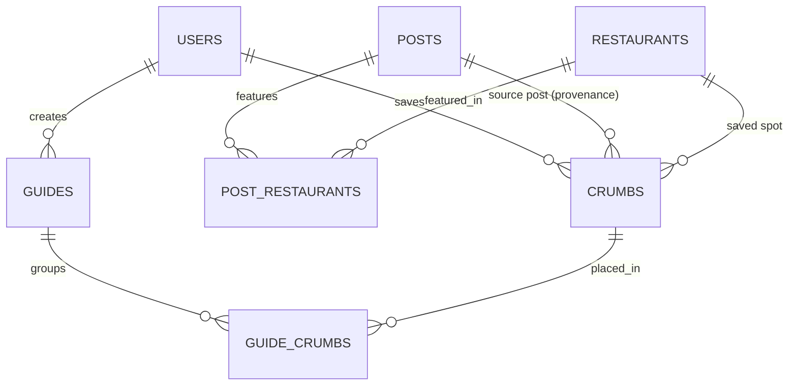
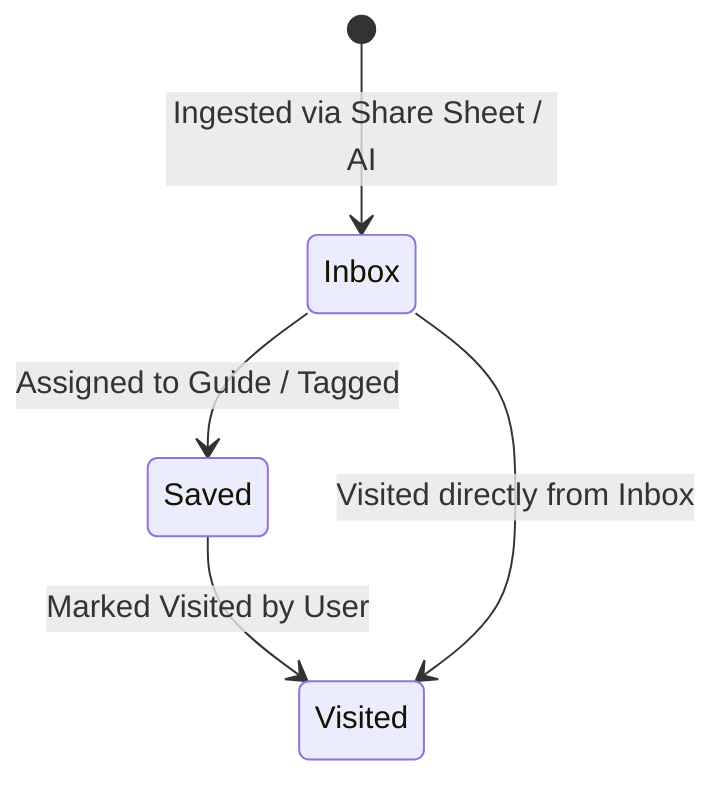

# Crumbs App Terminology & Domain Glossary

This document serves as the single source of truth for terminology, domain concepts, database entity naming, and user-facing vocabulary across the **Crumbs** ecosystem (iOS client, Backend API, Database, and Design System).

---

## 1. Core Brand & App Identity

| Term | Definition & Context |
| :--- | :--- |
| **Crumbs** | The product name. An iOS food and travel curation platform ("Spotify for Cravings") that converts viral social media videos (Instagram Reels, TikToks) into actionable, organized visual guides and maps. |
| **Crumb** *(noun)* | A specific restaurant or dining spot saved by a user from a social media post. Represents the bridge between the **User**, the canonical **Restaurant**, and the provenance **Post**. |
| **Crumb Trail** | The cumulative visual footprint of all crumbs a user has discovered, saved, and visited across cities worldwide. |

---

## 2. Domain Entities & Database Schema Mapping

Understanding how user concepts map directly to our normalized relational database schema (`api/src/db/schemas/`):

### Core Entity Definitions

#### 1. `Crumb` (`crumbs` table)
* **What it is:** A user's personal bookmark of a dining spot.
* **Key Attributes:**
  * `userId`: Owner of the saved crumb.
  * `restaurantId`: Foreign key to canonical `restaurants` record.
  * `sourcePostId`: (Optional) Foreign key to `posts` record preserving original video context.
  * `status`: Lifecycle stage (`'inbox'`, `'saved'`, `'visited'`).
  * `userNotes`: Personal notes written by the user (e.g., *"Table 4 in the garden has the best view"*).
* **Uniqueness:** Unique per `(userId, restaurantId)`. A user cannot duplicate a restaurant bookmark in their global collection.

#### 2. `Restaurant` (`restaurants` table)
* **What it is:** The global, canonical physical establishment. Deduplicated across all users via `googlePlaceId`.
* **Key Attributes:** Canonical name, formatted address, city, state, coordinates (`latitude`, `longitude`), cuisine, Google rating, user rating count, price level, opening hours, and synced Places photo URLs.

#### 3. `Post` (`posts` table)
* **What it is:** The ingested social media source post (Instagram Reel, TikTok, YouTube Short).
* **Key Attributes:** `platform` (`"instagram"` | `"tiktok"`), `platformPostId` (e.g. `DaiKM-vjXrl`), `originalUrl`, caption, location tag, `mediaUrls`, and `mediaSnapshot` (Cloudflare R2 image key).

#### 4. `PostRestaurant` (`post_restaurants` join table)
* **What it is:** The relational context between a specific Post and a Restaurant.
* **Key Attributes:**
  * `recommendedDishes`: Extracted hero dishes mentioned in the video/caption.
  * `vibeTags`: Atmosphere tags extracted from creator context.
  * `creatorNotes`: Notable quotes or tips from the content creator.

#### 5. `Guide` (`guides` table)
* **What it is:** A user-created themed collection or itinerary (e.g., *"West Village Date Nights"*, *"Tokyo 2026 Bakery Crawl"*).
* **Key Attributes:** `name`, `description`, `emojiIcon` (e.g. `🌴`, `🍷`), `coverImageUrl`, `isPublic` (sharing/collaboration flag).

#### 6. `GuideCrumb` (`guide_crumbs` join table)
* **What it is:** The ordered junction linking a `Crumb` to a specific `Guide`.
* **Key Attributes:** `guideId`, `crumbId`, and `orderIndex` for custom itinerary sorting.

---

## 3. Crumb Lifecycle & Inbox States

Every crumb progresses through a simple three-state lifecycle:

1. **`inbox` (The Queue):** Newly ingested spots awaiting user review, guide assignment, or tagging. Prevents saved content from getting lost even if the user didn't pick a guide when sharing.
2. **`saved` (Active Collection):** Organized crumbs categorized into one or more custom Guides or kept in active exploration lists.
3. **`visited` (Personal History):** Completed crumbs marked as dined-at, preserving personal travel memories and past recommendations.

---

## 4. Map Terminology & Naming Evaluation

### The "Aroma Map" Review
In early documentation, the interactive map was referred to as the **"Aroma Map"**. 

* **Assessment:** While evocative, "Aroma" is purely olfactory, which can feel ambiguous or confusing for travel, cocktail bars, and general venue mapping.
* **Recommended Terminology Options:**

| Candidate Name | Pros | Cons | Recommendation |
| :--- | :--- | :--- | :--- |
| **Cravings Map** | Directly aligns with Crumbs' core tagline *"Spotify for Cravings"*. Evocative, personal, and immediately understandable. | Focuses on cravings rather than pure geographic travel. | ⭐ **Recommended (Primary User-Facing)** |
| **Crumb Trail** / **Trail Map** | Strong metaphor on "Crumbs". Communicates a journey/path of saved spots across a city. | Slightly less clear if viewing isolated single pins. | ⭐ **Recommended (Guide / Itinerary context)** |
| **Living Map** | Best technical descriptor for real-time viewport sync, live open/closed statuses, and dynamic sheet filtering. | Slightly more technical than consumer-facing. | ⭐ **Recommended (UX & Technical Docs)** |
| **Taste Map** / **Flavor Map** | Sophisticated, editorial, emphasizes culinary taste and curation. | May sound too food-exclusive (less fitting for nightlife/bars). | Alternative |
| **Aroma Map** *(Legacy)* | Original concept placeholder. | Olfactory-only metaphor; potential user confusion. | Deprecate in favor of Cravings Map |

---

## 5. Feature & UX Vocabulary

| Term | Category | Definition |
| :--- | :--- | :--- |
| **Hero Dish** | Content & AI | The signature or standout food item highlighted in the video/caption (e.g. *Truffle Gnocchi*, *Smoked Duck Carpaccio*). Displayed as a primary visual pill over cards. |
| **Vibe Tags** | Content & AI | Atmospheric and mood descriptors extracted from context (e.g., *"Cozy"*, *"Candlelit"*, *"Jungle Views"*, *"Late Night"*). |
| **Social Credit / Creator Attribution** | Provenance | Visual badge acknowledging the original content creator (e.g., *"Saved from @theubudguide on Instagram"*). |
| **Multi-Spot Extraction** | Ingestion & AI | AI parsing that detects multiple distinct restaurants from a single carousel or compilation video and presents an interactive checklist to the user. |
| **Share Extension** | iOS Native | The lightweight iOS modal (`ShareViewController`) launched directly from Instagram or TikTok to ingest links without switching apps. |
| **Floating Liquid Glass Island** | UI / Ergonomics | The unified bottom capsule in the thumb zone integrating instant search (`🔍`), city switcher (`📍 Soho ▾`), quick action (`🎲`), and destination shortcuts into a single frosted glass element (replacing traditional bottom nav bars). |
| **Decide For Me (Decide Now)** | Decision Engine | The one-tap decision utility featuring haptic rolling that filters saved crumbs by proximity, current open hours, and vibe matching to eliminate decision fatigue. |

---

## 6. Architecture & Backend Pipeline Terms

| Term | Technology | Definition |
| :--- | :--- | :--- |
| **`IngestWorkflow`** | Cloudflare Workflows | The durable background workflow chaining 5 steps: Scrape $\rightarrow$ AI Extraction $\rightarrow$ Place Resolution $\rightarrow$ Media Snapshot $\rightarrow$ DB Persistence. |
| **Place Resolution** | Google Places API (New) | Geocoding and canonical verification step matching extracted restaurant names + cities into verified `googlePlaceId`, lat/lng, opening hours, and photos. |
| **Media Snapshot** | Cloudflare R2 | Cached snapshot of video cover frames stored on R2 to prevent dead links if social posts are edited or removed. |
| **Liquid Glass Material** | SwiftUI / CSS | Apple Ultra-Thin Material Blur (`.ultraThinMaterial` / `backdrop-filter: blur(28px) saturate(190%)`) with 1px specular refraction edge highlights. |
