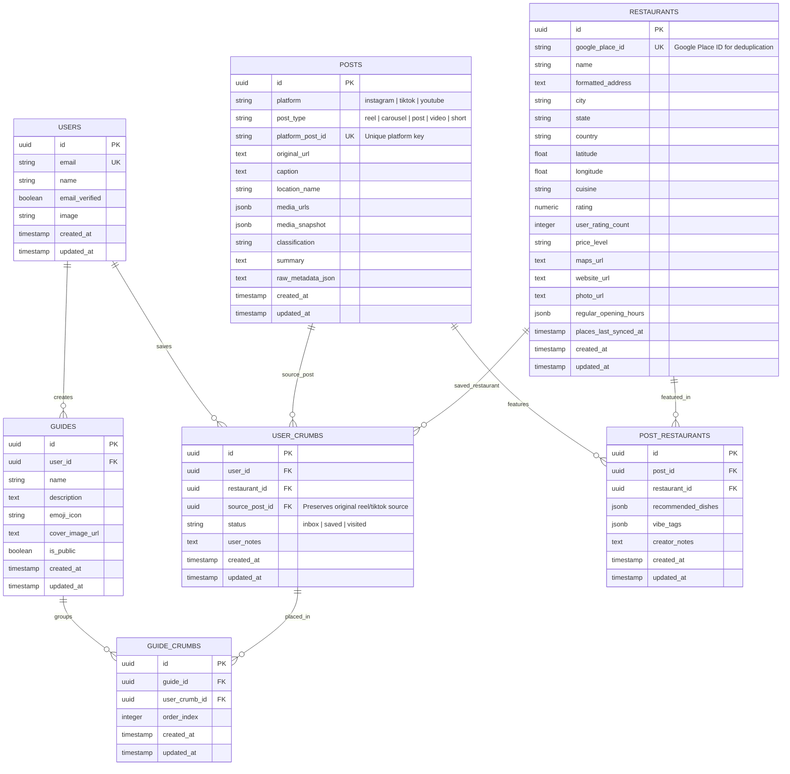

# Crumbs Architecture: Database & AI Schema Design

This document details the database schema and standard AI input/output schemas for the **Crumbs** backend. It is designed to handle asynchronous processing, prevent duplicate scraping, and support structured multi-restaurant extraction.

---

## 1. Database Schema Design (SQL / Drizzle)

To support multiple locations (chains/branches), multi-restaurant posts, and user trip-planning, we use a normalized relational schema with global canonical entities and user-scoped collections.



### Table Definitions

#### `posts`
Canonical table tracking ingested social media posts.
*   `id` (UUID, PK)
*   `platform` (VARCHAR, 32): `"instagram"` | `"tiktok"` | `"youtube"`
*   `post_type` (VARCHAR, 32): `"reel"` | `"carousel"` | `"post"` | `"video"` | `"short"`
*   `platform_post_id` (VARCHAR, 128, Unique Index with platform): E.g., `DaiKM-vjXrl`.
*   `original_url` (TEXT): Normalized original URL.
*   `caption` (TEXT, Optional)
*   `location_name` (VARCHAR, Optional)
*   `media_urls` (JSONB): Array of image/video URLs.
*   `media_snapshot` (JSONB): R2 snapshot status and key.
*   `classification` (VARCHAR, 64): `"restaurant_related"` | `"travel_unrelated_to_restaurants"` | `"random_unrelated"`.
*   `summary` (TEXT, Optional)
*   `raw_metadata_json` (TEXT, Optional): Full serialized payload from scraper.

#### `restaurants`
Canonical table representing physical dining spots, deduplicated via `google_place_id`.
*   `id` (UUID, PK)
*   `google_place_id` (VARCHAR, Unique Index)
*   `name` (VARCHAR)
*   `formatted_address` (TEXT)
*   `city`, `state`, `country` (VARCHAR)
*   `latitude`, `longitude` (DOUBLE PRECISION)
*   `cuisine` (VARCHAR)
*   `rating` (NUMERIC)
*   `user_rating_count` (INTEGER)
*   `price_level` (VARCHAR)
*   `maps_url`, `website_url`, `photo_url` (TEXT)
*   `regular_opening_hours` (JSONB)
*   `places_last_synced_at` (TIMESTAMP WITH TIMEZONE): 6-month cache TTL.

#### `post_restaurants` (Join Table)
Connects posts to the restaurants extracted from them with creator-specific recommended dishes and vibe tags.
*   `id` (UUID, PK)
*   `post_id` (UUID, FK -> `posts.id`)
*   `restaurant_id` (UUID, FK -> `restaurants.id`)
*   `recommended_dishes` (JSONB)
*   `vibe_tags` (JSONB)
*   `creator_notes` (TEXT)

---

## 2. AI Input & Output Schemas (Vercel AI SDK)

To ensure the AI extracts structured data reliably, we use `generateText` with `Output.object` via the **Vercel AI SDK** with **Zod** schema validation and multimodal vision.

### AI Input Payload (JSON)
Minimal clean metadata and slide images sent to the LLM:
```typescript
interface AIInput {
  platformPostId: string;
  caption: string;
  taggedLocation?: string;
  mediaUrls?: string[];
}
```

### AI Output Schema (Zod)
We define the exact structure the model is required to return.

```typescript
import { z } from "zod";

export const aiExtractionSchema = z.object({
  classification: z.enum([
    "restaurant_related",
    "travel_unrelated_to_restaurants",
    "random_unrelated"
  ]).describe("Classify the social media post category"),
  
  restaurants: z.array(
    z.object({
      name: z.string().describe("The name of the restaurant or cafe"),
      cuisine: z.string().optional().describe("Type of food served (e.g. Italian, Ramen, Cafe)"),
      address: z.string().optional().describe("Street address of the restaurant if available"),
      city: z.string().optional().describe("City where the restaurant is located"),
      state: z.string().optional().describe("State or Province"),
      country: z.string().optional().describe("Country"),
      recommendedDishes: z.array(z.string()).optional().describe("List of dishes highlighted in the caption"),
      notes: z.string().optional().describe("Key observations or details (e.g. 'Highly rated for brunch', 'needs reservations')"),
    })
  ).optional().describe("List of restaurants found in the post. Leave empty if classification is not 'restaurant_related'")
});
```

### Execution Example in Backend
```typescript
import { generateObject } from "ai";
import { google } from "@ai-sdk/google";

const { object } = await generateObject({
  model: google("gemini-2.5-flash"),
  schema: aiExtractionSchema,
  system: "You are an expert assistant that parses social media posts and extracts structured restaurant detail entities.",
  prompt: `Analyze the following post details:
Tagged Location: ${input.taggedLocation || "None"}
Caption:
"""
${input.caption}
"""`
});

console.log(object.classification); // "restaurant_related"
console.log(object.restaurants); // Array of extracted restaurant objects
```
