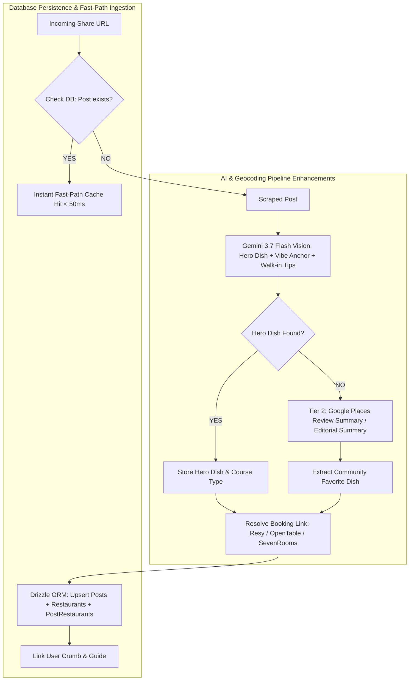

# Crumbs MVP: Technical Implementation Plan & Roadmap

> **Target Platform:** iOS (Native Swift & SwiftUI) + Edge API (Cloudflare Workers, Workflows, Drizzle ORM, Neon PostgreSQL)  
> **Core Identity:** "Spotify for Cravings" — Opinionated, High-Intent Culinary Utility.

---

## 1. Feature Gap Analysis: Implemented vs. Needed

| MVP Feature / Pillar | Status | Currently Implemented | Still Needed for MVP |
| :--- | :---: | :--- | :--- |
| **1. "The Hero Dish" AI Extraction & 3-Tier Fallback** | 🟢 **100% Done** | • Gemini Vision extraction with explicit `heroDish`, `vibeAnchor`, `courseCategory`, and `walkInTips`.<br>• `vibeTags` (3–6 search filter tags) and `recommendedDishes`.<br>• **Tier 1 (UI Primary):** `post_restaurants.hero_dish` (*"The Must-Order: Spicy Rigatoni"*).<br>• **Tier 2 (UI Fallback):** `restaurants.community_favorite_dish` from Google Places reviews.<br>• **Tier 3 (User Override):** User editable `crumbs.user_hero_dish_override` button `[ ✍️ Add must-order ]`. | *Complete (ready for iOS UI binding).* |
| **2. "Food Crawl" Sequencing Engine (Course Logic)** | 🔴 **0% Done** | • `course_category` classified by AI and stored in `post_restaurants`.<br>• Latitude / Longitude coordinates resolved and indexed. | • Meal course sequencing engine (`POST /crawl/sequence`) ordering selected spots by dining timeline (`aperitif` $\rightarrow$ `main` $\rightarrow$ `dessert` / `cocktail_bar`) + walking time estimation. |
| **3. Direct Transactional Utility (Booking Deep-Links & UI Fallbacks)** | 🟢 **100% Done** | • **Tier 1 (Direct Booking):** `restaurants.reservation_url` + `reservation_provider` (Resy, OpenTable, SevenRooms, Tock). Renders button: `[ 🍷 Book on Resy ]` / `[ 🍽️ Book on OpenTable ]`.<br>• **Tier 2 (Smart Search Deeplink):** Auto-generated provider search URL if creator mentions booking name without link.<br>• **Tier 3 (Website Fallback):** When no reservation platform exists (e.g. cafes, bakeries), fallback to `restaurants.website_url` (`[ 🌐 Visit Website ]`).<br>• **Tier 4 (Maps Fallback):** Fallback to `restaurants.maps_url` (`[ 🗺️ Open in Maps ]`).<br>• **Walk-In Banner:** `post_restaurants.walk_in_tips` displayed as prominent tactical tip pill. | *Complete (ready for iOS UI binding).* |
| **4. "The Digital Tasting Menu" (Export & Clone)** | 🔴 **0% Done** | • Relational guides, crumbs, and guide_crumbs tables defined in Drizzle. | • Dynamic editorial Tasting Menu payload endpoint (`GET /guides/:id/tasting-menu`).<br>• 1-Tap Clone endpoint (`POST /guides/:id/clone`). |
| **5. Database Persistence in Ingest Workflow & Fast Path** | 🟢 **100% Done** | • Step 5 atomically persists `posts`, `restaurants`, `post_restaurants`, and `crumbs` to Neon DB.<br>• Creator `author_username` captured and saved.<br>• Instant Fast-Path cache hit (`< 50ms`) for repeat URLs returning structured per-table data (`post`, `restaurants`, `crumbs`). | *Complete.* |
| **6. Native iOS App (Swift & SwiftUI)** | 🔴 **0% Done** | • Complete design spec in `docs/product_vision_and_ux.md`. | • Native iOS project setup (`/ios`):<br>  - Native SwiftUI Share Extension with inline guide search.<br>  - Living MapKit view with Floating Liquid Glass Control Island.<br>  - Crumb Cards with Hero Dish & Resy/OpenTable buttons.<br>  - Food Crawl itinerary builder & Tasting Menu export. |

---

## 2. Phase 1: Backend & AI Engine Completion



### Tasks:
1. **AI Extraction Prompt Refinement (`api/src/services/ai.ts`):**
   * Update schema to explicitly return:
     * `heroDish`: The single viral must-order item (or null if general).
     * `vibeAnchor`: Defining experience (e.g. *"Low-lit, vinyl records & natural orange wine"*).
     * `courseCategory`: `'aperitif' | 'main' | 'digestif_dessert' | 'cafe_bakery'`.
     * `walkInTips`: Specific advice from caption/comments (e.g. *"Arrive 15 min before 5 PM opening"*).
2. **Google Places Tier 2 Fallback (`api/src/services/places.ts`):**
   * Request `editorialSummary` and review text in Google Places API (New) FieldMask.
   * If `heroDish` is missing, extract `communityFavoriteDish` from top review mentions.
   * Detect reservation booking platforms (Resy, OpenTable, SevenRooms, Tock) from place website/links.
3. **Food Crawl Sequencing Engine (`api/src/services/crawlSequencer.ts`):**
   * Build algorithm that takes an array of 2–5 spot IDs, groups by `courseCategory` (Apéritif $\rightarrow$ Main $\rightarrow$ Dessert/Digestif), and calculates realistic timeline (e.g. 5:30 PM, 7:30 PM, 10:00 PM) with walking distances.
   * Expose endpoint: `POST /api/crawl/sequence`.
4. **Ingest Workflow Neon DB Persistence (`api/src/workflows/ingestWorkflow.ts`):**
   * Wire Step 5 (`persist-and-log-crumb`) to execute Drizzle ORM upserts.
   * Implement Fast-Path cache check in `POST /api/ingest` to return existing crumbs immediately.
5. **Digital Tasting Menu & Guide Clone Endpoints (`api/src/routes/guides.ts`):**
   * `GET /api/guides/:id/tasting-menu`: Returns structured JSON payload formatted for editorial Michelin-card rendering.
   * `POST /api/guides/:id/clone`: Duplicates a shared guide into the requesting user's account with 1-tap.

---

## 3. Phase 2: Native iOS App Architecture (Swift & SwiftUI)

```
ios/
├── CrumbsApp/                      # Main iOS App
│   ├── App/
│   │   ├── CrumbsApp.swift         # App Entrypoint
│   │   └── AppState.swift          # Global State & BetterAuth Session
│   ├── Core/
│   │   ├── DesignSystem/           # Liquid Glass Materials, Semantic Tokens, Typography
│   │   ├── API/                    # Hono API Client (Network Layer)
│   │   └── Location/               # CoreLocation Manager
│   ├── Features/
│   │   ├── Home/                   # Living MapKit + Floating Liquid Glass Island
│   │   ├── Guides/                 # Guide Collections & "Food Crawl" Sequencer
│   │   ├── CrumbCard/              # Hero Dish Card, Resy/OpenTable CTA, Walk-in Tips
│   │   ├── Inbox/                  # Ingested Spots Review Checklist
│   │   └── TastingMenu/            # Digital Tasting Menu Export Sheet (ImageRenderer)
└── CrumbsShareExtension/           # Native iOS Share Extension
    ├── ShareViewController.swift   # Extension Lifecycle
    └── ShareExtensionView.swift    # SwiftUI View with Live Guide Search & Quick Creation
```

### Tasks:
1. **iOS Project Initialization & Design System:**
   * Create SwiftUI project with `.ultraThinMaterial` Liquid Glass modifiers, custom MapKit annotations, and haptic feedback engine.
2. **SwiftUI Share Extension (`CrumbsShareExtension`):**
   * Intercept shared URLs from Instagram/TikTok.
   * Inline search bar (`🔍 Search all guides...`) with real-time filtering and `➕ Create "[Search Query]"` button.
   * Dispatch background ingestion to `POST /api/ingest`.
3. **Living Map & Floating Liquid Glass Island:**
   * Full-bleed MapKit canvas with custom visual pins.
   * Floating bottom glass control pill: Instant search, city selector (`📍 Soho ▾`), `🎲 Decide For Me`, and quick tabs.
   * Draggable bottom sheet with `.presentationDetents([.height(100), .medium, .large])`.
4. **The Crumb Card Component:**
   * Prominent **Hero Dish** badge (*"The Must-Order: Pistachio Escargot Croissant"*).
   * Context clip thumbnail & creator credit (*"Saved from @nycfoodie"*).
   * Actionable booking button (`[ Book on Resy ]` / `[ Book on OpenTable ]` / `[ Walk-In Tips ]`).
5. **The Food Crawl Sequencer View:**
   * Course-based visual timeline (Course 1: Apéritif $\rightarrow$ Course 2: Main $\rightarrow$ Course 3: Digestif).
   * Walking time indicators between stops.
6. **Digital Tasting Menu Card Exporter:**
   * Use SwiftUI `ImageRenderer` to generate an editorial, warm-bistro graphic (1080x1920) for Instagram Stories / iMessage.
   * Universal link overlay for friends to 1-tap clone the tasting crawl.

---

## 4. Execution Sequence & Milestones

| Milestone | Deliverable | Success Criteria |
| :--- | :--- | :--- |
| **M1: Backend AI & Geocoding Upgrades** | `api/src/services/ai.ts`, `places.ts` | Extracts Hero Dish, 3-tier fallback, booking links, and course categories. |
| **M2: Database Persistence & Fast Path** | `api/src/workflows/ingestWorkflow.ts`, `db/` | Ingestion writes to Neon DB; repeat URLs hit cache in < 50ms. |
| **M3: Food Crawl & Tasting Menu Endpoints** | `api/src/routes/crawl.ts`, `guides.ts` | Course sequencing algorithm & guide cloning API verified. |
| **M4: Native iOS Share Extension** | `ios/CrumbsShareExtension/` | Sharing IG Reel shows instant guide search modal and queues ingestion. |
| **M5: iOS Living Map & Liquid Glass UI** | `ios/CrumbsApp/` | Full-bleed MapKit, bottom control island, and draggable card sheet. |
| **M6: Tasting Menu Export & Polish** | `ios/CrumbsApp/Features/TastingMenu` | Instagram Story card generation and 1-tap guide sharing verified. |
