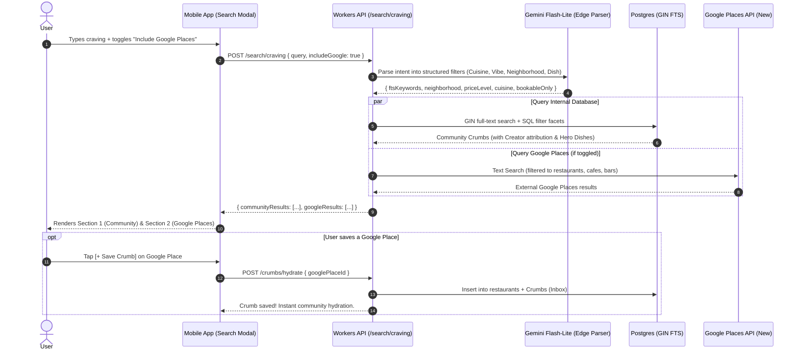

# Post-MVP Plan: AI-Powered Craving Search & Google Places Hybrid Fallback

## 1. Executive Summary

This document outlines the technical specification, UX flow, cost optimization strategy, and execution roadmap for the **Post-MVP AI-Powered Craving Search**.

This feature transforms natural language food and atmosphere cravings (e.g., *"late night spicy noodles in Soho with good natural wine and date night vibe"*) into structured database queries across all community-ingested crumbs, with an optional on-demand toggle to search the broader **Google Places API** to eliminate zero-result dead-ends and automatically hydrate the Crumbs restaurant catalog.

---

## 2. Product Goals & User Experience

### 2.1 Core Value Proposition
- **Natural Language Intent**: Users describe what they crave, the mood, occasion, or specific dishes rather than having to remember exact restaurant spellings.
- **Community-First Discovery**: Prioritizes crumbs previously ingested from social reels, displaying creator attribution (`@creator`), **Hero Dishes ("Must-Order: Vodka Rigatoni")**, and **Vibe Tags**.
- **Google Places Expansion Toggle**: When enabled or when community results are low, queries the Google Places API (New) to discover uncataloged establishments.
- **Instant Auto-Hydration**: Tapping `[+ Save Crumb]` on any Google Places result persists the restaurant in Postgres, extracts signature dishes from Google reviews, and makes it available to the entire Crumbs community.

---

### 2.2 User Flow Diagram



---

## 3. UI & Interaction Design

### 3.1 Modal Layout & Search Controls
1. **Header Search Input**:
   - Placeholder: *"Ask AI or search your cravings..."*
   - Clear button (`✕`) and immediate voice/text input.
2. **Search Scope Toggle Bar**:
   - `[✨ Crumbs Only]` (Default — free, instant, curated with videos & hero dishes)
   - `[🌐 Include Google Places]` (Toggle — expands search beyond the community catalog)
3. **Quick Suggestion Chips**:
   - *"🍝 Late Night Pasta"*, *"🍸 Cozy Speakeasy"*, *"🌮 Under $15 Tacos"*, *"☕ Matcha & Pastries"*

### 3.2 Result Sections
- **Section 1: 🌟 In Community Crumbs**:
  - Rendered using [`CompactCrumbCard`](file:///Users/khoa/Documents/crumbs/mobile/src/components/crumbs/CompactCrumbCard.tsx).
  - Displays reel attribution, hero dish callout, vibe badges, and direct actions (`🗺️ +`, `🍷 Book`).
- **Section 2: 📍 From Google Places**:
  - Clean card displaying Google Maps photo, name, address, price, rating (`4.8 ★ (1.2k)`).
  - Prominent **`[+ Save Crumb]`** button.
  - Tapping opens the quick Guide selector or saves directly to the user's Inbox.

---

## 4. Technical Architecture

### 4.1 Token-Optimized Intent Extraction
To ensure $\ll \$0.0001$ per query and sub-250ms response times, we use a lightweight structured schema with **Gemini 2.5 Flash / Flash Lite**:

```ts
import { z } from 'zod';

export const cravingSearchIntentSchema = z.object({
  // Normalized keywords for Postgres full-text search (tsquery)
  ftsKeywords: z
    .array(z.string())
    .describe('Core dishes, ingredients, or descriptive keywords, e.g. ["vodka rigatoni", "spicy noodles"]'),
  // Exact filter facets for database WHERE clauses
  neighborhood: z.string().nullable().optional(),
  city: z.string().nullable().optional(),
  cuisine: z.string().nullable().optional(),
  vibeTags: z.array(z.string()).optional(),
  priceLevel: z.enum(['$', '$$', '$$$', '$$$$']).nullable().optional(),
  bookableOnly: z.boolean().optional(),
  // Extracted query string optimized for Google Places Text Search
  googleSearchQuery: z.string().describe('Clean concise query for Google Places API'),
});
```

---

### 4.2 Postgres GIN Full-Text Indexing
In Postgres (`api/src/core/db/schemas/restaurants.table.ts`), generate and index a compound `tsvector`:

```sql
-- Compound GIN Full-Text Search Index
CREATE INDEX idx_restaurants_fts ON restaurants 
USING GIN (
  to_tsvector('english', 
    coalesce(name, '') || ' ' || 
    coalesce(cuisine, '') || ' ' || 
    coalesce(community_favorite_dish, '') || ' ' || 
    coalesce(editorial_summary, '') || ' ' ||
    coalesce(neighborhood, '') || ' ' ||
    coalesce(city, '')
  )
);
```

---

### 4.3 Google Places API (New) Integration & Cost Control
- **Endpoint**: Google Places API (New) Text Search (`https://places.googleapis.com/v1/places:searchText`).
- **Field Masking**: Only request required fields (`places.id`, `places.displayName`, `places.formattedAddress`, `places.rating`, `places.userRatingCount`, `places.priceLevel`, `places.photos`, `places.googleMapsUri`, `places.websiteUri`).
- **Strict Dining Types**: Restrict `includedType` to `['restaurant', 'cafe', 'bar', 'bakery']` to filter out non-food establishments.
- **Rate-Limiting & Debouncing**: Minimum 400ms debounce on input; Google API calls only trigger on explicit submission or toggle activation.

---

### 4.4 Auto-Hydration Pipeline
When a user selects a place from Google Places:
1. Check if `googlePlaceId` already exists in `restaurants` table.
2. If new, fetch Place Details and run [`extractCommunityDishFromReviews`](file:///Users/khoa/Documents/crumbs/api/src/modules/ingest/services/places.service.ts) to populate `communityFavoriteDish` and `editorialSummary`.
3. Detect reservation platform via [`detectReservationProvider`](file:///Users/khoa/Documents/crumbs/api/src/modules/ingest/services/places.service.ts).
4. Insert into `restaurants` and create user `Crumbs` record with `status: 'inbox'`.

---

## 5. Post-MVP Implementation Roadmap

| Phase | Scope | Key Deliverables |
| :--- | :--- | :--- |
| **Milestone 1** | Backend Intent Parser & GIN Index | • Postgres `idx_restaurants_fts` migration<br/>• `POST /search/craving` endpoint with Gemini Flash-Lite<br/>• Unit tests for query parsing & GIN execution |
| **Milestone 2** | Mobile AI Search Modal & Community Results | • Interactive search modal triggered from Inbox header<br/>• Quick craving suggestion chips<br/>• Community results rendering with Hero Dishes |
| **Milestone 3** | Google Places Toggle & Auto-Hydration | • Google Places Text Search integration on backend<br/>• `[🌐 Include Google Places]` UI toggle in search modal<br/>• Auto-hydration endpoint `POST /crumbs/hydrate` |
| **Milestone 4** | Semantic Embeddings & Cloudflare Vectorize | • Vector embeddings on restaurant vibe summaries<br/>• Hybrid Reciprocal Rank Fusion (FTS + Vector Search) |

---

## 6. Token & Cost Summary

- **Gemini Flash-Lite Intent Parsing**: ~80 input tokens, ~40 output tokens $\rightarrow \approx \$0.00003$ per query.
- **Edge Intent Caching (KV)**: 24h cache for identical queries $\rightarrow \$0.00$ per cached query.
- **Internal Database Search**: Zero API cost, sub-15ms latency.
- **Google Places Text Search**: $\approx \$0.032$ per call (invoked strictly on-demand when user opts in).
