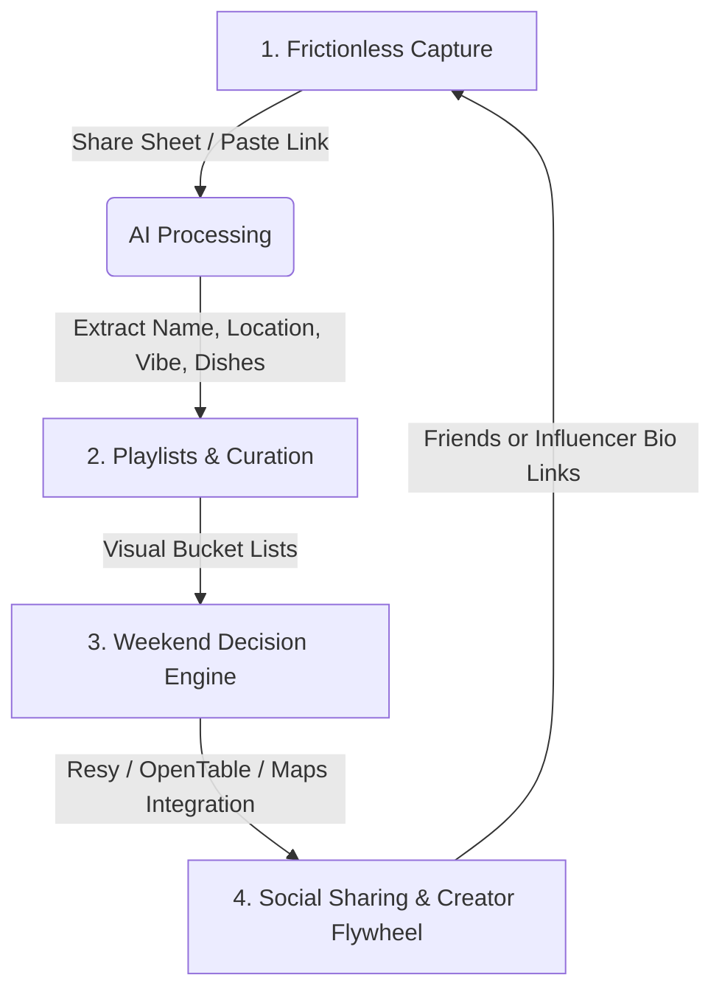

# Crumbs Product Strategy: The User Loop & Core Identity

Based on the product pitch presentation, **Crumbs**' biggest risk is becoming a static, forgotten database (a notes app with a map). To win, Crumbs must feel like a premium, active lifestyle utility. This document outlines the post-extraction user experience, detailing how users interact with their saved "crumbs" and what defines our core product identity.

---

## 1. Core Identity: "Spotify for Cravings"

Crumbs is **not** a travel planner or a review directory. The core identity is **The Visual Playlist Platform for Food & Vibes**. 

We replace:
*   **Static Directories (Yelp/Google Maps):** Too corporate, cluttered, and rating-obsessed.
*   **Notes Apps / Bookmarks:** Text-heavy, hard to search, no geographic context.

We introduce:
*   **Aroma Maps:** A high-end visual layout prioritizing video captures, signature dish highlights, and emotional vibe tags over boring star ratings.
*   **Food Playlists:** Just as users create music playlists for moods ("Gym", "Chill"), they create food playlists ("Friday Date Nights", "Late Night Slices", "Ubud Coffee Crawl").

---

## 2. The Core User Loop: Capture $\rightarrow$ Curate $\rightarrow$ Execute $\rightarrow$ Share

### Phase 1: Frictionless Capture (The Input)
*   User is browsing Instagram Reels/TikTok. They see a viral smash burger.
*   They tap the Share Sheet, select **Crumbs**, and keep scrolling.
*   **AI Background Engine** parses the shortcode, fetches metadata, extracts details, and places it into the user's Inbox.

### Phase 2: Playlists & Curation (The Organization)
When the user opens the app, they see their **Inbox** (newly extracted items). 
*   **No Folders:** Instead of folders, users add spots to **Playlists** (e.g., *"Brooklyn Date Spots"*, *"Kyoto Ramen Crawl"*).
*   **Vibe Tags & Hero Dishes:** The card isn't labeled with reviews; it features the visual frame from the video, the named "Hero Dish" (e.g. *Truffle Gnocchi*), and vibes (e.g. *Dimly lit, Cozy*).
*   **Interactive Maps:** Playlists can be viewed as a gorgeous map styled in warm buttercream, espresso, and tomato tones.

### Phase 3: The "Weekend Decision Engine" (The Execution)
This is where the user transitions from **passive saver** to **active diner**. On Friday night:
*   Instead of arguing about where to go or searching through Google Maps pins, the user opens Crumbs.
*   The **"Decide Now"** utility filters their saved playlists based on:
    *   *Proximity:* What's within 15 mins?
    *   *Availability:* Where has reservations open right now (integrating OpenTable/Resy)?
    *   *Vibe matching:* "Cozy dinner" vs "Quick bite".
*   **One-Tap Action:** Users can tap "Book" or "Get Directions" instantly.

### Phase 4: Social Coordination & Creator Loops (The Virality)
*   **Shared Playlists:** A user group (e.g., a friend group or couple) can collaborate on a single playlist (*"Our Anniversary Ideas"*).
*   **Quick Vote:** Send a playlist to a friend group chat. Friends swipe right/left on the visual cards, and Crumbs tells you the winning restaurant.
*   **Creator Guides (Creator Marketplace):** Food influencers publish their premium checklists (e.g. *"Paris Bakery Crawl"*) as paid or exclusive playlists that users can import into their own account with one tap.

---

## 3. Feature Roadmap: MVP vs. Post-MVP

### MVP (Minimum Viable Product)
1.  **Frictionless Share Sheet Receiver:** Quick ingestion and categorization.
2.  **Visual Inbox:** A queue of recently parsed links for users to tag, save, or dismiss.
3.  **My Playlists:** Create, rename, and add spots to custom lists.
4.  **Aroma Map View:** Map interface displaying saved spots filterable by playlist.
5.  **Direct Booking Shortcuts:** Quick redirect links to Google Maps, Resy, and OpenTable.

### Post-MVP (Monetization & Scale)
1.  **Shared Playlists:** Collaborative lists with real-time voting widgets.
2.  **Resy/OpenTable API Integration:** Check live reservation slots directly within Crumbs.
3.  **Creator Marketplace:** Influencer profiles selling custom, curated geographic checklists.
4.  **Audio & Video OCR processing:** Deep scraping to extract details from video audio/text overlays when captions are empty.
