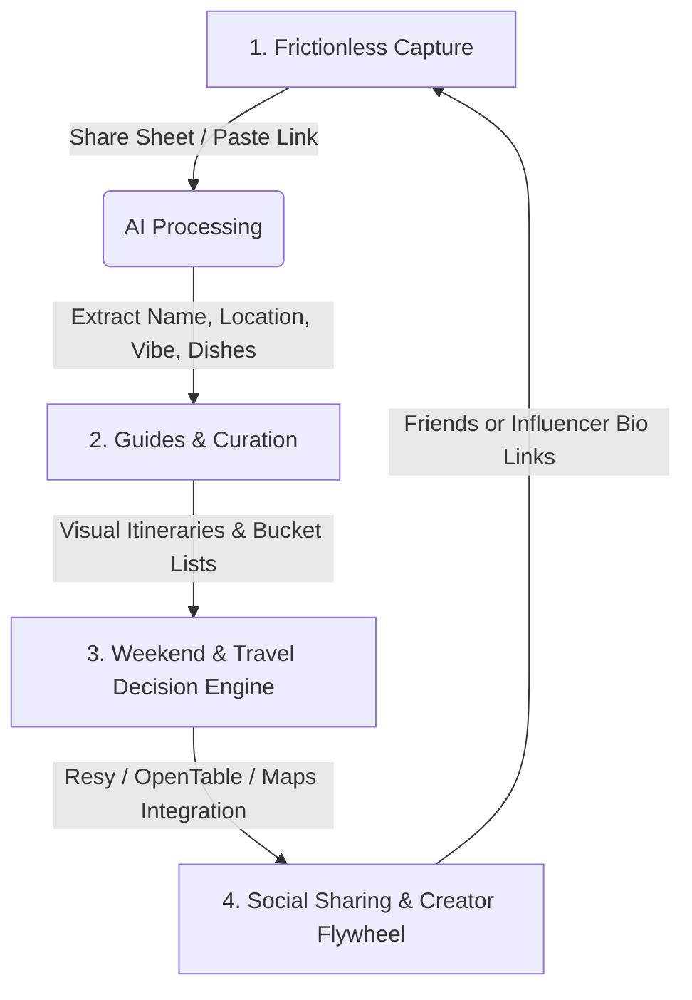

# Crumbs Product Strategy: The User Loop & Core Identity

Based on the product pitch presentation, **Crumbs**' biggest risk is becoming a static, forgotten database (a notes app with a map). To win, Crumbs must feel like a premium, active lifestyle and travel utility. This document outlines the post-extraction user experience, detailing how users interact with their saved "crumbs" and what defines our core product identity.

---

## 1. Core Identity: Visual Food & Travel Guides

Crumbs is **not** an overwhelming directory or a generic review site. The core identity is **The Visual Guide Platform for Food, Vibes & Travel**. 

We replace:
*   **Static Directories (Yelp/Google Maps):** Too corporate, cluttered, and rating-obsessed.
*   **Notes Apps / Bookmarks:** Text-heavy, hard to search, no geographic context.

We introduce:
*   **Aroma Maps:** A high-end visual layout prioritizing video captures, signature dish highlights, and emotional vibe tags over boring star ratings.
*   **Curated Guides:** Whether curating local moods (*"Friday Date Nights"*, *"Late Night Slices"*) or trip itineraries (*"Tokyo 2026 Trip"*, *"Paris Bakery Crawl"*), users organize spots into beautiful, shareable Guides.

---

## 2. The Core User Loop: Capture $\rightarrow$ Curate $\rightarrow$ Execute $\rightarrow$ Share

### Phase 1: Frictionless Capture (The Input)
*   User is browsing Instagram Reels/TikTok. They see a viral smash burger or Kyoto ramen shop.
*   They tap the Share Sheet, select **Crumbs**, optionally pick a Guide, and keep scrolling.
*   **AI Background Engine** parses the shortcode, fetches metadata, extracts details, and places it into the user's Inbox or selected Guide.

### Phase 2: Guides & Curation (The Organization)
When the user opens the app, they see their **Inbox** (newly extracted items). 
*   **No Folders:** Instead of folders, users organize spots into **Guides** (e.g., *"West Village Date Spots"*, *"Tokyo 2026"*).
*   **Vibe Tags & Hero Dishes:** The card features the visual frame from the video, the named "Hero Dish" (e.g. *Truffle Gnocchi*), and vibes (e.g. *Dimly lit, Cozy*).
*   **Interactive Maps:** Guides can be viewed as a gorgeous map styled in warm buttercream, espresso, and tomato tones.

### Phase 3: The Decision Engine (The Execution)
This is where the user transitions from **passive saver** to **active explorer**. On a Friday night or during a trip:
*   Instead of arguing about where to go or searching through Google Maps pins, the user opens Crumbs.
*   The **"Decide Now"** utility filters their saved guides based on:
    *   *Proximity:* What's within 15 mins?
    *   *Destination:* Spots for an upcoming trip (e.g. Tokyo, Paris).
    *   *Availability:* Where has reservations open right now (integrating OpenTable/Resy)?
    *   *Vibe matching:* "Cozy dinner" vs "Quick bite".
*   **One-Tap Action:** Users can tap "Book" or "Get Directions" instantly.

### Phase 4: Social Coordination & Creator Loops (The Virality)
*   **Shared Guides:** A friend group or couple can collaborate on a single guide (*"Our Anniversary Ideas"*, *"Japan 2026"*).
*   **Quick Vote:** Send a guide to a group chat. Friends swipe on visual cards, and Crumbs tallies the top pick.
*   **Creator Marketplace:** Food and travel influencers publish premium guides (e.g. *"Oaxaca Street Food Trail"*) that users can import with one tap.

---

## 3. Feature Roadmap: MVP vs. Post-MVP

### MVP (Minimum Viable Product)
1.  **Frictionless Share Sheet Receiver:** Quick ingestion and guide categorization.
2.  **Visual Inbox:** A queue of recently parsed links for users to tag, save, or dismiss.
3.  **My Guides:** Create, rename, and add spots to custom guides.
4.  **Aroma Map View:** Map interface displaying saved spots filterable by guide and city.
5.  **Direct Booking Shortcuts:** Quick redirect links to Google Maps, Resy, and OpenTable.

### Post-MVP (Monetization & Scale)
1.  **Shared Guides:** Collaborative lists with real-time voting widgets.
2.  **Resy/OpenTable API Integration:** Check live reservation slots directly within Crumbs.
3.  **Creator Marketplace:** Influencer profiles selling custom, curated geographic checklists.
4.  **Audio & Video OCR processing:** Deep scraping to extract details from video audio/text overlays when captions are empty.
